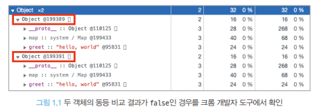

# JavaScript 동등 비교

- React의 가상 DOM과 실제 DOM의 비교, React Component의 렌더링 여부 판단 방법, 변수나 함수의 메모이제이션 등 모든 작업은 JS의 동등비교를 기반으로 함

## JS의 데이터 타입

### 원시 타입(primitive type)
  - null : 아직 값이 없거나 비어있음 (주의- `typeof` 로 타입 확인 시 `object`반환)
  - undefined : 선언 후 값을 할당하지 않거나 값이 주어지지 않음 
    - `null vs undefined`
        | null | undefined|
        |:---:|:---:|
        |명시적으로 비어있음|선언됐지만 할당되지 않음|
  - boolean : `참(true)`/`거짓 (false)`
    - truthy / falsy
      - truthy : falsy를 제외한 모든 값 
      - `falsy`
        |값|타입|설명|
        |:---:|:---:|:---:|
        |false|Boolean|대표적인 falsy|
        |0, -0, 0n, 0x0n|Number, BigInt|0은 부호나 소수점 유무에 상관없이 falsy|
        |NaN|Number|Not a Number === Number가 아님 -> falsy|
        |'',"",``|String|공백이 없는 빈 문자열 -> falsy|
        |null|null|null == falsy|
        |undefined|undefined|undefined == falsy|
  - number : ECMAScript 표준 $-(2^{53}-1)$ ~ $2^{53}-1$

    ```javascript
    // 진수 타입이 없어 모두 10진수로 저장된다.
    const 이진수_2 = 0b10
    이진수_2 = 2 // true

    const 이진수_2 = 0o10
    이진수_8 = 8 // true

    const 이진수_2 = 0x10
    이진수_16 = 16 // true
    
    ```

  - bigint : ECMAScript 2020에서 새롭게 나온것으로 number의 한계를 넘은 더 큰 숫자 저장 가능
    ```javascript
    // 선언 방식
    const number = 9007199254740992;    
    const bigint = 9007199254740992n;    
    const bigint = BigInt(9007199254740992);    

    number == bigint // true
    number === bigint // false

    ```

  - string : `""`, `''`, ` `` ` 으로 선언 가능, ` `` `은 템플릿 리터럴(template literal) 가능(변경 불가능)
  - symbol : ES6에서 새롭게 추가된 7번재 타입으로, 중복되지 않는 어떠한 고유한 값을 나타내기 위해 만들어 졌음, 생성: `Symbol()`
    ```javascript
    const key = Symbol('key')
    const key2 = Symbol('key2')
    
    key === key2 //false
    
    // 동일 비교
    Symbol.for('hello') === Symbol.for('hello') // true
    ```

### 객체 타입(object/reference type)
- object(객체타입으로 참조 전달하기에 참조 타입이라고도 불림)
  - 배열, 함수, 정규식, 클래스 등 대부분의 원시 타입을 제외한 JS타입
  - 동등 비교
    ```javascript
    typeof [] === 'object' // true
    typeof {} === 'object' // true

    function hello() {}
    typeof hello === 'function' //true

    const hello1 = function() {

    }
    const hello2 = function() {

    }

    // 함수의 내용이 같아 보여도 참조가 다르기 때문에 false 반환
    hello1 === hello2 // false

    ```


## 값을 저장하는 방식의 차이

- 원시 타입
  - 불변 형태의 값으로 변수 할당 시점에서 메모리 영역을 차지하고 저장
    ```js
    let hello = 'hello world'
    let hi = hello

    // 값을 복사해서 저장했기에 같음
    hello === hi // true

    let hello = 'hello world'
    let hi = 'hello world'

    // 같은 값이기에 같음
    hello === hi // true
    ```
- 객체 타입
  - 프로퍼티(속성)을 삭제, 추가, 수정할 수 있으므로 **변경이 가능한 상태**로 저장되며 값을 복사할 때, 참조를 전달
    ```js
    let hello = {
        geet: 'hello, world',
    }

    let hi = {
        geet: 'hello, world',
    }

    // 객체 자체의 동등 비교는 false, 원시적인 내부 속성 값은 true
    console.log(hello === hi) // false
    console.log(hello.greet === hi.greet) // true
    ```
    

- 객체 간 비교를 한다면, 내부 값이 같더라도 결과는 `true`가 아닐 수 있음을 인지하자!

## Object.is
- ES6에서 새롭게 도입된 비교 문법, `===`가 가지는 한계를 극복하고자 도입(하지만, 객체간 비교에서는 `===`와 똑같이 작용)
    ```js
    /*
    == vs Object.is
    == vs ===와 같이, ==는 단순 값만 비교(type이 다르면 변환하여 비교)하며, Object.is는 타입이 다르면 false를 반환한다.
    */ 
    console.log(-0 === +0) // true
    console.log(Object.is(-0, +0)) // false

    // === vs Object.is
    console.log(Number.NaN === NaN) // false
    console.log(Object.is(Number.NaN, NaN)) // true

    console.log(NaN === 0/0) // false
    console.log(Object.is(NaN, 0/0)) // true
    ```
- 객체에서의 비교(별 차이 없음)
    ```js
    Object.is({}, {}) // false

    const a = {
        hello: 'hi',
    }
    const b = a

    Object.is(a,b) // true
    a === b // true
    ```

## 리액트에서의 동등 비교
- `Object.is`를 사용하여 동등 비교를 수행(폴리필, Polyfill을 함께 사용)
  - 폴리필: 충전솜, 솜이 꺼졌을 때 충전하는 솜, 다시말해, 브라우저에서 지원하지 않는 코드를 사용가능한 코드 조각이나 플러그인(추가기능)을 의미
  - babel은 ES5문법까지는 번역하지만, ES6의 Map, Promise, Set, Object,assign() 등을 번역할 수 없으므로 이들을 사용가능하게 만들기 위해 폴리필 라이브러리를 사용
    ```js
    // objectis 구현 함수
    function is(x:any, y:any) {
        return (
            (x === y && (x !== 0 || 1 / x === 1 / y)) || (x !== x && y !== y)   // eslint-disable-line no-self-compare
        )
    }

    // 런타임에 Object.is가 있다면 그것을 사용하고, 아니라면 위 함수를 사용한다.
    const objectIs: (x:any, y:any) => boolean = typeof Object.is === 'function' ? Object.is : is

    export default objectIs
    ```

  - 리액트에서는 이 `objectIs`를 기반으로 shallowEqual이라는 함수를 만들어 사용, 의존성 비교 등 리액트의 동등 비교가 필요한 다양한 곳에서 사용
    ```js
    import is from './objectIs'
    // Object.prototype.hasOwnProperty
    // property 확인 매서드
    import hasOwnProperty from './hasOwnProperty'

    // 주어진 객체의 키를 순회하면서 두 값이 엄격한 동등성을 가지는 지를 확인, 다른 값이 있으면 false 모두 같으면 true

    // 단순히 Object.is를 수행하는 것이 아닌 객체 간의 비교도 추가 되어 있음

    function shallowEqual(objA: mixed, objB: mixed):boolean {
        if (is(objA, objB)){
            return true
        }

        if (
            typeof objA !== 'object' ||
            objA === null ||
            typeof objB !== 'object' ||
            objB === null
        ) {
            return false
        }

        if (keysA.length !== keysB.length) {
            return false
        }

        // A의 키를 기준으로, B에 키가 있는지, 값이 같은지 확인
        for (let i = 0; i < keysA.length; i++){
            const currentKey = keysA[i]
            if (
                !hasOwnProperty.call(objB, currentKey) ||
                !is(objA[currentKey], objB[currentKey])
            ){
                return false
            }
        }

        return true

    }

    export default shallowEqual
    ```

## 핵심!
1. `shallowEqual`은 `Object.is`로 수행하지 못하는 얕은 비교를 한 번 더 수행한다
    - `for` 부분
    ```js
    // Object.is는 참조가 다른 객체에 대해 비교가 불가능
    Object.is({hello:'world'}, {hello:'world'})  // false

    // shallowEqual은 객체의 1 depth까지 비교 가능
    shallowEqual({hello:'world'}, {hello:'world'})  // true

    // 2 depth는 비교 불가능
    shallowEqual({hello:{hi: 'world'}}, {hello:{hi: 'world'}}) // false
    ```
2. 객체의 얕은 비교(`shallowEqual`)까지만 구현한 이유
    - 리액트가 사용한 JSX props는 객체이며, 객체 내부는 1차적으로만 비교하면 됨
    ```js
    type Props = {
        hello:string
    }

    function HelloComponent(props: Props){
        return <h1>{props.hello}</h1>
    }

    // ...

    function App(){
        return <HelloComponent hello="hi!"/>
    }
    ```
3. `props`에 또다른 객체를 넘겨주면 렌더링이 예상치 못하게 작동할 수 있다.
4. [깊은 비교 예시](React_memo의_깊은_비교_문제_예시.js)
