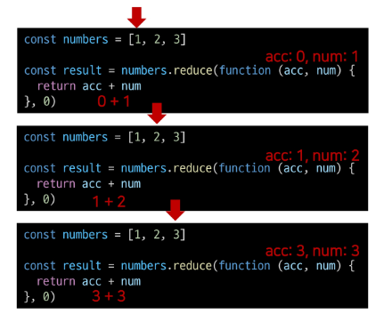

# 리액트에서 자주 사용하는 자바스크립트 문법
- 자바스크립트 문법을 알면 리액트가 작동하는 방식도 알 수 있음
- 개발 시에 자바스크립트 런타임이 항상 최신 자바스크립트 문법을 지원하는 것이 아니기 때문에 이를 고려해야함
- 이를 해결하기위해 나온 것이 **바벨** 이다

> ### 바벨 <br>
> - 자바스크립트의 최신 문법을 다양한 브라우저에서도 일관적으로 지원할 수 있도록 코드를 트랜스파일함 <br>
> - ES5를 기준으로 작성(인터넷 익스플로러를 지원하기 때문)<br>
> <br>


## 구조 분해 할당
- 배열 또는 객체의 값을 말 그대로 분해해 개별 변수에 즉시 할당하는 것
- 선언문 없이 즉시 분해해 변수를 선언하고 할당하고 싶을 때 사용
- 배열: ES6(ES2015)에 등장, 객체:ECMA 2018 등장

### 배열 구조 분해 할당

```js
const array = [1, 2, 3, 4, 5]

const [first, second, third, ...arrayRest] = array

/*
first 1
second 2
third 3
arrayRest [4, ]5
*/
```

- 대표적인 예) useState
```js
const [count, setCount] = useState(0);
```

- useState가 객체가 아닌 배열을 반환 하는 이유
    - 사용 시에 이름 변경이 어려움(객체)

- `,` 의 위치에 따라 값이 결정
    ```js
    const array = [1, 2, 3, 4, 5]
    const [first, , , , fifth] = array // 2,3,4는 아무런 표현식이 없으므로 변수 할당이 생략돼 있다(배열의 크기가 작은 경우만 사용)

    first // 1
    fifth // 5
    ```

    ```js
    const array = [1, 2]
    const [a=10, b=10, c=10] = array

    // a 1
    // b 2
    // c 10
    ```
- `undefined`일 경우 기본값을 사용(`e`의 경우 길이를 넘어 `undefined`로 평가)
    ```js
    const [a=1, b=1, c=1, d=1, e=1] = [undefined, null, 0, '']
    
    a // 1
    b // null
    c // 0
    d // ''
    e // 1
    ```
    - 특정값 이후 값을 다시금 배열로 선언(전개 연산자 `...`사용)
    ```js
    const array = [1,2,3,4,5]
    const [first, ...rest] = array

    // first 1
    // rest [2,3,4,5]
    ```
    - 앞 쪽은 어디서부터 어디까지 할당할지 예측이 불가능하므로 사용할 수 없음

- 바벨 트랜스파일 전/후 비교   
    ```js
    // 트랜스파일 하기 전
    const array = [1, 2, 3, 4, ,5] 
    const [first, second, third, ...arrayRest] = array

    // 트랜스파일된 결과
    var array = [1, 2, 3, 4, 5]
    var first = array[0],
    second = array[1],
    third = array[2],
    arrayRest = array.slice(3)
    ```

### 객체 구조 분해 할당
- 객체 내부 이름으로 꺼내옴

```js
const object = {
    a: 1,
    b: 2,
    c: 3,
    d: 4,
    e: 5,
}

const { a, b, c, ...objectRest } = object
// a 1
// b 2
// c 3
// objectRest = {d: 4, e: 5}
```

- 새로운 이름으로 할당
```js
const object = {
    a: 1,
    b: 2,
}

const { a: first, b: second } = object
// first 1
// second 2
```

- 기본값 설정
```js
const object = {
    a: 1,
    b: 1,
}

const { a = 10, b = 10, c = 10 } = object

// a 1
// b 1
// c 10
```

- 리액트 컴포넌트 props에서 값을 바로 꺼내올 때 매우 자주 쓰는 방식
```js
function SampleComponent({a, b}){
    return a + b
}

SampleComponent({a:3, b:5}) // 8
```

- 변수에 있는 값으로 꺼내오는 이른바 계산된 속성 이름방식도 가능
```js
const key = 'a'
const object = {
    a: 1,
    b: 1,
}

// [key] 문법 사용, 변수 네이밍 필요
const { [key]: a } = object
// 어느 변수명으로 할당할지 알 수 없음
const { [key] } = object // Ucaught SyntaxError : Unexpected token '['

// a = 1
```

- 전개 연산자 사용(`...`)
```js
const object = {
    a: 1,
    b: 1,
    c: 1,
    d: 1,
    e: 1,
}

const { a, b, ...rest } = object
// rest {c: 1, d: 1, e: 1}
```

- 바벨 트랜스파일
```js
// 트랜스파일 전
const object = {
    a: 1,
    b: 1,
    c: 1,
    d: 1,
    e: 1,
}

const { a, b, ... rest } = object

// 트랜스파일된 결과
function _objectWithoutPropeprties(source, excluded){
    if (source == null) return {}
    var target = _objectWithoutPropertiesLoose(source, excluded)
    var key, i
    if (Object.getOwnPropertySymbols) {
        var sourceSymbolKeys = Object.getOwnPropertySymbols(source)
        for (i = 0; i < sourceSymbolKeys.length; i++) {
            key = sourceSymbolKeys[i]
            if (excluded.indexOf(key) >= 0) continue
            if (!Object.prototype.propertyIsEnumerable.call(source, key)) continue
            target[key] = source[key]
        }
    }
    return target
}

function _objectWithoutPropertiesLoose(source, excoluded) {
    if (source == null) return {}
    var target = {}
    var sourceKeys = Object.keys(source)
    var key, i
    for (i=0 ; i < sourceKeys.length; i++){
        key = sourceKeys[i]
        if (excluded.indexOf(key) >= 0) continue
        target[key] = source[key]
    }
    return target
}

var object = {
    a: 1,
    b: 1,
    c: 1,
    d: 1,
    e: 1,
}

var a = object.a, b = object.b, rest = _objectWithoutProperties(object, ['a', 'b'])
```

## 전개 구문
- 배열이나 객체, 문자열과 같은 순회할 수 있는 값에 대해 말 그대로 전개해 간결하게 사용할 수 있는 구문이다.
- 배열의 전개 선언문
    ```js
    const arr1 = ['a', 'b']
    const arr2 = [...arr1, 'c', 'd', 'e'] // ['a', 'b', 'c', 'd', 'e']
    
    const arr1 = ['a', 'b']
    const arr2 = arr1

    arr1 === arr2 // true 내용이 아닌 참조를 복사하기 때문

    const arr1 = ['a', 'b']
    const arr2 = [...arr1]

    arr1 === arr2 // false, 실제 값만 복사됐을 뿐, 참조는 다르므로 false
    
    ```

- 객체의 전개 구문(**순서가 중요**)
    ```js
    const obj1 = {
        a: 1,
        b: 2,
    }

    const obj2 = {
        c: 3,
        d: 4,
    }

    const newObj = { ...obj1, ...obj2 }
    // { "a": 1, "b": 2, "c": 3, "d": 4}

    const obj = {
        a: 1,
        b: 1,
        c: 1,
        d: 1,
        e: 1,
    }

    const aobj = {
        ...obj,
        c: 10,
    }
    // {a: 1, b: 1, c:10, d: 1, e: 1}

    const bobj = {
        c: 10,
        ...obj,
    }
    // {a: 1, b: 1, c: 1, d: 1, e: 1}

    ```

- 바벨 트랜스파일 비교
    - 배열
    ```js
    // 트랜스파일하기 전
    const arr1 = ['a', 'b']
    const arr2 = [...arr1, 'c', 'd', 'e']

    // 트랜스파일된 결과
    var arr1 = ['a', 'b']
    var arr2 = [].concat(arr1, ['c', 'd', 'e'])
    ```
    
    - 객체
    ```js
    // 트랜스파일하기 전
    const obj1 = {
        a: 1,
        b: 2,
    }

    const obj2 = {
        c: 3,
        d: 4,
    }

    const newobj = {...obj1, ...ojb2}

    // 트랜스파일된 결과
    function ownKeys(object, enumerableOnly){
        var keys = Object.keys(object)
        if (Object.getOwnPropertySymbols) {
            var symbols = Object.getOwnPropertySymbols(object)
            enumerableOnly && (symbols = symbols.filter(function (sym) {
                return Object.getOwnPropertyDescriptor(object, sym).enumerable
            })),
            keys.push.apply(keys, symbols)
        }
        return keys
    }

    function _objectSpread(target) {
        for (var i = 1; i< arguments.length; i++){
            var source = null != arguments[i] ? arguments[i]: {}
            i % 2 ? ownKeys(Object(source), !0).forEach(function (key) {
                _defineProperty(target, key, source[key])
            }) : Object.getOwnPropertyDescriptors ? Object.defineProperties(
                target,
                Object.getOwnPropertyDescriptors(source), 
                )
            : ownKeys(Object(source)).forEach(function (key){
                Object.defineProperty(
                    target,
                    key,
                    Object.getOwnPropertyDescriptor(source, key),
                )
            })
        }
        return target
    }

    function _defineProperty(obj, key, value) {
        if (key in obj) {
            Object.defineProperty(obj, key, {
                value: value,
                enumerable: true,
                configurable: true,
                writable: true,
            })
        } else {
            obj[key] = value
        }
        return obj
    }

    var obj1 = {
        a: 1,
        b: 2,
    }

    var obj2 = {
        c: 3,
        d: 4,
    }

    var newObj = _objectSpread(_objectSpread({}, obj1), obj2)
    ```


## 객체 초기자
- 객체를 선언할 때, 객체에 넣고자 하는 키와 값을 가지고 있는 변수가 이미 존재한다면 해당 값을 간결하게 넣어줄 수 있는 방식
    ```js
    const a = 1
    const b = 2
    
    //
    // const obj = {
    //    a: a,
    //    b: b,
    // }
    //

    const obj = {
        a,
        b,
    }

    // {a: 1, b: 2}
    ```
- 바벨 트랜스코드

```js
// 트랜스파일하기 전
const a = 1
const b = 2

const obj = {
    a,
    b,
}

// 트랜스파일된 결과
var a = 1
var b = 1
var obj = {
    a: a,
    b: b,
}
```

## Array 프로토타임 메서드: map, filter, reduce, forEach
## 배열 메서드 기초

<table>
<tr>
<td style="text-align:center;">메서드</td>
<td style="text-align:center;">설명</td>
<td style="text-align:center;">비고</td>
</tr>
<tr>
<td>reverse</td>
<td><span style="color:skyblue;">원본 배열</span>의 요소들의 순서를 반대로 정렬</td>
<td></td>
</tr>
<tr>
<td>push & pop</td>
<td>배열의 <span style="color:skyblue;">가장 뒤에</span> 요소를 <span style="color:skyblue;">추가 또는 제거</span></td>
<td></td>
</tr>
<tr>
<td>unshift & shift</td>
<td>배열의 <span style="color:skyblue;">가장 앞에</span> 요소를 <span style="color:skyblue;">추가 또는 제거</span></td>
<td></td>
</tr>
<tr>
<td>includes</td>
<td>배열의 특정 값이 존재하는지 판별 후 <span style="color:skyblue;">참/거짓 반환</span></td>
<td></td>
</tr>
<tr>
<td>indexOf</td>
<td>배열의 특정 값이 존재하는지 판별 후 <span style="color:skyblue;">인덱스 반환</span></td>
<td>요소가 없을 경우 -1 반환</td>
</tr>
</table>

## 배열 메서드 심화
> Array Helper Methods
- 배열을 순회하며 특정 로직을 수행하는 메서드
- 메서드 호출시 인자로 `callback`함수를 받는 것이 특징
<table>
<tr style="text-align:center;">
<td>메서드</td>
<td>설명</td>
<td>비고</td>
</tr>
<tr>
<td><a href="#foreach">forEach</a></td>
<td style="color:skyblue;">배열의 각 요소에 대해 콜백 함수를 한 번씩 실행</td>
<td>반환 값 없음, 프로세스를 종료하지 않는 이상 멈출 수 없음</td>
</tr>
<tr>
<td><a href="#map">map</a></td>
<td><span style="color:skyblue;">콜백 함수의 반환 값</span>을 요소로 하는 <span style="color:skyblue;">새로운 배열 반환</span></td>
<td></td>
</tr>
<tr>
<td><a href="#filter">filter</a></td>
<td style="color:skyblue;">콜백 함수의 반환 값이 참인 요소들만 모아서 새로운 배열을 반환</td>
<td></td>
</tr>
<tr>
<td><a href="#reduce">reduce</a></td>
<td style="color:skyblue;">콜백 함수의 반환 값들을 하나의 값(acc)에 누적 후 반환</td>
<td></td>
</tr>
<tr>
<td><a href="#find">find</a></td>
<td>콜백 함수의 <span style="color:skyblue;">반환 값이 참이면 해당 요소를 반환</span></td>
<td><li>찾는 값이 배열에 없으면 <span style="color:skyblue">undefined</span> 반환</li><li>콜백 함수의 요소가 여러 개일 경우, 첫번째 요소 반환</li></td>
</tr>
<tr>
<td><a href="#some">some</a></td>
<td>배열의 <span style="color:skyblue;">요소 중 하나라도 판별 함수를 통과</span>하면 참 반환</td>
<td>빈 배열은 항상 <span style="color:skyblue;">false</span></td>
</tr>
<tr>
<td><a href="#each">each</a></td>
<td>배열의 <span style="color:skyblue;">모든 요소가 판별 함수를 통과</span>하면 참을 반환</td>
<td>빈 배열은 항상 <span style="color:skyblue;">true</span></td>
</tr>
</table>

### Arrya Helper Methods 예시
#### forEach
```javascript
// forEach
//                   배열의 요소, 배열 요소의 인덱스, 배열
array.forEach(function (element,       index,      array){
    // do something
})

const colors = ['red', 'blue', 'green'];
// 예시 1

printFunc = function (color) {
    console.log(color);
}
colors.forEach(printFunc)//

// red
// blue
// green

// 예시 2
color.forEach(function (color) {
    console.log(color);
})

// 예시 3
colors.forEach((color) => {
    return console.log(color);
})

// 예시 4
const arr = [1, 2, 3, 4, 5]
const Elements = arr.map((item) => {
    return <Fragment key={item}>{item}</Fragment>
})
```

#### map
```javascript
// map
//                배열의 요소, 배열 요소의 인덱스, 배열
array.map(function (element,       index,      array){
    // do something
})

const numbers = [1, 2, 3];
// 예시 1
// 함수 정의 (표현식)
const doubleFunc = function(number) {
    return number * 2;
}

// 함수를 다른 함수의 인자로 넣기( callback func )
const doubleNumbers = numbers.map(doubleFunc)
console.log(doubleNumbers)  // [2, 4, 6]

// 예시 2 함수 정의를 인자로 넣어보기
const doubleNumbers = numbers.map(function (number) {
    return number * 2
})
console.log(doubleNumbers) // [2, 4, 6]

// 예시 3 화살표 함수 적용하기
const doubleNumbers = numbers.map((number) => {
    return number * 2;
})
console.log(doubleNumbers)  // [2, 4, 6]
```

#### filter
```javascript
// filter
//                배열의 요소, 배열 요소의 인덱스, 배열
array.filter(function (element,       index,      array){
    // do something
})

const products = [
    {name: 'cucumber', type: 'vegetable'},
    {name: 'banana', type: 'fruit'},
    {name: 'carrot', type: 'vegetable'},
    {name: 'apple', type: 'fruit'},
];
// 예시 1
// 함수 정의 (표현식)
const fruitFilter = function(product) {
    return product.type === 'fruit';
}

// 함수를 다른 함수의 인자로 넣기( callback func )
const fruits = products.filter(fruitFilter)
console.log(fruits)
//[ {name: 'banana', type: 'fruit'}, {name: 'apple', type: 'fruit'} ]

// 예시 2 함수 정의를 인자로 넣어보기
const fruits = products.filter(function (product) {
    return product.type === 'fruit';
})
console.log(fruits)
//[ {name: 'banana', type: 'fruit'}, {name: 'apple', type: 'fruit'} ]

// 예시 3 화살표 함수 적용하기
const fruits = products.filter((product) => {
    return product.type === 'fruit';
})
console.log(fruits)
//[ {name: 'banana', type: 'fruit'}, {name: 'apple', type: 'fruit'} ]
```

#### reduce
```javascript
// reduce
//             누적할 변수, 배열의 요소, 배열 요소의 인덱스, 배열
array.reduce(function (acc,   element,       index,      array){
    // do something
}, initialValue)    //  누적할 변수 시작 값
// initialValue 생략 -> 첫번째 요소 값
// 빈 배열의 경우 에러발생

const tests = [90, 90, 80, 77];
// 총합을 구해보자
// 예시 1
// 함수 정의 (표현식)
const sum = tests.reduce(function (total, x){
    return total+x;
}, 0)   // 0 생략 가능
// 337


// 예시 2 화살표 함수
const sum = tests.reduce((total, x) => total+x, 0)   // 0 생략 가능
console.log(fruits) // 337

// 평균
const sum = tests.reduce((total, x) => total+x, 0) / tests.length;  
console.log(fruits) // 84.25
```
- 동작 과정
<div style="text-align:center; padding-top:10px; padding-bottom:10px;">
    
</div>

#### find
```javascript
// find
//                배열의 요소, 배열 요소의 인덱스, 배열
array.find(function (element,       index,      array){
    // do something
}) 

const avengers = [
    {name: 'Tony Stark', age: 45},
    {name: 'Steve Rogers', age: 32},
    {name: 'Thor', age: 40},
];

// 예시 1
// 함수 정의 (표현식)
const avenger = tests.find(function (avenger){
    return avenger.name === 'Tony Stark';
});
console.log(avenger) ;       // {name: 'Tony Stark', age: 45}


// 예시 2 화살표 함수
const avenger = tests.find((avenger) => {
    return avenger.name === 'Tony Stark';
});
console.log(avenger);       // {name: 'Tony Stark', age: 45}
```


#### some
```javascript
// some
//                배열의 요소, 배열 요소의 인덱스, 배열
array.some(function (element,       index,      array){
    // do something
}) 

const arr = [1, 2, 3, 4, 5];

// 예시 1
// 함수 정의 (표현식)
const result = arr.some(function (elem){
    return elem % 2;
}); 
console.log(result) ;       // true


// 예시 2 화살표 함수
const result = arr.some((elem) => {
    return elem % 2; 
}); 
console.log(result) ;       // true
```
#### every
```javascript
// every
//                배열의 요소, 배열 요소의 인덱스, 배열
array.every(function (element,       index,      array){
    // do something
}) 

const arr = [1, 2, 3, 4, 5];

// 예시 1
// 함수 정의 (표현식)
const result = arr.every(function (elem){
    return elem % 2 === 0;
}); 
console.log(result) ;       // false


// 예시 2 화살표 함수
const result = arr.some((elem) => {
    return elem % 2 === 0; 
}); 
console.log(result) ;       // false
```


## 삼항 조건 연산자
```js
const value = 10
            // 조건문    ?   참일 때 값 : 거짓일 때 값
const result = value % 2 === 0 ? "짝수" : "홀수"
// 짝수

// ex
function Component({ condition }) {
    return <>{condition ? '참' : '거짓'}</>
}

// 삼항 연산자 중첩(권장하지 않음)
const value = useMemo(
    () => (condition1 ? '1' : condition2 ? '2' : condition3 ? '3' : 'else'),
    [condition1, condition2, condition3],
)
```

## 정리
- [참조: ECMAScript 신규문법](https://github.com/tc39/proposals)

> ### 바벨 <br>
> - 자바스크립트의 최신 문법을 다양한 브라우저에서도 일관적으로 지원할 수 있도록 코드를 트랜스파일함 <br>
> - ES5를 기준으로 작성(인터넷 익스플로러를 지원하기 때문)<br>
> <br>

### 구조 분해 할당 / 전개 구문
|구분|배열|객체|
|:---:|:---|:---|
|공통점|`...` 연산자를 사용 |기본값 사용 가능|
||주소를 전달하는 게 아닌 값을 전달|이름 설정 가능|
||||
|이름 변경|쉬움|어려움|
|바벨 변환|간단함|복잡합|

### 객체 초기자
- `{a:a, b:b}` ➡️ `{a, b}`로 간단히 쓸 수 있음
- 바벨 변환도 간단하여 언제든지 사용 가능

### [Array Method](#array-프로토타임-메서드-map-filter-reduce-foreach)

### 삼항 연산자
- 중첩은 사용 지양
- `조건식 ? 참 : 거짓` 형식으로 사용