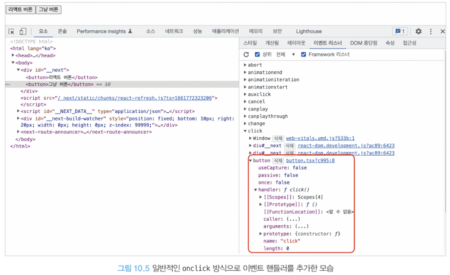
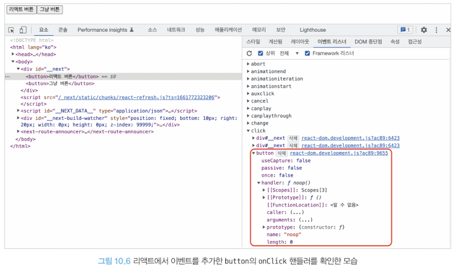
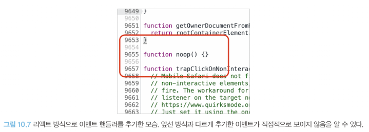
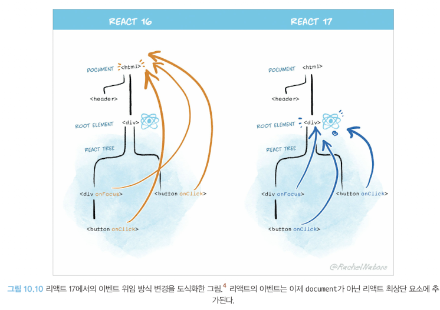
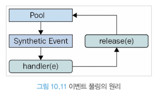
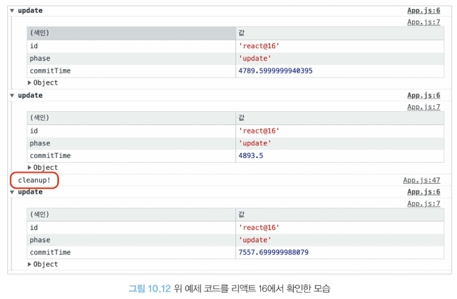

# 리액트 17버전 살펴보기

- 새롭게 추가된 기능은 없음
- 호환성이 깨지는 변경 사항(기존에 사용하던 코드 수정을 필요로하는 사항)을 최소로 함
- 대부분의 애플리케이션에서 업그레이드 가능

## 리액트의 점진적 업그레이드

- 리액트는 유의적 버전(semantic version, 주.부.수에 의거하는 버전 형식)에 의거하고 있으며, 16버전에서 17버전으로 넘어오는데 레거시 코드를 기반으로 하는 웹 애플리케이션 관리자 입장에선 쉽지 않은 결정이다.(버전 변환에 있어 업그레이드 하거나 안 하거나 둘 중 하나밖에 없다)
- 17버전 이후로는 점진적 업그레이드를 제공(기능별로 버전 적용 가능)

- [예제 링크](https://github.com/wikibook/react-deep-dive-example/blob/main/chapter10/react-gradual-demo/)

- 리액트 16과 17 같은 경우, 두 버전을 모두 지원하는 훅이나 컴포넌트는 두 리액트에서 모두 사용가능(Context도 해당)

> Note that this approach is meant to be an escape hatch, not the norm. ...Always prefer using one React if you can.
>
> (번역) 이 접근 방식은 어디까지나 일반적인 접근 방식이 임시방편이라는 것을 알아두어야 한다. ... 대부분 가능한 하나의 리액트 버전을 사용하는 것이 좋다.

## 이벤트 위임 방식의 변경

- 리액트의 이벤트 추가 방식

```tsx
import { useEffect, useRef } from "react";

export default function Button() {
  const buttonRef = useRef<HTMLButtonElement | null>(null);

  useEffect(() => {
    if (buttonRef.current) {
      buttonRef.current.onclick = function click() {
        alert("안녕하세요!");
      };
    }
  }, []);

  return (
    <>
      <button onClick={안녕하세요}>리액트 버튼</button>
      <button onClick={buttonRef}>그냥 버튼</button>
    </>
  );
}
```

### 리액트와 바닐라 JS의 이벤트 등록의 차이

- 바닐라 JS
  

- 버튼 `click`으로 리스너에 추가

- 리액트
  

- 버튼 `noop`함수로 리스너에 추가



- 이벤트 타입(click, change)당 하나의 핸들러를 루트에 부착(**이벤트 위임**)

> 이벤트 위임
>
> - 캡처(capture): 이벤트 핸들러가 트리 최상단 요소에서 부터 시작해서 실제 이벤트가 발생한 타깃 요소까지 내려가는것을 의미
> - 타깃(targee): 이벤트 핸들러가 타킷 노드에 도달하는 단계, 이 단계에서 이벤트 호출
> - 버블링(bubbling): 이벤트가 발생한 요소부터 시작해 최상위 요소까지 다시 올라감
> - 이벤트 위임: 이벤트 단계의 원리를 활용해 이벤트를 상위 컴포넌트에만 붙이는 것을 의미

### 리액트 16과 17의 이벤트 등록 차이

- 16버전: 이벤트 위임이 모두 `document`에서 수행
- 17버전: 이벤트 위임이 모드 `root` 요소에서 수행

- 방식이 바뀐 이유

  1. 점진적인 업그레이드의 지원
  2. 바닐라 자바스크리브 코드 또는 jQuery 등이 혼재돼 있는 경우 혼란을 방지하기 위함

- 16버전 방식

  ```tsx
  import React from 'react'; // 16.14
  import ReactDOM from 'react-dom'; // 16.14

  function React164() {
      function App () {
          function 안녕하세요(){
              alert('안녕하세요! 16.14');=
          }
          return <button onClick={안녕하세요}>리액트 버튼</button>;
      }
      return ReactDOM.render(<App/>, document.getElementById('React-16-14'));
  }

  import React from 'react'; // 16.8
  import React from 'react-dom'; // 16.8

  function React168() {
      function App() {
          function 안녕하세요(){
              alert('안녕하세요! 16.8');
          }
          return <button onClick={안녕하세요}>리액트 버튼</button>
      }
      return ReactDOM.render(<App />, document.getElementId('React-16-8'));
  }
  ```

  - 렌더링 코드

  ```html
  <html>
    <body>
      <div id="React-16-14">
        <div id="React-16-8"></div>
      </div>
    </body>
    <html></html>
  </html>
  ```

  - 16버전 이벤트 위임에 의해 모두 `document`에 이벤트가 등록되고, `React168`에서 `e.stopPropagation` 실행 시 `React164`에 이벤트가 전파된다.(`e.stopPropagation` 실행되지만 역할을 못함)

  - 리액트 버전끼리만 일어나는 것이 아닌 바닐라 자바스크립트나 jQuery에서도 똑같은 문제 발생

  - 그렇다고 document와 리액트가 렌더링되는 루트 컴포넌트 사이에서 이벤트를 막는 코드를 추가하면 모든 핸들러가 작동하지 않도록 막을 수 있었다.

  

### 주의할 점

- 다음 코드는 리액트 16버전과 17버전에서 다르게 동작하는데,`e.stopPropagation()`이 16버전에선 이벤트가 `document`에 등록되어 있어 상관없지만 17버전의 경우 `console.log()`를 볼 수 없다

```tsx
import React, { MouseEvent, useEffect } from "react";
import ReactDOM from "react-dom";

export default function App() {
  useEffect(() => {
    document.addEventListener("click", (e) => {
      console.log("이벤트가 document까지 올라옴");
    });
  }, []);

  function 안녕하세요(e: MouseEvent<HTMLButtonElement>) {
    // 이 부분
    e.stopPropagation();
    alert("안녕하세요!");
  }

  return <button onClick={안녕하세요}>리액트 버튼</button>;
}

ReactDOM.render(<App />, document.getElementById("root"));
```

## import React from 'react'가 더 이상 필요 없다: 새로운 JSX transform

- 기존 React 16버전까지는 `import React from 'react'`문이 없다면 에러가 발생
- React 17버전 이후 부턴 `import React`와 불필요한 import 구문을 삭제해 번들링 크기를 약간 줄일 수 있고 컴포넌트 작성을 더욱 간결하게 해준다.

### JSX 변환 비교

```jsx
const Component = (
  <div>
    <span>hello world</span>
  </div>
);
```

- 17 이전 버전

  ```js
  var Component = React.createElement(
    "div",
    null,
    React.createElement("span", null, "hello world")
  );
  ```

- 17 버전 이후

  ```jsx
  'use strict'

  var _jsxRuntime = require('react/jsx-runtime')

  var Component = (0, _jsxRuntime.jsx)('div', {
      children: (0, _jsxRuntime.jsx)('span, {
          children: 'hello world',
      }),
  })
  ```

- 변경사항
  1. `React.createElement` 구문의 삭제
     - jsx의 경우 key를 추론하고 props를 설정하는 작업
     - createElement의 경우 defaultProps 확인 등 여러 작업을 동시 수행
  2. `require()` 구문 추가
     - 이로 인해 import React 구문이 삭제할 수 있어 번들 사이즈가 조금이나마 줄어듬

## 그 밖의 주요 변경사항

### 이벤트 풀링 제거

> 이벤트 풀링
>
> - 리액트 이벤트를 처리하기 위한 SyntheticEvent
>   - 브라우저 기본 이벤트가 아닌 한번 래핑한 이벤트를 사용하기 때문에 이벤트가 발생할 때마다 이벤트를 새로 만들어야 했고, 그 과정에서 항상 메모리 할당 작업이 일어날 수 밖에 없음
>   - 메모리 누수를 방지하기 위해 이벤트를 주기적으로 해제해야하는 번거로움이 있음
> - SyntheticEvent 풀을 만들어서 이벤트가 발생할 때마다 가져오는 것을 의미



- 이벤트 발생

  1. 이벤트 핸들러가 이벤트를 발생
  2. 합성 이벤트 풀에서 합성 이벤트 객체에 대한 참조를 가져온다.
  3. 이 이벤트 정보를 합성 이벤트 객체에 넣어준다.
  4. 유저가 지정한 이벤트 리스너가 실행된다.
  5. 이벤트 객체가 초기화(null로 변경)되고 다시 이벤트 풀로 돌아간다.

- 위 과정에서 비동기 코드 내부에서 SyntheticEvent인 e에 접근하면 이미 사용되고 초기화된 이후이기 때문에 null만 얻음
- 따라서 추가적인 작업이 필요함(`e.persist()`와 같은)

```tsx
export default function App() {
  const [value, setValue] = useState("");
  function handleChange(e: ChangeEvent<HTMLInputElement>) {
    setValue(() => {
      e.persist(); // 비동기 코드 내부에서 합성 이벤트 e에 접근하기 위한 추가적인 작엄
      return e.target.value;
    });
  }
}
```

- 이벤트 풀링이 제거된 이유
  1. 비동기 코드로 이벤트 핸들러에 접근하기 위해 별도 메모리 공간에 합성 이벤트 객체를 할당해야함
  2. 모든 브라우저에서는 이와 같은 방식이 성능 향상에 도움이 안됨(모던 브라우저에서는 성능이 많이 개선되어 풀링 처리의 의미가 퇴색)

### useEffet 클린업 함수의 비동기 실행

- 17 이전까지는 동기적 실행(클린업 함수가 끝나지 않으면 본 함수를 실행하지 않음): **성능 저하**
- 17 이후 버전에서는 화면이 완전히 업데이트된 이후에 클린업 함수가 비동기적으로 실행(컴포넌트의 커밋 단계가 완료될 때까지 지연)

- 업데이트 비교(`update`: 리렌더링) : **commitTime이 조금 빨라짐**
  
  

### 컴포넌트의 undefined 반환에 대한 일관적인 처리

- 컴포넌트 내부에서 undefined를 반환하면 오류가 남
- 하지만 forwardRef나 memo에서 undefined를 반환하는 경우는 오류가 안남

- 17버전에서 모든 상황에서 undefined를 반환하면 오류가 남(18버전부터는 안 남)

## 정리

- 모든 변경사항이 있는 것은 아니며(주요 변경 사항만 다룸) 공식문서를 통해 모든 변경 사항을 확인 가능

### 모아보기

|             변경사항              | 내용                                                                                      |                             비고                              |
| :-------------------------------: | :---------------------------------------------------------------------------------------- | :-----------------------------------------------------------: |
|         점진적 업그레이드         | ㅁ 17버전 이후에는 여러 버전의 React를 동시에 렌더링 가능                                 |                                                               |
|      이벤트 위임 방식의 변경      | ㅁ 17버전 이후 이벤트 핸들러를 `root` 요소를 기준으로 등록                                | 기본적으로 리액트의 이벤트는 noop 함수에 등록하여 버블링 활용 |
|      jsx 파일 변환 방식 변경      | ㅁ `import React` 제거 가능 (번들 파일 용량 감소)<br> ㅁ 불필요한 처리방식 제거           |                                                               |
|         이벤트 풀링 제거          | ㅁ 비동기 함수 내부에서 통합 이벤트 객체 접근 시 추가 작업 제거 가능                      |                                                               |
| useEffect 클린업 함수 비동기 실행 | 클린업 함수 실행 방식 변경에 따른 commitTime 감소(commit 단계 보장)                       |                                                               |
| 컴포넌트 undefined 반환 일괄 처리 | ㅁ 기존 memo나 forwardRef에서 undefined를 반환하면 오류가 나지 않는 상황을 오류 나게 만듦 |                     18버전 부턴 오류 안남                     |
