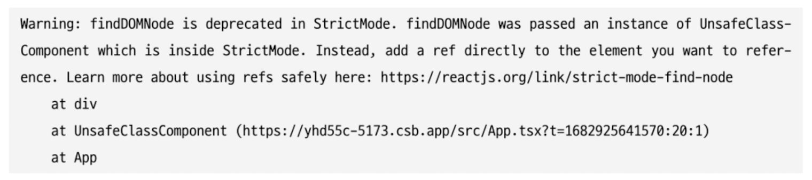

# 리액트 18버전 살펴보기

## 새로 추가된 훅 살펴보기

### useId

- 컴포넌트별로 유니크한 값을 생성하는 훅
- 하나의 컴포넌트가 여러 군데에서 재사용되는 경우도 고려해야 하며, 리액트 컴포넌트 트리에서 컴포넌트가 가지는 모든 값이 겹치지 않고 다 달라야 한다는 제약이 있음

- 리액트 useId를 활용한 아이디 생성 알고리즘

1. 현재 트리에서 자신의 위치를 나타내는 32글자 이진 문자열로 이뤄짐
2. 왼쪽 5자리가 부모의 트리를 나타내며, R(서버), r(클라이언트)로 생성된 위치에 따라 나눠진다.

### useTransition

- UI 변경을 가로막지 않고 상태를 업데이트할 수 있는 리액트 훅
- 상태 업데이트를 긴급하지 않은 것으로 간주해 무거운 렌더링 작업을 조금 미룰 수 있으며, 사용자에게 조금 더 나은 사용자 경험을 제공할 수 있다.

```tsx
// App.tsx
type Tab = "about" | "posts" | "contact";

export default function App() {
  const [tab, setTab] = useState<Tab>("about");

  function selectTab(nextTab: Tab) {
    setTab(nextTab);
  }

  return (
    <>
      <TabButton isActive={tab === "about"} onClick={() => selectTab("about")}>
        Home
      </TabButton>
      <TabButton isActive={tab === "posts"} onClick={() => selectTab("posts")}>
        Posts (slow)
      </TabButton>
      <TabButton
        isActive={tab === "contact"}
        onClick={() => selectTab("contact")}
      >
        Contact
      </TabButton>
      <hr />

      {/* 일반적인 컴포넌트 */}
      {tab === "about" && <About />}
      {/* 매우 무거운 연산이 포함된 컴포넌트 */}
      {tab === "posts" && <Posts />}
      {/* 일반적인 컴포넌트 */}
      {tab === "contact" && <Contact />}
    </>
  );
}

// PostTab.tsx
import { memo } from "react";

const PostsTab = memo(function PostsTab() {
  const items = Array.from({ length: 1500 }).map((_, i) => (
    <SlowPost key={i} index={i} />
  ));

  return <ul className="items">{items}</ul>;
});

function SlowPost({ index }: { index: number }) {
  let startTime = performance.now();
  // 렌더링이 느려지는 상황을 가정하기 위해 느린 코드를 추가
  while (performance.now() - startTime < 1) {
    // 아무것도 하지 않음
  }

  return <li className="item">Post #{index + 1}</li>;
}

export default PostsTab;
```

> 문제 발생: Post 선택 후 바로 Contact를 선택 시 브라우저가 멈춤

- 원인
  - `setTab`이라는 상태 업데이트로 인해 Post 렌더링 작업이 UI 렌더링을 가로막음
- 해결방안
  - useTransition 사용
- 코드

  ```tsx
  import { useState, useTransition } from "react";
  // ...

  export default function TabContainer() {
    // isPending: 상태 업데이트가 진행 중인지 확인할 수 있는 boolean
    // startTransition: 긴급하지 않은 상태 업데이트로 간주할 set 함수를 넣어둘 수 있는 함수를 인수로 받음(여러 개 설정 가능)
    // 비동기 방식 처리
    const [isPending, startTransition] = useTransition();
    const [tab, setTab] = useState<Tab>("about");

    function selectTab(nextTab: Tab) {
      startTransition(() => {
        setTab(nextTab);
      });
    }

    return (
      <>
        {/* ... */}
        {isPending ? (
          "로딩 중"
        ) : (
          <>
            {tab === "about" && <About />}
            {tab === "posts" && <Posts />}
            {tab === "contact" && <Contact />}
          </>
        )}
      </>
    );
  }
  ```

> useTransition 사용 시 주의사항

- startTransition 내부는 반드시 setState와 같은 상태를 업데이트하는 함수와 관련된 작업만 넘길 수 있다. 만약 props나 사용자 정의 훅에서 반환하는 값 등을 사용하고 싶다면 `useDeferredValue`를 사용
- **startTransition으로 넘겨주는 상태 업데이트는 다른 모든 동기 상태 업데이트로 인해 실행이 지연될 수 있다**. 에를 들어, 타이핑으로 인해 setState가 일어나는 경우 타이핑이 끝날 때까지 useTransition으로 지연시킨 상태 업데이트는 일어나지 않는다.
- **startTransition으로 넘겨주는 함수는 반드시 동기 함수여야 한다.** 만약 이 안에 setTimeout과 같은 비동기 함수를 넣으면 제대로 작동하지 않게 된다. 이는 startTransition이 작업을 지연시키는 작업과 비동기로 함수가 실행되는 작업 사이에 불일치가 일어나기 때문

### useDeferred

- 리액트 컴포넌트 트리에서 리렌더링이 급하지 않은 부분을 지연할 수 있게 도와주는 훅
- **디바운스(특정 시간 동안 발생하는 이벤트를 하나로 인식해 한 번만 실행하게 해줌)와 비슷**

> 디바운스와의 차이

- 디바운스는 고정된 지연 시간이 필요하지만 **`useDeferredValue`는 고정된 지연 시간 없이 첫 번째 렌더링이 완료된 이후에 이 `useDeferredValue`로 지연된 렌더링을 수행**
- 지연된 렌더링은 중단될 수 있음
- 사용자 인터랙션을 차단하지 않음

```tsx
export default function Input() {
  const [text, setText] = useState("");
  const deferredText = useDeferredValue(text);

  const list = useMemo(() => {
    const arr = Array.from({ length: deferredText.length }).map(
      (_) => deferredText
    );
    return (
      <ul>
        {arr.map((str, index) => (
          <li key={index}>{str}</li>
        ))}
      </ul>
    );
  }, [deferredText]);

  function handleChange(e: ChangeEvent<HTMLInputElement>) {
    setText(e.target.value);
  }
  return (
    <>
      <input value={text} onChange={handleChange} />
      {list}
    </>
  );
}
```

> useDeferredValue vs useTransition

- 낮은 우선순위로 처리해야 할 작업에 대해 직접적으로 상태를 업데이트할 수 있는 코드에 접근 가능 → `useTransition`
- 컴포넌트의 props와 같이 상태 업데이트에 관여할 수는 없고 오로지 값만 받아야하는 상황 → `useDeferredValue`

### useSyncExternalStore

- React 17버전의 `useSubscription`를 대체하는 함수
- 테어링 현상을 해결하기 위한 훅

> 테어링(tearing)

- 영어로 *찢어진다*라는 뜻으로 하나의 state 값이 있음에도 서로 다른 값(보통 state나 props의 이전과 이후)을 기준으로 렌더링되는 현상
- 리액트 18버전의 동시성 지원 이후 동시성 이슈가 발생할 수 있음

  

- 그림 설명
  1. 첫 번째 컴포넌트에서는 외부 데이터 스토어의 값이 파란색이었으므로 파란색을 렌더링
  2. 그리고 나머지 컴포넌트도 파란색으로 렌더링 준비
  3. 그러다 갑자기 외부 데이터 스토어의 값이 빨간색으로 변경됌
  4. 나머지 컴포넌트들은 렌더링 도중 바뀐 색을 확인해 빨간색으로 렌더링
  5. 결과적으로 같은 데이터 소스를 바라보고 있음에도 컴포넌트의 색상이 달라지는 테어링 현상 발생.

> 리액트 17버전과의 비교

- 18버전 이전에는 데이터 업데이트와 상관없이 렌더링이 동기적으로 한 번에 발생해 문제가 없었음
- 18버전 이후, 리액트 동시성 업데이트에 의해 렌더링이 중간에 멈춰있다 다시 실행하는 등 양보하는 것이 가능해져 발생하는 문제
- 앞선 훅(useTransition, useDeferredValue)의 경우는 내부적으로 처리되어있지만, 클로저 외부 데이터에 의한 문제는 해결할 수 없음

> useSyncExternalStore

- 외부 값을 렌더링하기 위한 작동 방식이 담겨있음(subscribe나 Object.is를 통한 비교)
- useSyncExternalStore 어딘가에 콜백을 등록하고, 콜백 호출 시마다 렌더링을 트리거하는 장치가 마련되어 있음

```tsx
import { useSyncExternalStore } from "react";
const snapshot = useSyncExternalStore(subscribe, getSnapshot, getServerSnapshot?);
// useSyncExternalStore(
//     subscribe: (callback) => Unsubscribe
//     getSnapshot: () => State
// ) => State
```

- 첫번째 인수: `subscribe`
  - 콜백 함수를 받아 스토어에 등록하는 용도
  - 스토어에 있는 값이 변경되면 이 콜백이 호출돼야 함
  - useSyncExternalStore는 이 훅을 사용하는 컴포넌트를 리렌더링
- 두번째 인수: `getSnapshot`
  - 컴포넌트에 필요한 현재 스토어의 데이터를 반환하는 함수
  - 스토어가 변경되지 않았다면 매번 함수를 호출할 때마다 동일한 값을 반환해야함
  - 이 값을 이전 값과 `Object.is`로 비교해 정말로 값이 변경됐다면 컴포넌트 리렌더링
- 마지막 인수(option)

  - 서버 사이드 렌더링 시에 내부 리액트를 하이드레이션하는 도중에만 사용
  - 서버 사이드에서 렌더링되는 훅이라면 반드시 이 값을 넘겨줘야 함(클라이언트 값과 불일치시 오류 발생)

- 사용예제

  ```tsx
  import { useSyncExternalStore } from "react";

  function subscribe(callback: (this: Window, ev: UIEvent) => void) {
    window.addEventListener("resize", callback);
    return () => {
      window.removeEventListener("resize", callback);
    };
  }

  export default function App() {
    const windowSize = useSyncExternalStore(
      subscribe,
      () => window.innerWith,
      () => 0 // 서버 사이드 렌더링 시 제공되는 기본값
    );

    return <>{windowSize}</>;
  }
  ```

- 사용자 훅으로 만들기

  ```tsx
  import { useSyncExternalStore } from "react";

  function subscribe(callback: (this: Window, ev: UIEvent) => void) {
    window.addEventListener("resize", callback);
    return () => {
      window.removeEventListener("resize", callback);
    };
  }

  function useWindowWidth() {
    return useSyncExternalStore(
      subscribe,
      () => window.innerWith,
      () => 0 // 서버 사이드 렌더링 시 제공되는 기본값
    );
  }

  export default function App() {
    const windowSize = useWindowWidth();
    return <>{windowSize}</>;
  }
  ```

- useSyncExteranlStore 없이 구현하기

  ```tsx
  function useWindowWidth() {
    const [windowWdth, setWindowWidth] = useState(0);
    useEffect(() => {
      function handleResize() {
        setWindowWidth(window.innerWidth);
      }

      window.addEventListener("resize", handleResize);
      return () => window.removeEventListener("resize", handleResize);
    }, []);
    return windowWidth;
  }
  ```

> 두 가지 방식의 차이

- useSyncExternalStore을 사용해야 테이링 현상이 일어나지 않음

```tsx
// posts..
const PostsTab = memo(function PostsTab() {
  const width1 = useWindowWidthWithSyncExternalStore();
  const width2 = useWindowWidth();
  const items = Array.from({ length: 1500 }).amp((_, i) => (
    <SlowPost key={i} index={i} />
  ));

  return (
    <>
      <div>useSyncExternalStore {width1}px</div>
      <div>useEffect + useState {width2}px</div>
      <ul className="items">{items}</ul>
    </>
  );
});

export default PostsTab;
```

### useInsertionEffect

- CSS-in-js 라이브러리를 위한 훅
- 서버 사이드 렌더링에서 styled-components 사용 시, 서버 사이드 렌더링 이전에 `<style>`태그 삽입하는 작업(실제로 무거운 작업)이 발생하지 않도록 서버 사이드에서 스타일 코드를 삽입했음
- 이를 훅으로 처리하는 것이 쉽지 않았는데 **훅에서 이러한 작업을 할 수 있도록 도와주는 훅이 useInsertionEffect**

> 기본 구조: useEffect와 비슷

- 실행 시점: DOM이 실제로 변경되기 전에 동기적으로 실행
- 훅 내부에 스타일을 삽입하는 코드를 집어 넣으면 브라우저가 레이아웃을 계산하기 전에 실행될 수 있게끔 좀 더 자연스러운 스타일 삽입이 가능

> useEffect, useLayoutEffect, useInsertionEffect 실행 순서 비교

- useEffect: DOM 변경 작업 이후, paint 작업 이후
- useLayoutEffect: 모든 DOM의 변경 작업이 다 끝난 이후, paint 이전 실행
- useInsertionEffect: DOM 변경 작업 이전에 실행

```tsx
function Index() {
  useEffect(() => {
    console.log("useEffect!"); // 3
  });
  useLayoutEffect(() => {
    console.log("useLayoutEffect!"); // 2
  });
  useInsertionEffect(() => {
    console.log("useInsertionEffect!"); // 1
  });
}
```

> 주의사항

- 실제 애플리케이션 코드를 작성할 때 사용될 일이 거의 없음(라이브러리 제외)

## react-dom/client

- 클라이언트에서 리액트 트리를 만들 때 사용되는 API가 변경
- 만약 리액트 18 이하 버전에서 만든 cra로 프로젝트를 유지보수 중이라면 리액트 18로 업그레이드할 때 반드시 `index.{t|j}sx에 있는 내용을 변경해야함

### createRoot

- 기존 react-dom에 있던 `render` 메서드를 대체할 새로운 메서드
- 리액트 18버전에선 `createRoot`와 `render`를 함께 사용

```tsx
// before
import ReactDOM from "react-dom";
import App from "App";

const container = document.getElementById("root");

ReactDOM.render(<App />, container);

// after
import ReactDOM from "react-dom";
import App from "App";

const container = document.getElementById("root");

const root = ReactDOM.createRoot(container);
root.render(<App />);
```

### hydrateRoot

- 서버 사이드 렌더링 애플리케이션에서 하이드레이션을 하기 위한 새로운 메서드
- ReactDOM 서버 API와 함께 사용
- 대부분의 서버 사이드 렌더링은 프레임 워크에 의존하고 있을 것이므로 사용하는 쪽에서 수정할 일은 거의 없음
- 다만 자체적으로 서버 사이드 렌더링을 구현해서 사용한다면 이 부분을 수정

```tsx
// before
import ReactDOM from "react-dom";
import App from "App";

const container = document.getElementById("root");

ReactDOM.render(<App />, container);

// after
import ReactDOM from "react-dom";
import App from "App";

const container = document.getElementById("root");

const root = ReactDOM.hydrateRoot(container, <App />);
```

- API가 변경된 것 외에도 추가로 두 API는 새로운 옵션인 `onRecoverableError`를 인수로 받는다.
- 이 옵션은 리액트가 렌더링 또는 하이드레이션 과정에서 에러가 발생했을 때 실행하는 콜백 함수이다.(default: reportError || console.error)

## react-dom/server

### renderToPipeableStream

- 리액트 컴포넌트를 HTML로 렌더링하는 메서드
- 스트림을 지원하는 메서드로, HTML을 점진적으로 렌더링하고 클라이언트에서는 중간에 script를 삽입하는 등의 작업을 할 수 있음
- Suspense를 사용해 빠르게 렌더링 가능
- 값비싼 연산으로 구성된 부분은 이후에 렌더링되게끔 가능

```tsx
import * as React from "react";

// res는 HTTP 응답
function render(url, res) {
  let didError = false;
  // 서버에서 필요한 데이터를 불러옴
  // 그리고 여기에서 데이터를 불러온느 데 오랜 시간이 걸린다고 가정
  const data = createServerData();
  const steam = renderToPipeableStream(
    // 데이터를 context API로 넘긴다.
    <DataProvider data={data}>
      <App assets={assets} />
    </DataProvider>,
    {
      // 렌더링 시에 포함시켜야 할 자바스크립트 번들
      bootstrapScripts: [assets["main.js"]],
      onShellReady() {
        // 에러 발생 시 처리 추가
        res.statuscode = didError ? 500 : 200;
        res.setHeader("Content-type", "text/html");
        stream.pipe(res);
      },
      onError(x) {
        didError = true;
        console.error(x);
      },
    }
  );
  // 렌더링 시작 이후 일정 시간이 흐르면 렌더링에 실패한 것으로 간주하고 취소
  setTimeout(() => stream.abort(), ABORT_DELAY);
}
export default function App({ assets }) {
  return (
    <Html assets={assets} title="Hello">
      <Suspense fallback={<Spinner />}>
        <ErrorBoundary FallbackComponent={Error}>
          <Content />
        </ErrorBoundary>
      </Suspense>
    </Html>
  );
}

function Content() {
  return (
    <Layout>
      <NavBar />
      <article className="post">
        <section className="comments">
          <h2>Comments</h2>
          <!-- 데이터가 불러오기 전에 보여줄 컴포넌트 -->
          <Suspense fallback={<Spinner />}>
            <!-- 데이터가 완료된 후에 노출되는 컴포넌트 -->
            <Comments />
          </Suspense>
        </section>
        <h2>Thanks for reading!</h2>
      </article>
    </Layout>
  );
}
```

- 로딩

```html
<main>
  <article class="post">
    <!--$-->
    <h1>Hello world</h1>
    <!-- ... -->
    <section class="comments">
      <h2>Comments</h2>
      <template id="B:0"></template>
      <!-- Suspense의 fallback이 온다 -->
      <div
        class="spinner spinner--active"
        role="progressbar"
        aria-busy="true"
      ></div>
    </section>
    <h2>Thanks for reading!</h2>
  </article>
</main>
```

> 개선사항

- 기존 renderToNodeStream의 문제는 무조건 렌더링을 순서대로 해야 하고, 그리고 그 순서에 의존적이기 대문에 이전 렌더링이 완료되지 않았다면 이후 렌더링도 끝나지 않음
- 개선: 오래 걸리는 렌더링에 영향 받을 필요 없이 빠르게 렌더링 가능

### renderToReadableStream

- renderToPipeableStream: Node.js 환경
- renderToReadableStream: 웹 스트림(web stream) 기반 작동
- 서버 환경이 아닌 클라우드레어(Cloudflare)나 디노(Deno) 같은 웹 스트림을 사용하는 모던 엣지 런타임 환경에서 사용되는 메서드(실제로는 거의 사용 ❌)

## 자동 배치(Automatic Batching)

- 리액트가 여러 상태 업데이트를 하나의 리렌더링으로 묶어서 성능을 향상시키는 방법
- 리액트 17버전까지는 동기 함수 내에서만 일어났고, 18버전 이후로 부턴 비동기, 동기, 이벤트 함수에서 동일하게 자동 배치가 일어난다.

- 예제

  ```tsx
  import { Profiler, useEffect, useState, useCallback } from 'react';

  cosnt sleep = (ms:number) => {
    return new Promise((resolve) => setTimeout(resolve, ms));
  }

  export default function App() {
    const [count, setCount] = useState(0);
    const [flag, setFlag] = useState(false);

    const callback = useCallback((id, phase, actualDuration, baseDuration, startTime, commitTime) => {
        console.group(phase)
        console.table({ id, phase, commitTime })
        console.groupEnd()
    }, [])

    useEffect(() => {
        console.log('rendered!');
    })

    function handleClick() {
        sleep(3000).then(() => {
            setCount((c) => c+1)
            setFlag((f)=>!f)
        })
    }

    return (
        <Profiler id="React18" onRender={callback}>
            <button onClick={handleClick}>Next</button>
            <h1 style={{ color: flag ? 'blue' : 'black'}}>{count}</h1>
        </Profiler>
    )
  }
  ```

  

- 이러한 자동 배치를 끄고 싶다면 `flushSync`를 사용(**react-dom 내부 함수**)
  ```tsx
  import { flushSync } from "react-dom";
  function handleClick() {
    flushSync(() => {
      setCounter((c) => c + 1);
    });
    flushSync(() => {
      setFlag((f) => !f);
    });
  }
  ```

## 더욱 엄격해진 엄격모드

### 리액트 엄격모드

- 리액트에서 제공하는 컴포넌트 중 하나로, 리액트 애플리케이션에서 발생할 수도 있는 잠재적인 버그를 찾는 데 도움되는 컴포넌트
- 리액트에서 널리 알려져 있는 Fragement나 Suspense와 마찬가지로 컴포넌트 형태로 선언해서 사용 가능
- 엄격 모드에서 수행하는 모드는 개발자 모드에서만 작동
- 원하면 특정 컴포넌트 내부에서만 작동하게 가능

```tsx
import { StrictMode } from "react";
import { createRoot } from "react-dom/client";

const root = createRoot(document.getElementById("root"));

root.render(
  <StrictMode>
    <App />
  </StrictMode>
);
```

> 더 이상 안전하지 않은 특정 생명주기를 사용하는 컴포넌트에 대한 경고

- `componentWillMount`, `componentWillReceiveProps`, `componentWillUpdate`는 더이상 사용 불가
- 16.3버전 이후로 `UNSAFE_` 접두사가 붙으며 17버전 이후부터는 이 세메서드만 남고 나머지는 다 삭제
  

> 문자열 ref 사용 금지

- 과거 리액트에서는 레거시 문자열 ref라 해서 createRef가 없어도 컴포넌트 내부에서 문자열로 ref를 생성하고, 이를 사용해 DOM 노드를 참조하는 것이 가능

```tsx
class UnsafeClassComponent extends Component {
  componentDidMount() {
    // 'refs' is deprecated
    // <input type="text" />
    console.log(this.refs.myInput);
  }

  render() {
    return (
      <div>
        <input type="text" ref="myInput" />
      </div>
    );
  }
}
```


- 문제점
  - 문자열로 값을 주는 것은 여러 컴포넌트에 걸쳐 사용될 수 있으므로 충돌의 여지가 있다.
  - 앞의 코드에서도 볼 수 있듯이 단순히 문자열로만 존재하기 때문에 실제로 어떤 ref에서 참조되고 있는지 파악하기 어렵다.
  - 리액트가 계속해서 현재 렌더링되고 있는 컴포넌트 ref의 값ㅇ르 추적해야 하기 때문에 성능 이슈가 있다.

> findCOMNode에 대한 경고 출력

- 클래스 컴포넌트 인스턴스에서 실제 DOM 요소에 대한 참조를 가져올 수 있는, 현재 사용이 권장되지 않는 메서드

```tsx
class UnsafeClassComponent extends Component {
  componentDidMount() {
    const node = ReactDOM.findDOMNode(this);
    if (node) {
      (node as HTMLDivElement).style.color = "red";
    }
  }

  render() {
    return <div>UnsafeClassComponent</div>;
  }
}
```



- 문제점

  - findDOMNode 사용시 부모가 특정 자식만 별도로 렌더링하는 것이 가능해짐. 이는 리액트가 추구하는 트리 추상화 구조를 무너뜨림
  - 항상 첫 번째 자식을 반환하는데, 이는 Fragement를 사용할 때 어색해진다
  - 일회성 API라는 특징 때문에 자식 컴포넌트가 특정 시점에서 다른 노드를 렌더링할 경우 이러한 변경 사항을 추적할 수 없다

- 대체재
  - createRef, useRef

> 구 Context API 사용 시 발생하는 경고

- `childContextTypes`와 `getChildContext`를 사용하는 구 리액트 Context API를 사용시 에러

```text
Warning: Legacy context API has been detected within a strict-mode tree.

The old API will be supported in all 16.x releases, but applications using it should migrate to the new version.

Please update the following components: Button, MessageList

Learn more about this waring here: https://fb.me/react-legacy-context
    in MessageList (at App.js:46)
    in App (at src/index.js:8)
    in StrictMode (at src/index.js:7)
```

> 예상치 못한 부작용(side-effects) 검사

- 리액트 엄격 모드 내부에서는 다음 내용을 의도적으로 이중 호출

  - 클래스 컴포넌트의 constructor, render, shouldComponentUpdate, getDerivedStateFromProps
  - 클래스 컴포넌트의 setState의 첫 번째 인수
  - 함수 컴포넌트의 body
  - useState, useMemo, useReducer에 전달되는 함수

- 이중 호출 이유

  - 함수형 프로그래밍의 원칙에 따라 리액트의 모든 컴포넌트는 항상 순수하다고 가정하기 때문
  - 항상 순수한 결과물을 내고 있는지 개발자에게 도시

- 리액트 17과 18의 엄격 모드 내 `console.log` 작동 방식 차이
  - 리액트 17: 혼선을 방지하고자 의도적으로 두 번씩 기록되지 않게 함
  - 리액트 18: 두 번씩 기록하되, 두 번째 기록은 회색으로 표시
  - 엄격 모드에서도 한 번씩 기록되게 하고 싶을 때:
    - 개발자모드 → 설정 → debugging → hide logs during second render in Strict Mode

### 리액트 18에서 추가된 엄격 모드

- 리액트에서 컴포넌트가 마운트 해제된 상태에서도 (컴포넌트가 렌더링 트리에 존재하지 않는 상태에서도) 컴포넌트 내부의 상태값을 유지할 수 있는 기능 제공 예정
- 예시: 사용자가 뒤로가기를 했다가 다시 현재 화면으로 돌아왔을 때, 리액트가 즉시 이전의 상태를 그대로 유지해 표시할 준비를 하는 기능 추가
- 이 기능을 향후에 지원하기 위해 엄격 모드의 개발 모드에 새로운 기능 추가

- **useEffect 두 번 작동**: 이를 위해 반드시 적절한 cleanUp 함수를 배치해 반복 실행될 수 있는 useEffect로부터 최대한 자유로운 컴포넌트를 만드는 것이 좋음

## Suspense 기능 강화

- 컴포넌트를 동적으로 가져올 수 있게 도와주는 기능
- 최초 렌더링 이후에 컴포넌트를 지연시켜 불러오는 역할
- 애플리케이션에서 상대적으로 중요하지 않은 컴포넌트를 분할해 초기 렌더링 속도를 향상시키는데 도움을 줌

```tsx
export default function SampleComponent() {
  return <>동적으로 가져오는 컴포넌트</>;
}

// app.tsx
import { Suspense, lazy } from "react";

const DynamicSampleComponent = lazy(() => import("./SampleComponent"));

export default function App() {
  reutrn(
    <Suspense fallback={<>로딩중</>}>
      <DynamicSampleComponent />
    </Suspense>
  );
}
```

### 리액트 18버전 이전의 문제점

- 컴포넌트가 아직 보이기도 전에 useEffect가 실행되는 문제
- 서버에서 사용할 수 없음

### 리액트 18버전의 정식 출시, Suspense

- 컴포넌트가 아직 보이기도 전에 useEffect가 실행되는 문제 해결
- Suspense로 인해 컴포넌트가 보이거나 사라질 때도 effect가 정상적으로 실행
  - 이전에는 컴포넌트 스스로가 Suspense에 의해 현재 보여지고 있는지, 숨겨져 있는지 알 수 없었음
  - 현재: Suspense에 의해 노출 → useLayoutEffect의 effect(componentDidMount) / Suspense에 의해 숨겨짐 → useLayoutEffect의 cleanUp(componentWillUnmount)이 실행
- 서버에서 실행가능
- Suspense 내 스로틀링 추가
  - 화면이 너무 자주 업데이트되어 시각적으로 방해받는 것을 방지하고자 다음 렌더링을 보여주기 전에 잠시 대기(Suspense의 fallback 중첩 시 자동으로 스로틀링되어 자연스럽게 보여주기 위해 노력)

## 인터넷 익스플로러 지원 중단에 따른 추가 폴리필 필요

- 이제 리액트는 리액트를 사용하는 코드에서 다음과 같은 최신 자바스크립트 기능을 사용할 수 있다는 가정하에 배포
  1. Promise: 비동기 연산이 종료된 이후에 실패 또는 결과값을 확인할 수 있는 객체
  2. Symbol: 자바스크립트의 새로운 데이터 형식으로, 익명의 객체 속성을 만들 수 있는 특성을 가진 객체
  3. Object.assign: 객체의 열고 가능한 모든 속성을 다른 객체로 붙여 넣는 메서드
- 따라서 이 기능들을 지원하지 않는 브라우저에서 서비스해야한다면 세가지 기능에 대한 폴리필을 반드시 추가해야함

## 그 밖에 알아두면 좋은 변경사항

- 이제 컴포넌트에서 undefined를 반환해도 에러가 발생하지 않음(undefined 반환과 null 반환이 동일하게 처리)
- `<Suspens fallback={undefined}>`도 null과 동일하게 처리
- renderToNodeStream 지원 중단, 대체재 renderToPipeableStream

## 정리

- 리액트 18 버전 업의 핵심: **동시성**
