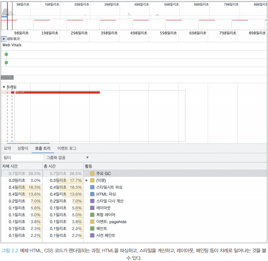

# 가상 DOM과 리액트 파이버

## DOM과 브라우저 렌더링 과정

### DOM
- 웹페이지에 대한 인터페이스로 브라우저가 웹페이지의 콘텐츠와 구조를 어떻게 보여줄지에 대한 정보를 담고 있음

### 렌더링 과정

> 1. 브라우저가 사용자 요청 주소를 방문해 HTML 파일을 다운로드
> 2. 브라우저의 렌더링 엔진은 HTML을 파싱해 DOM 노드로 구성된 트리(DOM)을 만듦
> 3. 2번 과정에서 CSS 파일을 만나면 해당 파일도 다운로드
> 4. 브라우저의 렌더링 엔진은 CSS도 파싱해 CSS 노드로 구성된 트리(CSSOM)를 만듦
> 5. 브라우저는 2번에서 만든 DOM노드를 순회하면서, 모든 노드를 방문하지 않고 사용자 눈에 보이는 노드만 방문(display:none과 같은 사용자 화면에 보이지 않는 요소는 방문해 작업하지 않음- 효율성 증진)
> 6. 5번에서 제외된 눈에 보이는 노드를 대상으로 해당 노드에 대한 CSSOM 정보를 찾고 여기서 발견한 CSS 스타일 정보를 이 노드에 적용, 
>       - DOM 노드에 CSS를 적용하는 과정
>           1. 레이아웃(layout, reflow): 각 노드가 브라우저 화면의 어느 좌표에 정확히 나타나야 하는지 계산하는 과정, 반드시 페인팅 과정도 거치게 됨
>           2. 페인팅(painting): 레이아웃 단계를 거친 노드에 색과 같은 실제 유효한 모습을 그리는 과정
> 


### 브라우저 렌더링 예제

```html
#text{
    background-color: red;
    color: white;
}

<!DOCTYPE html>
<html>
    <head>
        <link rel="stylesheet" type="text/css" href="./style.css"/>
        <title>Hello React!</title>
    </head>
    <body>
        <div style="width: 100%">
            <div id="text" style="width: 50%;">Hello world!</div>
        </div>
    </body>
</html>
```

1. HTML을 다운로드. 다운로드와 함께 HTML을 분석하기 시작
2. 스타일시트가 포함된 link 태그를 발견해 style.css를 다운로드
3. body 태그 하단의 `div`는 `width: 100%`이므로 뷰포트(브라우저가 사용자에게 노출하는 영역)로 좌우 100% 너비로 잡는다.
4. 3번 하단의 `div`는 `width: 50%` 즉 부모의 50%를 너비로 잡아야 하므로 전체 영역의 50%를 너비로 잡는다.
5. 2번에서 다운로드한 CSS에 id="text"에 대한 스타일 정보 결합
6. 화면에 HTML 정보를 그리기 위한 모든 정보가 준비됐으므로 위 정보를 바탕으로 렌더링을 수행




## 가상 DOM의 탄생 배경

### DOM 렌더링 비용 문제
- 렌더링 완료 이후 사용자의 인터랙션으로 웹페이지가 변경되는 상황도 고려해야 함
> 요소의 색상이 변경되는 경우

  - 페인팅만 일어나 비교적 빠르게 처리


> 특정한 요소의 노출 여부나 사이즈가 변경되는 등 요소의 위치와 크기를 재계산하는 경우

  - 레이아웃 후 리페인팅으로 인한 비용이 발생(자식 요소가 많은 경우, 특히나 SPA, 더 많은 비용 발생)

### 가상 DOM의 탄생
- 실제 브라우저가 아닌 리액트가 관리하는 가상의 DOM
- 웹페이지가 표시해야할 DOM을 일단 메모리에 저장하고 리액트(package.json/react-dom)가 실제 변경에 대한 준비가 완료되었을 때 실제 브라우저의 DOM에 반영
- 장점: 브라우저가 아닌 메모리에서 계산 과정을 한 번 거치게 되어 여러 번 발생하는 렌더링 과정을 최소화할 수 있음
- 무조건 빠른 건 아니지만 대부분의 경우 빨라서 웬만해선 사용하는 것이 합리적

## 가상 DOM을 위한 아키텍처 리액트 파이버
- 가상 DOM을 만드는 리액트의 처리, 리액트 파이버

### 리액트 파이버란?
- 리액트에서 관리하는 자바스크립트 객체
- 목표: 리액트 웹 애플리케이션에서 발생하는 애니메이션, 레이아웃, 사용자 인터랙션에 올바른 결과물을 만드는 반응성 문제 해결
- **파이버 재조정자(fiber reconciler)**
  - 파이버를 관리하며, 가상 DOM과 실제 DOM을 비교해 변경 사항을 수집하고 차이가 있으면 관련된 정보를 가지고 있는 파이버를 기준으로 화면에 렌더링을 요청

> 파이버가 할 수 있는 일(**비동기적 처리**)
  - 작업을 작은 단위로 분할하고 쪼갠 다음, 우선순위를 매김
  - 실행 중이던 작업을 일시 중지하고, 나중에 다시 시작할 수 있음
  - 이전에 했던 작업을 다시 재사용하거나 필요하지 않은 경우에는 폐기 가능

> 파이버 이전 리액트의 조정 알고리즘
- 스택으로 구현
- 렌더링을 동기적으로 처리하며, 자바스크립트 특성상 중간에 중단 될 수 없음

> 파이버 구현 방식
> - 파이버는 하나의 작업 단위로 구성되어 있으며, 작업 단위를 하나씩 처리하고 `finishedWord()`라는 작업으로 마무리
> - 커밋 후 실제 브라우저 DOM에 가시적인 변경 사항을 만듦
> 1. 렌더 단계에서 리액트는 사용자에게 노출되지 않는 모든 비동기 작업을 수행한다. 이 단계에서 파이버의 작업, 우선순위를 지정하거나 중지시키거나 버리는 등의 작업이 일어남
> 2. 커밋 단계에서는 DOM에 실제 변경 사항을 반영하기 위한 작업, `commitWork()`가 실행되는데, 이 과정은 동기식으로 일어나며, 중단될 수 없다.

- 내부 코드에 있는 파이버 객체

    ```jsx
    function FiberNode(tag, pendingProps, key, mode){
        // Instance
        this.tag = tag
        this.key = key
        this.elementType = null
        this.type = null
        this.stateNode = null

        //Fiber
        this.return = null
        this.child = null
        this.sibling = null
        this.index = 0
        this.ref = null
        this.refCleanup = null

        this.pendingProps = pendingProps
        this.memoizedProps = null
        this.updateQueue = null
        this.memoizedState = null
        this. dependencis = null

        this.mode = mode

        // Effects
        this.flags = NoFlags
        this.subtreeFlag = NoFlags
        this.deletions = null

        this.lanes = NoLanes
        this.childLanes = NoLanes

        this.alternate = null

        // 이하 프로파일러, __DEV__ 코드는 생략
    }
    ```
> 리액트 요소와 파이버 차이점
- 리액트 요소는 렌더링 시에 매번 새롭게 생성되지만, 파이버는 가급적 재사용됨

```jsx
var createFiber = function (tag, pendingProps, key, mode){
    return new FiberNode(tag, pendingProps, key, mode)
}

// 생략...
function createFiberFromElement(element, mode, lanes){
    var owner = null
    {
        owner = element._owner
    }

    var type = element.type
    var key = element.key
    var pendingProps = element.props
    var fiber = createFiberFromTypeAndProps(
        type,
        key,
        pendingProps,
        owner,
        mode,
        lanes,
    )

    {
        fiber._debugSource = element._source
        fiber._debugOwner = element._owner
    }

    return fiber
}


function createFiberFromFragment(elements, mode, lanes, key){
    var fiber = createFiber(Fragment, elements, key, mode)
    fiber.lanes = lanes
    return fiber
}
```

### 주요 속성
- tag : 하나의 element에 하나가 생성되는 1:1관계를 갖고있으며, 매칭된 정보를 가지고 있는 것이 `tag`
- 리액트의 컴포넌트, HTML의 DOM 노드 등등일 수 있음
- `stateNode`: 파이버 자체에 대한 참조 정보를 가지고 있으며, 이를 바탕으로 파이버와 관련된 상태에 접근
```jsx
var FunctionComponent = 0
var ClassComponent = 1
var IndeterminateComponent = 2
var HostRoot = 3
var HostPortal = 4
var HostComponent = 5
var HostText = 6    //  div와 같은 요소
var Fragment = 7
var Mode = 8
var ContextConsumer = 9
var ContextProvider = 10
var ForwardRef = 11
var Profiler = 12
var SuspenseComponent = 13
var MemoComponent = 14
var SimpleMemoComponent = 15
var LazyComponent = 16
var IncompleteClassComponent = 17
var DehydratedFragment = 18
var SuspenseListComponent = 19
var ScopeComponent = 21
var OffscreenComponent = 22
var LegacyHiddenComponent = 23
var CacheComponent = 24
var TracingMarkerComponent = 25
```
- `child`, `sibling`, `return`: 파이버 트리 내부 파이버 간의 관계 개념을 나타내는 속성(`children` 속성이 없음)

```jsx
<ul>
    <li>하나</li>
    <li>둘</li>
    <li>셋</li>
</ul>

// fiber 변환
const l3 = {
    return: ul,
    index: 2            // 여러 형제들(sibling) 사이에서 자신의 위치가 몇번째인지 숫자로 표현
}
const l2 = {
    sibling: l3,
    return: ul,
    index: 1
}
const l1 = {
    sibling: l2
    return: ul,
    index: 0
}
const ul = {
    // ...
    child: l1,
}
```

- `pendingProps`: 아직 작업을 미처 처리못한 props
- `memoizedProps`: pendingProps를 기준으로 렌더링이 완료된 이후 `pendingProps`를 `memoizedProps`로 저장해 관리
- `upadateQueue`: 상태 업데이트, 콜백 함수, DOM 업데이트 등 필요한 작업을 담아두든 큐
  - 구조
    ```jsx
    type UpdateQueue = {
        first: Update | null
        last: Update | null
        hasForceUpdate: boolean
        callbackList: null | Array<Callback>    //setState로 넘긴 콜백 목록
    }
    ```
- `momizedState`: 함수 컴포넌트의 훅 목록이 저장된다. 여기에는 단순히 `useState` 뿐만 아니라 모든 훅 리스트가 저장된다
- `alternate`: 리액트의 트리는 두개인데, alternate가 반대편 트리 파이버를 가리킨다.

### 리액트 파이버 트리
- 파이버 트리: 현재 모습을 담은 트리
- workInProgress 트리: 작업 중인 상태를 나타내는 트리
- **더블 버퍼링**: 리액트 파이버의 작업이 끝나면 단순히 포인터만 변경해 `workInProgress`트리를 현재 트리로 바꾸는 것(커밋 단계에서 수행)
  
    

### 파이버의 작업 순서
1. 리액트는 `beginWork()`함수를 실행해 파이버 직업을 수행하는데, 더 이상 자식이 없는 파이버를 만날 때까지 트리 형식으로 시작된다.
2. `completeWork()`함수를 실행해 파이버 작업을 완료
3. 형제가 있다면 형제로 넘어감(`sibling`)
4. 2, 3번이 모두 끝나면 `return`으로 돌아가 자신의 작업이 완료됐음을 알린다.
   
- ex)
    ```jsx
    <A1>
        <B1>안녕하세요</B1>
        <B2>
            <C1>
                <D1 />
                <D2 />
            </C1>
        </B2>
    </A1>
    ```
> 수행 과정
1. `A1`의 `beginWork()` 수행
2. `A1`의 자식이 있으므로 `B1`으로 이동해 `beginWork()`수행
3. `B1`은 자식이 없으므로 `completeWork()`가 수행, 자식은 없으므로 형제인 `B2`로 넘어감
4. `B2`의 `beginWork()`가 수행, 자식이 있으므로 `C1`로 이동
5. `C1`의 `beginWork()`가 수행, 자식이 있으므로 `D1`로 이동
6. `D1`의 `beginWork()`가 수행
7. `D1`은 자식이 없으므로 `completeWork()` 수행, 자식이 없으므로 형제인 `D2`로 이동
8. `D2`도 자식이 없으므로 `completeWork()` 수행
9. `D2`는 자식도 더 이상의 형제도 없기에 위로 이동해 `D1`, `C1`, `B1`순으로 `completeWork()` 호출
10. `B2`는 형제인 `B3`로 이동해 `beginWork()`를 수행.
11. `B3`의 `completeWork()`가 수행되면 반환해 상위로 타고 올라감
12. `A1`의 `completeWork()` 수행
13. 루트 노드가 완성되는 순간, 최종적으로 `commitWork()`가 수행되고 이 중 변경 사항을 비교해 업데이트가 필요한 변경 사항이 DOM에 반영


    


- `setState` 등으로 업데이트가 발생 시
  - workInProgress 트리를 다시 빌드하고 앞선 과정을 수행
  - 최초 렌더링 시에는 모든 파이버를 새로 만들어야하지만, 이미 존재하므로 **기존 파이버에서 업데이트된 props를 받아 파이버 내부에서 처리**


- 개선 점
  - 트리 업데이트 과정이 재귀적으로 하나의 트리를 순회해 새로운 트리를 만드는 작업은 동기식이고 중단될 수 없었는데, 파이버를 사용하면서 우선순위가 높은 다른 업데이트가 오면 현재 업데이트를 중단하거나 새롭게 만들거나 폐기할 수 도 있다.
  
## 파이버와 가상 DOM
- 파이버를 통해 비동기식으로 리액트 컴포넌트에 대한 정보를 1:1로 업데이트하면서 변경 사항을 동기식으로 DOM에 적용하는 것이 바로 가상 DOM

## 정리

1. 브라우저 렌더링 과정
2. 리액트 파이버가 나온 이유와 장점
3. 리액트 파이버 렌더링 과정
4. 가상DOM 개념
   