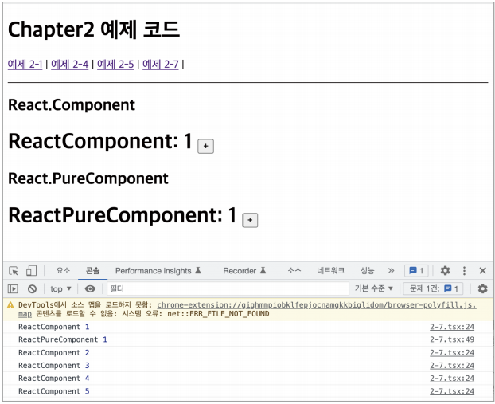

# 클래스 컴포넌트와 함수 컴포넌트

## 클래스 컴포넌트
### 기본적인 클래스 컴포넌트
```jsx
import React from 'react'

class SampleComponent extends React.Component{
    render(){
        return <h2>Sample Component</h2>
    }
}
```

- `extends`할 수 있는 클래스
  - `React.Component`
  - `React.PureComponent`

### 코드를 통한 알아보기
```jsx
import React from 'react'

// props 타입을 선언
interface SampleProps {
    required?: boolean
    text: string
}

// state 타입을 선언
interface SampleState {
    count: number
    isLimited?: boolean
}

// Component에 제네릭으로 props, state를 순서대로 넣어줌
class SampleComponent extends React.Component<SampleProps, SampleState> {
    // constructor에서 props를 넘겨주고, state의 기본값을 설정
    private constuctor(props: SampleProps){
        super(props)
        this.state={
            count: 0,
            isLimited: false,
        }
    }
    
    // render 내부에서 쓰일 함수 선언
    private handleClick = () => {
        const newValue = this.state.count + 1
        this.setState({ count: newValue, isLimited: newValue >= 10 })
    }

    // render에서 이 컴포넌트가 렌더링할 내용을 정의
    public render(){
        // props와 state 값을 this, 즉 해당 클래스를 꺼냄
        const {
            props: {required, text},
            state: {count, isLimited },
        } = this

        return (
            <h2>
                Sample Component
                <div>문자: {text}</div>
                <div>count: {count}</div>
                <button onClick={this.handleClick} disable={isLimited}>
                    증가
                </button>
            </h2>
        )
    }
}
```
- `constructor`: 컴포넌트 내부에 이 생성자 함수가 있다면 컴포넌트가 초기화되는 시점에 호출한다. 여기서는 컴포넌트의 state를 초기화할 수 있다. 선언돼 있는 super는 컴포넌트를 만들면서 상속받은 상위 컴포넌트, `React.Component`의 생성자 함수를 먼저 호출해 필요한 상위 컴포넌트에 접근할 수 있게 도와준다.

> 부록) constructor 없이 state 초기활 수 있지않나요?
>```jsx
>import {Component} from 'react'
>
>class SampleComponent2 extends Component {
>    state = {
>        count: 1,
>    }
>
>    render() {
>        const {
>            state: {count},
>        } = this
>        return <div>{count}</div>
>    }
>}
>```
> - ES2022에 추가된 클래스 필드(class field) 덕분에 가능한 문법
> - 별도의 초기화 과정을 거치지 않고도 클래스 내부에 필드를 선언할 수 있게 도와줌
> - 2022이전 버전에서 사용하려면 트랜스파일 과정이 필요

- `props`: 함수에 인수를 넣는 것과 비슷하게, 컴포넌트에 특정 속성을 전달하는 용도로 쓰임
- `state`: 클래스 컴포넌트 내부에서 관리하는 값, 값에 변화가 있을 때마다 리렌더링 발생
- `메서드`: 렌더링 함수 내부에서 사용되는 함수, 보통 DOM에서 발생하는 이벤트와 함께 사용
  - 메서드를 만드는 방식 3가지
    1. `constructor`에서 `this`바인드를 하는 방법
        - 일반적인 함수로 메서드를 만들면 `this`가 `undefined`로 나옴(전역 객체, strict 모드는 undefined)
         - ex)
            ```jsx
            import { Component } from 'react'

            // 빈 Props 선언
            type Props = Record<string, never>

            interface State{
                counter: number
            }

            class SampleComponent extends Component<Props, State> {
                private constructor(props: Props) {
                    super(props)
                    this.state = {
                        count: 1,
                    }
                    // handleClick의 this를 현재 클래스로 바인딩
                    this.handleClick = this.handleClick.bind(this)
                }

                private handleClick() {
                    this.setState((prev) => ({count: prev.count+1}))
                }

                public render() {
                    const {
                        state: { count },
                    } = this
                    return (
                        <div>
                            <button onClick={this.handleClick}>증가</button>
                        </div>
                    )
                }
            }
            ```
            - 화살표 함수를 쓴다면 작성 시점에 this가 상위 스코프로 결정되므로 굳이 바인딩하지 않아도됨
    2. 렌더링 함수 내부에서 함수를 새롭게 만들어 전달하는 방법
        - ex)
            ```jsx
            <button onClick={() => this.handleClick()}>증가</button>
            ```
        - 최적화가 어려움(렌더링 시마다 새로운 함수 생성)

### 클래스 컴포넌트의 생명주기 메서드
- 생명주기 메서드의 실행 시점
    1. 마운트(mount) : 컴포넌트가 마운팅(생성)되는 시점
    2. 업데이트(update): 이미 생성된 컴포넌트의 내용이 변경(업데이트)되는 시점
    3. 언마운트(unmount): 컴포넌트가 더 이상 존재하지 않는 시점

#### `render()`
- 시점: 마운트, 업데이트
- 리액트 클래스 컴포넌트의 유일한 필수 값으로 항상 쓰임.
- 컴포넌트가 UI를 렌더링하기 위해서 쓰임
- 순수성 보장(같은 입력이 들어갔을 때 같은 결과)
- `this.setState` 사용 금지

#### `componentDidMount()`
- 시점: 마운트 후 준비되는 즉시
- `this.setState` 사용 가능
- `state` 변경 시 재렌더링을 하지만, 브라우저가 실제로 UI를 업데이트 하기 전에 실행되어 사용자가 변경되는 것을 눈치챌 수 없음
- `this.setState` 허용하는 이유는 생성자 함수에서 할 수 없는 것(API호출 후 업데이트, DOM 의존 작업- 이벤트 리스너 추가 등)을 하기 위해서이므로 무분별한 사용은 성능에 영향을 줄 수 있음

#### `componentDidUpdate()`
- 시점: 컴포넌트 업데이트가 일어난 이후 즉시
- `state`나 `props`의 변화에 따라 DOM을 업데이트하는 등에 쓰임
- `this.setState` 사용 가능(적절한 조건문 필수, 계속 호출될 수 있음)

```jsx
componentDidUpdate(prevProps: Props, prevState: State){
    // 만약 이런 조건문이 없다면 props가 변경되는 매 순간마다 fetchData가 실행
    if (this.props.userName !== prevProps.userName) {
        this.fetchData(this.props.userName);
    }
}
```

#### `componentWillUnmount()`
- 시점: 컴포넌트가 언마운트되거나 더 이상 사용되지 않기 직전
- 메모리 누수나 불필요한 작동을 막기 위한 클린업 함수를 호출하기 위한 최적 위치
- `this.setState` 사용 불가능
- 이벤트를 지우거나 API 호출 취소, `setInterval`, `setTimeout`으로 생성된 타이머를 지우는데 유용
```jsx
componentWillUnmount(){
    window.removeEventListener('resize', this.resizeListener)
    clearInterval(this.intervalId)
}
```
 
#### `shouldComponentUpdate()`
- `state`나 `props`의 변경으로 리액트 컴포넌트가 다시 리렌더링되는 것을 막고 싶을 때 사용
- 컴포넌트에 영향을 받지 않는 변화에 대해 정의 가능
- **특정한 성능 최적화 상황에서만 사용 고려**
```jsx
shouldComponentUpdate(nextProps: Props, nextState: State){
    // true인 경우, 즉 props의 title이 같지 않거나 state의 input이 같지 않은 경우에만 컴포넌트를 업데이트함
    return this.props.title !== nextProps.title || this.state.input !== nextState.input
}
```
- `Component` vs `PureComponent`
    - Component: 버튼을 누를때마다 state 업데이트로 인해 재렌더링
    - PureComponent: state 업데이트가 없어 재렌더링 없음(state 얕은 비교 기반 변화 관찰)
```jsx
import React from 'react'

interface State{
    count: number
}

type Props = Record<string, never>

export class ReactComponent extends React.Component<Props, State>{
    private constructor(props: Props) {
        super(props)
        this.state = {
            count: 1,
        }
    }

    private handleClick = () => {
        this.setState({ count:1 })
    }

    public render(){
        console.log('ReactComponent', ++this.renderCounter) // eslint-disable-line no-console
        return (
            <h1>
                ReactComponent: {this.state.count}{' '}
                <button onClick={this.handleClick}>+</button>
            </h1>
        )
    }
}

export class ReactPureComponent extends React.PureComponent<Props, State> {
    private renderCounter = 0
    
    private constructor(props: Props) {
        super(props)
        this.state = {
            count: 1,
        }
    }

    private handleClick = () => {
        this.setState({ count: 1 })
    }

    public render() {
        console.log('ReactPureComopnent', ++this.renderCounter) // eslint-disable-line no-console
        return (
            <h1>
                ReactPureComponent: {this.state.count}{' '}
                <button onClick={this.handleClick}>+</button>
            </h1>
        )
    }
}

export default function CompareComponent() {
    return (
        <>
            <h2>React.Component</h2>
            <ReactComponent />
            <h2>React.PureComponent</h2>
            <ReactPureComponent />
        </>
    )
}
```



#### `static getDerivedStateFromProps()`
- 이전 `componentWillReceiveProps()` 대체 메서드
- 시점: 모든 `render()`를 호출하기 직전 호출
- `static`이기에 `this`접근 불가능
- 반환하는 객체는 해당 객체의 내용이 모두 `state`에 들어감(`null` 반환 시 아무 일도 일어나지 않음)
```tsx
static getDerivedStateFromProps(nextProps:Props, prevState:State){
    // 이 메서드는 다음에 올 props를 바탕으로 현재의 state를 변경하고 싶을 때 사용

    if (props.name !== state.name){
        // state변경
        return {
            name: props.name
        }
    }

    // state에 영향을 주지 않음
    return null
}
```

#### `getSnapShotBeforeUpdate()`
- 시점: DOM 업데이트 되기 직전
- `componentWillUpdate()`를 대체할 수 있는 메서드
- 반환 값 `componentDidUpdate`로 전달
- DOM 렌더링 전 윈도우 크기 조절 및 스크롤 위치 조정하는 등의 작업 처리에 유용
- 리액트 훅으로 구현되지 않아 클래스 컴포넌트로 사용
```tsx
getSnapshotBeforeUpdate(prevProps: Props, prevState: State){
    // props로 넘겨받은 배열의 길이가 이전보다 길어질 경우 현재 스크롤 값 반환
    if (prevProps.list.length < this.props.list.length){
        const list = this.listRef.current;
        return list.scrollHeight - list.scrollTop;
    }
    return null;
}

// 3번째 인수인 snapshot은 클래스 제너릭의 3번째 인수로 넣어줄 수 있다
componentDidUpdate(prevProps: Props, prevState: State, snapshot:Snapshot){
    // getSnapshotBeforeUpdate로 넘겨받은 값은 snapshot에서 접근 가능
    // 스크롤 위치를 재정해 기존 아이템이 스크롤에서 밀리지 않도록 도와줌
    if (snapshot !== null){
        const list = this.listRef.current;
        list.crollTop = list.scrollHeight - snapshot;
    }
}
```


#### `getDerivedStateFromError()`
- 시점: 에러 상황
- 리액트 훅으로 구현되지 않아 클래스 컴포넌트로 사용
- 에러 처리 로직 구현
- 반드시 `state` 값 반환
- 하위 컴포넌트에서 에러 발생 시 어떻게 자식 리액트 컴포넌트를 렌더링할 지 결정
- 부수효과를 발생시키면 안됨
    - state를 반환하는 것 이외의 모든 작업
    - ex) console.error 등 로깅 작업
```tsx
// ErrorBoundary.tsx
import React, { PropsWithChildren } from 'react'

type Props = PropsWithChildren<{}>
type State = { hasError: boolean; errorMessage: string }

export default class ErrorBoundary extends React.Component<Props, State> {
    constructor(props: Props){
        super(props)
        this.state = {
            hasError: false,
            errorMessage: '',
        }
    }

    static getDerivedStateFromError(error: Error){
        return {
            hasError: true,
            errorMessage: error.toString(),
        }
    }

    render() {
        // 에러가 발생했을 경우에 렌더링할 JSX
        if (this.state.hasError){
            return (
                <div>
                    <h1>에러가 발생했습니다.</h1>
                    <p>{this.state.errorMessage}</p>
                </div>
            )
        }
        
        // 일반적인 상황의 JSX
        return this.props.children
    }
}


// ...

// App.tsx
function App() {
    return (
        <ErrorBoundary>
            <Child />
        </ErrorBoundary>
    )
}

function Child() {
    const [error, setError] = useState(false)

    const handleclick = () => {
        setError((prev) => !prev)
    }

    if (error) {
        throw new Error('Error has been occurred')
    }

    return <button onClick={handleClick}>에러 발생</button>
}
```

#### `componentDidCatch`
- 시점: getDerivedStateFromError에서 에러잡고 state를 결정한 이후(커밋 단계)
- 리액트에서 에러 발생 시 로깅하는 등의 용도로 사용
- `(error, info)` 인수 (info: 어떤 에러를 발생시켰는지 정보)
- 개발모드와 프로덕션 모드에서 다르게 작용
```tsx
import React, { ErrorInfo, PropsWithChildren } from "react";

type Props = PropsWithChildren<{}>;
type state = { hasError: boolean; errorMessage: string; }

export default class ErrorBoundary extends React.Component<Props, State> {
    constructor(props: Props){
        super(props);
        this.state = {
            hasError: false,
            errorMessage: "",
        };
    }

    static getDerivedStateFromError(error: Error){
        return {
            hasError: true,
            errorMessage: error.toString(),
        };
    }

    // componentDidCatch를 추가
    componentDidCatch(error: Error, info: ErrorInfo){
        console.log(error);
        console.log(info);
    }

    render() {
        // 에러가 발생했을 경우에 렌더링할 JSX
        if (this.state.hasError) {
            return (
                <div>
                    <h1>에러가 발생했습니다.</h1>
                    <p>{this.state.errorMessage}</p>
                </div>
            );
        }

        // 일반적인 상황의 JSX
        return this.props.children;
    }
}
```


### 클래스 컴포넌트의 한계
- 데이터 흐름을 추적하기 어려움
    - 서로 다른 여러 메서드에서 state 업데이트 가능
    - 메서드 순서가 강제되어 있어 읽기 힘듦
- 애플리케이션 내부 로직의 재사용이 어려움
    - `extends`와 `PureComponent`의 중복으로 처리하기엔 한계가 있음 
- 기능이 많아질수록 컴포넌트의 커짐
    - 로직이 많아지고, 데이터 흐름이 복잡해져 생명주기 메서드 사용이 잦아지면 컴포넌트 크기가 기하급수적으로 커짐
- 클래스는 함수에 비해 상대적으로 어려움
    - `this`의 사용
- 코드 크기를 최적하기 어려움
    - 최종 결과물 번들 크기를 줄이는데도 어려움
    - 사용되지 않는 메서드들도 번들에 그대로 포함되어 최적화가 어려움
- 핫 리로딩을 하는데 상대적으로 불리
    - 코드에 변경 사항 발생시 앱을 다시시작하지 않고 해당 변경된 코드만 업데이트해 변경 사항을 빠르게 적용하는 기법
    - instance 특징으로 인해 값들이 초기화 됨


## 함수 컴포넌트
- `this` 바인딩 필수가 아님
- `state` 객체가 아닌 원시값으로 관리
```tsx
import { useState } from 'react'

type SampleProps = {
    required?: boolean
    text: string
}

export function SampleComponent({ required, text } : SampleProps) {
    const [count, setCount] = useState<number>(0)
    const [isLimited, setIsLimited] = useState<boolean>(false)

    function handleClick() {
        const newValue = count + 1
        setCount(newValue)
        setIsLimited(newValue >= 10)
    }

    return (
        <h2>
            Sample Coomponent
            <div>{required ? '필수' : '필수 아님'}</div>
            <div>문자: {text}</div>
            <div>count: {count}</div>
            <button onClick={handleClick} disable={isLimited}>
                증가
            </button>
        </h2>
    )
}
```

## 함수 컴포넌트 vs 클래스 컴포넌트

### 생명주기 메서드의 부재
- 함수 컴포넌트는 `React.Component`를 상속받아 구현하지 않기에 생명주기 메서드가 없음
- `useEffect` 훅을 사용해 생명주기 메서드 `componentDidMount`, `componentDidUpdate`, `componentWillUnmount` **비슷하게** 구현가능
- `useEffect`는 생명주기를 위한 훅이 아닌 컴포넌트의 `state`를 활용해 동기저긍로 부수효과를 만드는 메커니즘


### [함수 컴포넌트와 렌더링된 값](https://overreacted.io/ko/how-are-function-components-different-from-classes/)

```tsx
import React from 'react'

interfact Props {
    user: string
}

// 함수 컴포넌트로 구현한 setTimeout 예제
export function FunctionalComponent(props: Props){
    const showMessage = () => {
        alert('Hello '+ props.user)
    }

    const handleClick = () => {
        setTimeout(showMessage, 3000)
    }

    return <button onClick={handleClick}>Follow</button>
}

// 클래스 컴포넌트로 구현한 setTimeout 예제
export class ClassComponent extends React.Component<Props, {}>{
    private showMessage = () => {
        alert('Hello ' + this.props.user)
    }

    private handleClick = () => {
        setTimeout(this.showMessage, 3000)
    }

    public render() {
        return <button onClick={this.handleClick}>Follow</button>
    }
}
```
- 차이(3초 사이에 props를 변경한다면?)
    - 클래스 컴포넌트: 3초 뒤에 변경된 props를 기준으로 메시지가 뜸
    - 함수 컴포넌트: 클릭 시점의 props 값을 기준으로 메시지가 뜸

- 차이의 이유
    - 클래스 컴포넌트: `this`를 통해 가져와 인스턴스 값이 항상 변경
    - 함수 컴포넌트: `props`와 `state`가 변경된다면, 다시 그 값을 기준으로 함수가 호출 

- 해결방법
    ```tsx
    // this.props를 조금 더 일찍 부르고, 이를 함수의 인수로 넘기는 방법

    export class ClassComponent extends React.Component<Props, State>{
        private showMessage = (name: string) => {
            alert('Hello ' + name)
        }

        private handleClick = () => {
            const {
                props:{ user },
            } = this
            setTimeout(this.showMessage(user), 3000)
        }

        public render() {
            return <button onClick={this.handleClick}>Follow</button>
        }
    }

    // render()에 필요한 값을 넣는 방법(렌더 시에 함수가 계속 생성)
    export class ClassComponent extends React.Component<Props, State>{
        
        public render() {
            const props = this.props
            
            const showMessage = () => {
                alert('Hello ' + props.user)
            }
        
            const handleClick = () => {
                setTimeout(showMessage, 3000)
            }
            return <button onClick={this.handleClick}>Follow</button>
        }
    }
    ```

### 클래스 컴포넌트를 공부해야 할까?
- 클래스 컴포넌트가 사라질 계획이 없음 => 공부해야함

## 정리
|구분|클래스 컴포넌트|함수 컴포넌트|
|:---:|:---:|:---:|
|state 변경|`this`를 통해 변경|함수 재호출|
|난이도|비교적 높음|비교적 낮음|
|데이터 흐름 체크|어려움|비교적 쉬움|
|내부 로직 재사용|어려움|쉬움|
|핫 리로딩|불리(instance 초기화)|적합|
