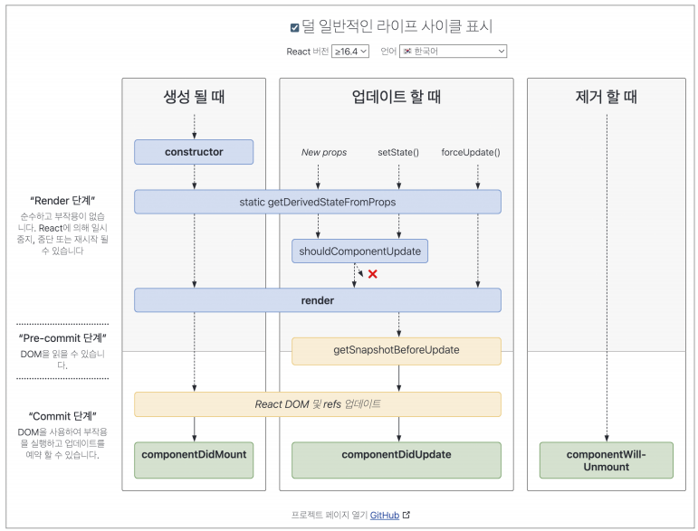

# 렌더링은 어떻게 일어나는가?
- 브라우저: HTML과 CSS 리소스를 기반으로 웹페이지에 필요한 UI를 그리는 과정
- 리액트: 브라우저가 렌더링에 필요한 DOM 트리를 만드는 과정
- 알아야하는 이유(**UX 최적화**)
    - 리액트의 렌더링은 시관과 리소스를 소비해 수행되는 과정 👉 비용이 커지면 사용자 경험(UX)를 저해

## 리액트의 렌더링이란?
> 리액트 렌더링
- 리액트 애플리케이션 트리 안에 있는 모든 컴포넌트들이 현재 자신들이 가지고 있는 `Props`와 `State`의 값을 기반으로 어떻게 UI를 구성하고, 어떤 DOM 결과를 브라우저에 제공할 것인지 계산하는 일련의 과정
- `Props`와 `State`가 없다면 컴포넌트가 반환하는 JSX 값에 기반해 렌더링

## 리액트의 렌더링이 일어나는 이유
### 렌더링이 발생하는 시점(과정)
#### **최초 렌더링**
- 사용자가 처음 애플리케이션에 진입하면 발생하는 렌더링, 리액트는 브라우저에 이 정보를 제공하기 위해 최초 렌더링 수행
#### **리렌더링**
- 최초 렌더링 이후 발생하는 모든 렌더링(아래 경우 이외 변경해도 리렌더링이 작동하지 않음)
> 클래스 컴포넌트
- `setState` 실행: `state` 변화에 따른 리렌더링
- `forceUpdate` 실행: 렌더링 수행 인스턴스 메서드 `render`가 `state`나 `props`가 아닌 다른 값에 의존하여 리렌더링이 자동으로 실행되지 않을 경우 `forceUpdate` 사용
    - **`forceUpdate` 실행 시 `shouldComponentUpdate` 무시(하위 컴포넌트 포함)**
    - **`render` 함수 내에서 `forceUpdate` 수행 시 무한루프**

> 함수 컴포넌트
- `useState`의 두 번째 배열 요소 `setter` 수행: `state` 변화에 따른 리렌더링
- `useReducer`의 두 번째 배열 요소 `dispatch` 수행: `state` 변화에 따른 리렌더링

> 컴포넌트
- `key props` 변경: 리액트에서 key는 명시적으로 선언돼 있지 않더라도 모든 컴포넌트에서 사용할 수 있는 특수한 `props`, 일반적으로 `key`는 다음과 같이 배열에서 하위 컴포넌트를 선언할 때 사용
```tsx
const arr = [1,2,3]

export default function App() {
    return (
        <ul>
            {/* 키가 없다면 'Warning: Each child in a list should have a unique "key" prop'가 출력된다.*/}
            {arr.map((index) => (
                <li key={index}>{index}</li>
            ))}
        </ul>
    )
}
```

- `key`가 필요한 이유   
    - 리렌더링이 발생하는 동안 형제 요소들 사이에서 동일한 요소를 식별하는 값
    - `current` 트리와 `workInProgress` 트리 사이에서 어떠한 컴포넌트가 변경이 있었는지 구별하기 위한 값(리렌더링 컴포넌트 최소화)
    - 없다면 파이버 내부 `sibling` 인덱스에 의존
    ```tsx
    const Child = memo(() => {
        return <li>hello</li>
    })

    function List({ arr }: {arr: number[]}) {
        const [state, setState] = useState(0)

        function handleButtonClick() {
            setState((prev) => prev +1)
        }

        return (
            <>
                <button onClick={handleButtonClick}>{state}+</button>

                <ul>
                    {arr.map((_, index) => (
                        {/* <Child key={index}> 와 동일하게 작동: memo 선언 */}
                        {/* <Child key={Math.random()}>과 같이 렌더링할 때마다 변하는 임의의 값을 key에 넣는다고 가정하면 sibling 컴포넌트를 명확히 구분할 수 없어 memo 선언 관계없이 매번 리렌더링 */}
                        <Child />
                    ))}
                </ul>
            </>
        )
    }
    ``` 
- `props`의 변경: 부모로부터 전달받는 값인 `props`가 달라지면 이를 사용하는 자식 컴포넌트에서도 변경이 필요, 리렌더링
- 부모 컴포넌트 렌더링:**부모 컴포넌트가 리렌더링된다면 자식 컴포넌트도 무조건 리렌더링**


## 리액트의 렌더링 프로세스(리액트의 재조정)
1. 렌더링 프로세스 시작
2. 컴포넌트의 루트에서부터 차근차근 아래쪽으로 내려가면서 업데이트가 필요하다고 지정돼 있는 모든 컴포넌트 탐색
3. 업데이트 필요 컴포넌트 발견 시, `render(클래스 컴포넌트)` 혹은 `FunctionComponent(함수 컴포넌트)` 호출 후 결과물 저장
4. JSX 문법으로 구성된 결과물을 `React.createElement`를 호출하는 구문으로 변환
5. `createElement`는 브라우저의 UI구조를 설명할 수 있는 일반적인 자바스크립트 객체 반환

```jsx
function Hello(){
    return (
        <TestComponent a={35} b="yceffort">
            안녕하세요
        </TestComponent>
    )
}

// React.createElement 호출 및 변환
function Hello() {
    return React.createElement(
        TestComponent,
        {a: 35, b: 'yceffort'},
        '안녕하세요',
    )
}

// 결과
{type: TestComponent, props: {a: 35, b: "yceffort", children: "안녕하세요"}}
```

6. 각 컴포넌트의 렌더링 결과물을 수집 후 리액트의 새로운 트리인 가상 DOM과 비교하여 실제 DOM에 반영하기 위한 모든 변경 사항을 차례차례 수집
7. 모든 변경 사항을 하나의 동기 시퀀스로 DOM에 적용 👉 변경된 결과물 도시

## 렌더와 커밋
- 리액트의 렌더링은 렌더와 커밋 단계로 분리되어 실행
- **리액트 렌더링 !== DOM 업데이트**
### 렌더 단계
- 렌더 단계 : 컴포넌트를 렌더링, 변경 사항을 계산하는 모든 작업
- 렌더링 프로세스에서 컴포넌트를 실행해(`render()` 또는 `return`)이 결과와 이전 가상 DOM을 비교하는 과정을 거쳐 **변경이 필요한 컴포넌트를 체크하는 단계**

- 비교사항: `type`, `props`, `key`(이 중 하나라도 변경되면 변경이 필요하다고 체크)

### 커밋 단계
- 렌더 단계의 변경사항을 실제 DOM에 적용해 사용자에게 보여주는 과정
- 이후 브라우저 렌더링 수행
- 리액트가 먼저 DOM을 커밋 단계에서 업데이트한다면 이렇게 만들어진 모든 DOM 노드 및 인스턴스를 가리키도록 리액트 내부의 참조를 업데이트
- 그다음 
- 생명주기 개념이 있는 클래스 컴포넌트: `componentDidMount`, `componentDidUpdate` 메서드 호출
- 함수 컴포넌트 : `useLayoutEffect`훅 호출

### 정리



- **리액트 렌더링 !== DOM 업데이트**
- 렌더 과정에서 수행한 변경 사항들을 계산 후 변경사항이 없으면 커밋단계 생략(DOM 업데이트 ❌)
- 두 과정은 동기식으로 수행(UI업데이트 혼동 가능성)
- 비동기 렌더링 시나리오의 유효상황: 의도된 우선순위로 컴포넌트 렌더링해 최적화(react 18에 도입)


## 일반적인 렌더링 시나리오 살펴보기
- 코드를 통한 정리
```jsx
import { useState } from 'react'


// 컴포넌트 A
export default function A() {
    return (
        <div className="App">
            <h1>Hello React!</h1>
            <B />
        </div>
    )
}

// 컴포넌트 B
function B() {
    const [counter, setCounter] = useState(0)

    function handleButtonClick() {
        setCounter((previous) => previous + 1)
    }

    return (
        <>
            <label>
                <C number={counter}>
            </label>
            <button onClick={handleButtonClick}>|</button>
        </>

    )
}

// 컴포넌트 C
function C({number}) {
    return (
        <div>
            {number} <D />
        </div>
    )
}

// 컴포넌트 D
function D(){
    return <>리액트 재밌다!</>
}
```

> B 컴포넌트의 버튼을 눌러 counter 변수를 업데이트 순서
1. B 컴포넌트의 setState가 호출
2. B 컴포넌트의 리렌더링 작업이 렌더링 큐에 들어감
3. 리액트는 트리 최상단에서부터 렌더링 경로 검색
4. A 컴포넌트는 리렌더링이 필요한 컴포넌트로 표시돼 있지 않으므로 별다른 작업을 하지않음
5. 하위 컴포넌트 B 확인: 업데이트 필요 체크돼 있어 B 리렌더링
6. 5과정에서 B는 C 반환
7. C는 props인 number가 업데이트, 업데이트 필요 체크돼 있어 업데이트
8. 7과정에서 C는 D 반환
9. D도 마찬가지로 업데이트가 필요한 컴포넌트로 체크되지 않았지만 C가 렌더링되어 D도 렌더링

- D 컴포넌트에 memo 추가하면? 👉 **D는 렌더링 되지않음**


## 정리

1. 리액트 렌더링 vs 브라우저 렌더링
- 리액트 렌더링 !== 브라우저 렌더링
- 리액트 렌더링: `props`와 `state`, 없으면 반환하는 `JSX`를 기반으로 브라우저에 제공할 DOM 결과를 계산하는 일련읙 과정
- 브라우저 렌더링: HTML, CSS, JS를 기반으로 만든 DOM을 기반으로 Layout을 구성하고, Painting을 통해 UI를 구성해 사용자에게 제공

2. 리액트이 발생 시점

|발생 시점|클래스 컴포넌트|함수 컴포넌트|
|:---:|:---:|:---:|
|`key`값 변경|-|-|
|`state`값 변경|`setState`|`useState - setter`, `useReducer - dispatch`|
|`props`값 변경|-|-|
|이외|`forceUpdate`|-|

3. 리액트의 렌더링 프로세스(동기적으로 연산, 비동기 연산 - react 18)
    > 1. render 단계
    > - 컴포넌트 루트부터 변경사항 체크하여 렌더가 필요한 부분 체크 및 연산
    > 2. commit level
    > - 렌더 단계 이후 DOM 변동이 있으면 이를 적용(없으면 생략)
    > 3. DOM 적용
    > 4. 브라우저 렌더링


