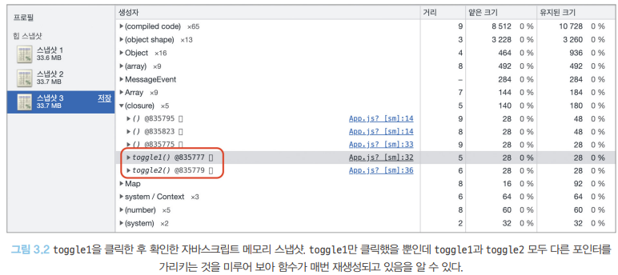
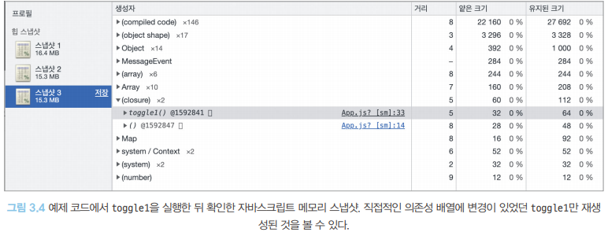
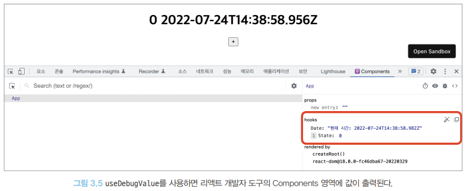

# 리액트의 모든 훅 파헤치기
- 함수 컴포넌트에서 가장 중요한 개념
- 클래스 컴포넌트에서만 가능했던 리액트 핵심기능을 함수에서도 가능하게 만듦
- 클래스 컴포넌트보다 간결하게 만들 수 있게함

## useState
- 함수 내부 상태 정의 및 관리

### useState 구현 살펴보기
- 기본
```jsx
import { useState } from 'react'

// [상태, 상태 업데이트 메서드] = useState(초깃값)
// 초깃값이 없으면 undefined
const [state, setState] = useState(initialState)
```
- 작동 방식
```jsx
// 리렌더링을 발생시키기에 조건이 충족되지 않음 ( useState, useReducer 함수를 포함하지 않음 - state 변화 읽지 못함)
function Component() { 
    let state = 'hello'

    function handleButtonClick() {
        state = 'hi'
    }

    return (
        <>
            <h1>{state}</h1>
            <button onClick={handleButtonClick}>hi</button>
        </>
    )
}
```

```jsx
// 버튼 클릭시 리렌더링 발생(useState - setter 메서드를 통해 state 값 변화시킴 => 리렌더링)
function Component(){
    const [, triggerRender] = useState()

    let state = 'hello'

    function handleButtonClick() {
        state = 'hi'
        triggerRender()
    }

    return (
        <>
            <h1>{state}</h1>
            <button onClick={handleButtonClick}>hi</button>
        </>
    )
}
```
- `useState` 내부 구현
```jsx
// 구조분해 할당으로 value값을 이미 할당 해놓아 setValue로 변동시켜도 의미가 없음(주솟값이 다름)
function useState(initialValue){
    let internalState = initialValue
    
    function setState(newValue) {
        internalState = newValue
    }

    return [internalState, setState]
}

const [value, setValue] = useState(0)
setValue(1)
console.log(value) // 0
```

```jsx
// 비슷하지만 value를 변수가 아닌 함수로 구현되어있어 다름
function useState(initialValue) {
    let internalState = initialValue

    function state(){
        return internalState
    }

    function setState(newValue){
        internalState = newValue
    }

    return [state, setState]
}

const [value, setValue] = useState(0)
setValue(1)
console.log(value()) // 1
```

- 유사하게 구현(실제 코드는 `useReducer`를 사용하여 구현)
- 클로저를 이용하여 구현(state 외부 접근 보안 및 이전 값을 정확하게 꺼내 쓸 수 있음)
```jsx
const MyReact = (function () {
    const global = {}
    let index = 0

    function useState(initalState) {
        if (!global.states){
            // 애플리케이션 전체의 states 배열을 초기화한다.
            // 최초 접근이라면 빈 배열로 초기화
            global.states = []
        }

        //states 정보를 조회해서 현재 상태값이 있는지 확인하고, 없다면 초깃값 설정
        const currentState = global.states[index] || initialState
        // states의 값을 위에서 조회한 현재 값으로 업데이트
        global.states[index] = currentState

        // 즉시 실행 함수로 setter  구현
        const setState = (function () {
            // 현재 index를 클로저로 가둬놔서 이후에도 계속해서 동일한 index에 접근할 수 있도록 함
            let currentIndex = index
            return function (value) {
                global.states[currentIndex] = value
                // 컴포넌트를 렌더링한다. 실제로 컴포넌트를 렌더링하는 코드는 생략
            }
        })()
        //useState를 쓸 때마다 index를 하나씩 추가한다. 이 index는 setState에서 사용
        // 하나의 state마다 index할당, 배열의 값(global.states)을 가리키고 필요할 때마다 가져옴
        index = index + 1

        return [currentState, setState]
    }

    // 실제 useState를 사용하는 컴포넌트
    function Component() {
        const [value, setValue] = useState(0)
        // ...
    }
})();
```

### 게으른 초기화
- `useState`의 인수로 특정한 값을 넘기는 함수를 인수로 넣어줄 수 있음
- 변수 대신 함수를 넘기는 것을 **게으른 초기화**라고 한다.
- `localStorage`나 `sessionStorage`에 대한 접근, `map`, `filter`, `find` 같은 배열에 대한 접근, 혹은 초깃값 계산을 위해 함수 호출이 필요한 때와 같이 무거운 연산을 포함해 실행 비용이 많이 드는 경우에 좋음

```jsx
// 일반적인 useState 사용
// 바로 값을 집어넣음
const [count, setCount] = useState(
    Number.parseInt(window.localStorage.getItem(cacheKey)),
)

// 게으른 초기화
// 위 코드와의 차이점은 함수를 실행해 값을 반환하다는 것
// 초깃값이 복잡하거나 무거운 연산을 포함하고 있을 때 사용(초기 state가 만들어질때만 사용, 이후 리렌더링시 무시)
const [count, setCount] = useState(() => 
    Number.parseInt(window.localStorage.getItem(cacheKey)),
)
```

```jsx
import { useStaet } from 'react'

export default function App() {
    const [state, setState] = useState(() => {
        console.log('복잡한 연산...') // App 컴포넌트가 처음 구동될 때만 실행, 이후 리렌더링시에는 실행되지 않음
        return 0
    })

    function handleClick() {
        setState((prev) => prev + 1)
    }

    return (
        <div>
            <h1>{state}</h1>
            <button onClick={handleClick}>+</button>
        </div>
    )
}
```

## useEffect
>- 두 개의 인수를 받는데, 첫 번째는 콜백, 두 번째는 의존성 배열이다. 이 두 번 째 의존성 배열의 값이 변경되면 첫 번째 인수인 콜백을 실행한다.
>- 클래스 컴포넌트의 생명주기 메서드와 비슷한 작동을 구현할 수 있다. 두 번째 의존성 배열에 빈 배열을 넣으면 컴포넌트가 마운트될 때만 실행
>- useEffect는 클린업 함수를 반환할 수 있는데, 이 클린업 함수는 컴포넌트가 언마운트될 때 실행된다.
- 애플리케이션 내 컴포넌트의 여러 값들을 활용해 동기적으로 부수 효과를 만드는 매커니즘
- "어떤 상태값과 함께 실행되는가?" 가 중요

### useEffect란?
- **렌더링된 이후 어떠한 부수효과를 일으키고 싶을때 사용하는 훅**
```jsx
// 기본 형태
function Component() {
    //...
    useEffect(() => {
        // do something
    }, [props, state])
    // ...
}
```
> 의존성 배열 값이 변화하면 내부 함수를 실행할 수 있는 이유
```jsx
function Component() {
    const [counter, setCounter] = useState(0)

    function handleClick() {
        setCounter((prev) => prev + 1)
    }

    return (
        <>
            <h1>{counter}</h1>
            <button onClick={handleClick}>+</button>
        </>
    )
}
```
- 렌더링 시, 함수를 실행하여 렌더링하는 함수 컴포넌트 특성을 이용
- 렌더링할 때마다 의존성에 있는 값을 보면서 이 의존성의 값이 이전과 다른 게 하나라도 있으면 부수 효과를 실행하는 함수

### 클린업 함수의 목적
```jsx
import { useState, useEffect } from 'react'

export default function App() {
    const [counter, setCounter] = useState(0)

    function handleClick() {
        setCounter((prev => prev + 1))
    }

    useEffect(() => {
        function addMouseEvent() {
            console.log(counter)
        }

        window.addEventListener('click', addMouseEvent)

        // 클린업 함수
        return () => {
            console.log('클린업 하마수 실행!', counter)
            window.removeEventListener('click', addMouseEvent)
        }
    }, [counter])

    return (
        <>
            <h1>{counter}</h1>
            <button onClick={handleClick}>+</button>
        </>
    )
}
```
- 결과
```text
클린업 함수 실행! 0
1

클린업 함수 실행! 1
2

클린업 함수 실행! 2
3

클린업 함수 실행! 3
4

// ...
```
- useEffect에 이벤트를 추가했을 때, 클린업 함수에서 지우지 않으면 useEffect는 그 콜백이 실행될 때마다 이전의 클린업 함수가 존재했다면 그 클린업 함수를 실행한 뒤에 콜백을 실행한다.
- 이벤트를 추가하기 전에 이전에 등록했던 이벤트 핸들러를 삭제하는 코드를 클린업 함수에 추가하는 것(**이벤트의 핸들러가 무한히 추가되는것을 방지**)

- 생명주기 메서드 언마운트와의 차이
    - 언마운트: 특정 컴포넌트가 DOM에서 사라진다.
    - useEffect(클린업 함수): 함수 컴포넌트가 리렌더링됐을 때 의존성 변화가 있었을 당시 이전의 값을 기준으로 실행되는 이전 상태 청소의 개념 

### 의존성 배열
- 빈 배열: 비교할 의존성이 없다고 판단하여 최초 렌더링 이후 더이상 실행하지 않음
- 아무값도 넘겨주지 않음: 의존성을 비교할 필요없이 렌더링할 때마다 실행(컴포넌트가 렌더링 되는가를 판단할 때 사용)
```jsx
// 렌더링을 확인하기
useEffect(() => {
    console.log('컴포넌트 렌더링됨')
})
```

- `useEffect` 없이 사용?

```jsx
// 1
function Component() {
    console.log('렌더링됨')
}

// 2
function Component() {
    useEffect(() => {
        console.log('렌더링됨')
    })
}
```
- 차이점
1. 서버 사이드 렌더링 과넞ㅁ에서 useEffect는 클라이언트 사이드에서 싫애되는 것을 보장, useEffect 내부에서는 window 객체의 접근에 의존하는 코들르 사용해되 된다
2. useEffect는 컴포넌트 렌더링의 부수 효과, 즉 컴포넌트의 렌더링이 완료된 이후 실행. 1번 함수는 렌더링 중간에 실행되며 서버사이드 렌더링의 경우 서버에서 실행, 2번은 렌더링 이후 실행 => **성능에 영향을 준다**


### useEffect의 구현
- 의존성 배열 또한 얕은 비교
```jsx
const MyReact = (function () {
    const global = {}
    let index = 0
    
    function useEffect(callback, dependencies) {
        const hooks = global.hooks

        // 이전 훅 정보가 있는지 확인
        let previousDependencies = hooks[index]

        // 변경됐는지 확인
        // 이전 값이 있다면 이전 값을 얕은 비교로 비교해 변경이 일어났는지 알 수 있음
        // 이전 값이 없다면 최초 실행이므로 변경이 일어난 것으로 간주해 실행을 유도
        let isDependeciesChanged = previousDependencies ? dependecies.some(
            (value, idx) => !Object.is(value, previousDependencies[idx])
        ): true

        // 변경이 일어났다면 첫 번째 인수인 콜백함수 실행
        if (isDependenciesChanged) {
            callback()

            // 다음 훅이 일어날 때를 대비하기 위해 index를 추가
            index ++

            // 현재 의존성을 훅에 다시 저장
            hooks[index] = dependencies
        }
    }

    return { useEffect }
})()
```
### useEffect 사용시 주의할 점
> eslint-disable-line react-hooks/exhaustive-deps 주석은 최대한 자제하라
- 의존성 배열을 빈 배열로 두었을 때 즉, 컴포넌트를 마운트하는 시점에만 무언가를 하고 싶다라는 의도로 작성하지만, 이는 클래서 컴포넌트의 생명주기 메서드인 componentDidMount에 기반한 접근법으로 가급적 사용해선 안 됨
- 컴포넌트의 `state`, `props`와 같은 어떤 값의 변경과 useEffect의 부수 효과가 별개로 작동하게 됨
- 콜백 함수의 실행과 내부 에서 사용한 값의 실제 변경 사이에 연결 고리가 끊어져 있따는 것
- useEffect를 사용하기 전에 정말로 useEffect의 부수 효과가 컴포넌트의 상태와 별개로 작동해야만 하는지, 혹은 여기서 호출하는게 최선인지 한 번 더 검토해 봐야한다.
- 변경 시점을 피할 목적이라면 메모이제이션을 적절히 활용해 해당 값의 변화를 막거나 적다한 실행 위치를 다시 한번 고민해 보는 것이 좋음

> useEffect의 첫 번째 인수에 함수명을 부여하라
- useEffect의 코드가 복잡하고 많아질수록 무슨 일을 하는 useEffect 코드인지 파악하기 어려워진다.
- 적절한 이름을 부여하여 사용하면 해당 변수가 왜 만들어졌는지 파악하기 쉬움

```jsx
useEffect(
    function logActiveUser() {
        logging(user.id)
    },
    [user.id],
)
```

> 거대한 useEffect를 만들지 마라
- 의존성 배열을 바탕으로 렌더링 시 의존성이 변경될 때마다 부수효과를 실행한다.
- 따라서 부수 효과의 크기가 커질수록 애플리케이션 성능에 악영향을 준다.
- 렌더링 작업에는 적게 영향이 갈 수 있지만, 자바스크립트 실행 성능에 영향은 마찬가지이다.
- 가능한 useEffect는 간결하고 가볍게 유지하고, 부득이하게 크게 만든다면 여러개로 분리해 의존성을 최소화하자
- 너무커지면 언제 실행되는지 명확해지지 않는다
- 최대한 useCallback과 useMemo 등으로 사전에 정제한 내용들만 useEffect에 담아두자

> 불필요한 외부 함수를 만들지 마라
- `useEffect`가 실행하는 콜백 또한 불필요하게 존재해서는 안 된다.
- `useEffect` 내에서 사용할 부수 효과라면 내부에서 만들어 정의하여 사용하는 편이 훨씬 도움됨.
```tsx
// 불필요한 코드가 많음
function Component({ id }: { id: string }) {
    const [info, setInfo] = useState<number | null>(null)
    const controllerRef = useRef<AbortController | null>(null)
    // 무한루프 방지 useCallback
    const fetchInformation = useCallback(async (fetchId: string) => {
        controllerRef.current?.abort()
        controllerRef.current = new AbortController()

        const result = await fetchInfo(fetchId, {signal: controllerRef.signal})
        setInfo(await result.json())
    }, [])

    useEffect(() => {
        fetchInformation(id)
        return () => controllerRef.current?.abort()
    }, [id, fetchInformation])
    return <div>{/* 렌더링 */}</div>
}

// 간결하게 처리
function Component({ id }: { id: string }) {
    const [info, setInfo] = useState<number | null>(null)

    useEffect(() => {
        cosnt controller = new AbortController()
        
        ;(async () => {
            const result = await fetchInfo(id, {signal: controller.signal})
            setInfo(await result.json())
        })()

        return () => controller.abort()
    }, [id])
    return <div>{/* 렌더링 */}</div>
}

```
> useEffect의 콜백 인수로 비동기 함수를 넣을 수 없다.
- 함수의 비동기 응답에 따라 결과가 이상하게 나타날 수 있음
- cleanup 함수의 실행순서도 보장할 수 없음
- useEffect의 경쟁상태(race condition)가 올 수 있음
    - 경쟁 상태: 비동기 응답에 따라 결과가 상이하게 나타나는 상태
    - 예시 : 이전 state 기반의 응답이 10초가 걸리고, 이후 바뀐 state 기반의 응답이 1초 뒤에 왔다면 이전 state기반으로 결과가 나와버린다.

- useEffect 비동기 함수 실행법
```jsx
useEffect(() => {
    let shouldIgnore = false

    async function fetchData() {
        const response = await fetch('http:some.data.com')
        const result = await response.json()
        if (!shouldIgnore) {
            setData(result)
        }
    }

    fetchData()

    return () => {
        // shouldIgnore를 이용해 useState의 두 번째 인수를 실행을 막는 것 뿐만 아니라 AbortController를 활용해 직전 요청 자체를 취소하는 것도 좋은 방법이 될 수 있다.
        // 클린업 함수에서 이전 비동기 함수에 대한 처리를 추가하는 것이 좋음
        shouldIgnore = true
    }
}, [])
```

## useMemo
- 비용이 큰 연산에 대한 결과를 저장(메모이제이션)해 두고, 이 저장된 값을 반환하는 훅
- 리액트 최적화를 떠올릴 때 가장 먼저 언급되는 훅
- 첫 번째 인수: 값을 반환하는 생성 함수
- 두 번재 인수: 의존성 배열 
- 이전에 기억해 둔 해당 값을 반환하고, 의존성 배열의 값이 변경됐다면 첫 번째 인수의 함수를 실행한 후에 그 값을 반환 후 다시 기억
- 컴포넌트도 적용 가능(물론 React.memo를 쓰는것이 더 현명)

```jsx
// 기본형태
import { useMemo } = from 'react'

const memoizedValue = useMemo(() => expensiveComputation(a, b), [a,b])
```

```jsx
// 컴포넌트를 감싸기
function ExpensiveComponent({ value }) {
    useEffect(() => {
        console.log('rendering!')
    })
    return <span>{value+1000}</span>
}

function App() {
    const [value, setValue] = useState(0)
    const [, triggerRendering] = useState(false)

    // 컴포넌트의 props를 기준으로 컴포넌트 자체를 메모이제이션
    const MemoizedComponent = useMemo(
        () => <ExpensiveComponent value={value} />,
        [value],
    )

    function handleChange(e) {
        setValue(Number(e.target.value))
    }

    function handleClick(){
        triggerRendering((prev) => !prev)
    }

    return (
        <>
            <input value={value} onChange={handleChange} />
            <button onClick={handleClick}>렌더링 발생!</button>
            {MemoizedComponent}
        </>
    )
}
```

## useCallback
- 인수로 넘겨받은 콜백 자체를 기억
- 특정 함수를 새로 만들지 않고 다시 재사용
- `useMemo`와 동일한 역할(함수용 `useMemo`)
```jsx
// 의도치 않게 둘 중 하나만 눌러도 둘다 렌더링 됨
// onChange 함수가 재생성되기 때문
const ChildComponent = memo(({ name, value, onChange }) => {
    // 렌더링 수행 확인
    useEffect(() => {
        console.log('rendering!', name)
    })

    return (
        <>
            <h1>
                {name} { value? '켜짐' : '꺼짐'}
            </h1>
            <button onClick={onChange}>toggle</button>
        </>
    )
})

function App(){
    const [status1, setStatus1] = useState(false)
    const [status2, setStatus2] = useState(false)
    
    const toggle1 = () => {
        setStatus1(!status1)
    }

    const toggle2 = () => {
        setStatus2(!status2)
    }

    return (
        <>
            <ChildComponent name='1' value={status1} onChane={toggle1} />
            <ChildComponent name='2' value={status2} onChane={toggle2} />
        </>
    )
}
```


- 함수 메모이제이션을 위한 `useCallback`(함수, 의존성 배열): 의존성 배열이 변경되지 않는 한 함수를 재생성하지 않음
```jsx
const ChildComponent = memo(({ name, value, onChange }) => {
    useEffect(() => {
        console.log('rendering!', name)
    })

    return (
        <>
            <h1>
                {name} { value? '켜짐' : '꺼짐'}
            </h1>
            <button onClick={onChange}>toggle</button>
        </>
    )
})

function App(){
    const [status1, setStatus1] = useState(false)
    const [status2, setStatus2] = useState(false)

    // 익명의 함수를 넘겨줘도 되지만, 기명의 함수 사용 시 디버깅에 유용
    const toggle1 = useCallback(
        function toggle1() {
            setStatus1(!status1)
        },
        [status1],
    )

    const toggle2 = useCallback(
        function toggle2() {
            setStatus2(!status2)
        },
        [status2],
    )

    return (
        <>
            <ChildComponent name='1' value={status1} onChane={toggle1} />
            <ChildComponent name='2' value={status2} onChane={toggle2} />
        </>
    )
}
```


### [useMemo를 이용한 useCallback 구현](https://bit.ly/475LmOv)
```jsx
export function useCallback(callback, args) {
    currentHook = 8
    return useMemo(() => callback, args)
}
```

## useRef
- `useState`와 동일하게 컴포넌트 내부에서 렌더링이 일어나도 변경 가능한 상태값을 저장
- `useState`와 차이점
    - `useRef`는 반환값인 객체 내부에 있는 current로 값에 접근 또는 변경 가능
    - `useRef`는 그 값이 변하더라도 렌더링을 발생시키지 않음

```jsx
// 간단한 사용 코드
function RefComponent() {
    const count = useRef(0)

    function handleClick() {
        count.current += 1
    }

    // 버튼을 아무리 눌러도 변경된 count 값이 렌더링되지 않음
    return <button onClick={handleClick}>{count.current}</button>
}
```

> 필요한 이유
- 렌더링에 영향을 미치지 않는 고정된 값을 관리하기 위함
- `useRef` 없이 관리하기 코드
```jsx
let value = 0

function Component(){
    function handleClick() {
        value += 1
    }

    // ...
}
```
- 단점
    1. 컴포넌트 실행되어 렌더링이 되지 않아도 `value`값이 기본적으로 존재(**메모리 악영향**)
    2. 컴포넌트가 여러 번 생성된다면 각 컴포넌트에서 가리키는 값이 모두 value로 동일하여 컴포넌트별 인스턴스를 관리하기에 부적합

- `useRef`를 사용한 DOM 접근 예제
```jsx
function RefComponent() {
    const inputRef = useRef()

    // 이때는 미처 렌더링이 실행되기 전(반환되기 전)이므로 undefined 반환
    console.log(inputRef.current) // undefined

    useEffect(() => {
        console.log(inputRef.current)
    }, [inputRef])

    return <input ref={inputRef} type="type">
}
```
- `useState`의 이전 값을 저장하는 `usePrevious` 같은 훅을 구현할 때 사용
```jsx
function usePrevious(value) {
    const ref = useRef()
    useEffect(() => {
        ref.current = value
    }, [value])     // value가 변경되면 그 값을 ref에 저장
    return ref.current
}

function Somecomponent() {
    const [counter, setCounter] = useState(0)
    const previouscounter = usePrevious(counter)

    function handleClick() {
        setCounter((prev) => prev + 1)
    }

    // 0 (undefined)
    // 1, 0
    // 2, 1
    // 3, 2
    return (
        <button onClick={handleClick}>
            {counter} {previousCounter}
        </button>
    )
}
``` 

### [useRef 구현](https://bit.ly/3Q6PbfG)
```jsx
export function useRef(initialValue) {
    currentHook = 5
    return useMemo(() => ({ current: initialValue }), [])
}
```

## useContext

### Context란?
- props 내려주기(props drilling): 원하는 데이터를 넘겨주기 위해 props를 하위 컴포넌트로 필요한 위치까지 계속해서 넘겨야 할 때 쓰는 기법
- 이를 극복하기 위한 개념
- 명시적인 props 전달 없이도 선언한 하위 컴포넌트 모두에서 자유롭게 원하는 값을 사용할 수 있음

### Context를 함수 컴포넌트에서 사용할 수 있게 해주는 useContext 훅
- 사용
```tsx
const Context = createContext<{ hello: string } | undefined>(undefined)

function ParentComponent() {
    return (
        <>
            <Context.Provider value ={{ hello: 'react' }}>
                <Context.Provider value={{ hello: 'javascript' }}>
                    <ChildComponent />
                </ Context.Provider>
            </ Context.Provider>
        </>
    )
}

function ChildComponent() {
    const value = useContext(Context)

    // react가 아닌 'javascript' 가 반환
    // 만약 여러개가 있다면 가장 가까운 값을 가져옴
    return <>{value ? value.hello : '' } </>
}
```

- 컴포넌트 트리가 복잡해지면 콘텍스트 사용이 복잡해지는데, 이때 useContext로 원하는 값을 얻으려고 했지만 정작 컴포넌트가 실행될 때 이 context가 존재하지 않아 에러가 발생할 수 있음
- 이러한 에러를 방지하기 위해 useContext 내부에서 해당 콘텍스트가 존재하는 환경인지, 즉 context가 한 번이라도 초기화 되어 값을 내려주고 있는지 확인하면 됨
```tsx
const Context = createContext<{ hello: string } | undefined>(undefined)

function ContextProvider({
    children,
    text,
}: PropsWithChildren<{ text: string }>) {
    return (
        <MyContext.Provider value={{ hello: text }}>{children}</MyContext.Provider>
    )
}

function useMyContext() {
    const context = useContext(MyContext)
    if (context === undefined) {
        throw new Error(
            'useMyContext는 ContextProvider 내부에서만 사용할 수 있습니다.',
        )
    }

    return context
}

function ChildComponent() {
    // 타입이 명확히 설정돼 있어서 굳이 undefined 체크를 하지 않아도 된다.
    // 이 컴포넌트가 Provider 하위에 없다면 에러가 발생
    const { hello } = useMyContext()

    return <>{hello}</>
}

function ParentComponent() {
    return (
        <>
            <ContextProvider text="react">
                <ChildComponent />
            </ContextProvider>
        </>
    )
}
```
### useContext를 사용할 때 주의할 점
- useContext를 함수 컴포넌트 내부에서 사용할 때는 항상 컴포넌트 재활용이 어려워진다.
- Provider의존성을 가지고 있는 셈이 됨으로 어려워짐
- 최상위 루트 컴포넌트에 넣으면, 불필요하게 리소스가 낭비되어 좋은 접근이 아님
- useContext는 상태를 주입해주는 API이지만, 상태 관리 라이브러리가 아니다
    > 상태관리 라이브러리 2가지 조건
    > 1. 어떠한 상태를 기반으로 다른 상태를 만들어 낼 수 있어야함.
    > 2. 필요에 따라 이러한 상태 변화를 최적화할 수 있어야 한다.
- 상태를 내려주는 역할을 수행하는 것 뿐, 최적화도 수행할 수 없다(최적화 시 `React.memo`가 필요)

## useReducer
- `useState`의 심화 버전
- 좀 더 복잡한 상태값을 미리 정의해 놓은 시나리오에 따라 관리할 수 있음
###  `useReducer`에서 사용되는 용어
- 반환값은 useState와 동일하게 길이가 2인 배열이다
   - state: 현재 useReducer가 가지고 있는 값을 의미한다. useState와 마찬가지로 배열을 반환하는데, 동일하게 첫 번째 요소가 이 값
   - dispatcher: state를 업데이트하는 함수. useReducer가 반환하는 배열의 두 번째 요소, setState는 단순히 값을 넘겨주지만, dispatcher는 action을 넘겨줌(action: state를 변경할 수 있는 액션)
 - useState의 인수와 달리 2개에서 3개의 인수를 필요로 한다.
   - reducer: useReducer의 기본 action을 정의하는 함수, useReducer의 첫 번째 인수로 넘겨줘야함
   - initialState: 두 번째 인수로, useReducer의 초깃값
   - init: useState의 인수로 함수를 넘겨줄 때처럼 초깃값을 지연해서 생성시키고 싶을 때 사용하는 함수, 선택 값이며, 여기에 인수로 넘겨주는 함수가 존재한다면, useState와 동일하게 게으른 초기화가 일어나며 initialState를 인수로 init 함수가 실행

### 사용법
```tsx
// useReducer가 사용할 state를 정의
type State = {
    count: number
}

// state의 변화를 발생시킬 action의 타입과 넘겨줄 값(payload)을 정의
// 꼭 type과 payload라는 네이밍을 지킬 필요도 없으며, 굳이 객체일 필요도 없음
// 가장 흔히 쓰이는 네이밍
type Action = { type: 'up' | 'down' | 'reset'; payload? State }

// 무거운 연선이 포함된 게으른 초기화 함수
function init(count: State):State {
    // count: State를 받아서 초깃값을 어떻게 정의할지 연산하면 된다.
    return count
}

// 초깃값
const initialState: State = { count: 0 }

// 앞서 선언한 state 와 action을 기반으로 state가 어떻게 변경될지 정의
function reducer(state: State, action: Action): State {
    switch (action.type) {
        case 'up':
            return { count: state.count + 1 }
        case 'down':
            return { count: state.count - 1 > 0 ? state.count - 1 : 0 }
        case 'reset':
            return init(action.payload || { count: 0 })
        default:
            throw new Error(`Unexpected action type ${action.type}`)
    }
}

export default function App() {
    const [state, dispatcher] = useReducer(reducer, initialState, init)

    function handleUpButtonClick(){
        dispatcher({ type: 'up' })
    }

    function handleDownButtonClick() {
        dispatcher({ type: 'down' })
    }

    function handleResetButtonClick() {
        dispatcher({ type: 'reset', payload: { count: 1 }})
    }

    return (
        <div className="App">
            <h1>{state.count}</h1>
            <button onClick={handleUpButtonClick}>+</button>
            <button onClick={handleDownButtonClick}>-</button>
            <button onClick={handleResetButtonClick}>reset</button>
        </div>
    )
}
```
### useReducer로 구현하는 useState
1. 첫 번째 인수는 값을 업데이트하는 함수이거나 값 그 자체여야한다.
```jsx
function reducer(prevState, newState){
    return typeof newState === 'function' ? newState(prevState) : newState
}
```
2. 두 번째 인수는 초깃값이기 때문에 별다른 처리를 할 필요가 없음, 세 번째 값은 두 번째 값을 기반으로한 게으른 초기화를 하는 함수임

```tsx
function init(initialArg: Initializer) {
    return typeof initialArg === 'function' ? initialArg() : initalArg
}
```

3. 1, 2번 과정을 모두 useReducer에서 사용하면 useState를 흉내낼 수 있음
```jsx
function useState(initalArg){
    return useReducer(reducer, initalArg, init)
}
```

### useState로 구현하는 useReducer
```jsx
const suseReducer = (reducer, initialArg, init) => {
    const [stat, setState] = useState(
        // 초기화 함수가 있으면 초깃값과 초기화 함수를 실행하고,
        // 그렇지 않으면 초깃값을 넣는다
        init? () => init(initialArg) : initialArg
    )

    // 값을 업데이트하는 dispatch를 넣어줌
    const dispatch = useCallback(
        (action) => setState((prev) => reducer(prev, action)),
        [reducer]
    )

    // 이 값을 메모이제이션
    return useMemo(() => [state, dispatch], [state, dispatch])
}
``` 

- `useState`와 `useReducer`의 공통점
    - 클로저를 활용해 값을 가두어 state를 관리함

## useImperativeHandle
- `useImperativeHandle`을 알기 위해선 `React.forwardRef`를 알아야한다

### forwardRef 살펴보기
- ref: `useRef`에서 반환한 객체로, 리액트 컴포넌트의 props인 ref에 넣어 HTMLElement에 접근하는 용도로 흔히 사용
- `key`와 마찬가지로 `ref`도 리액트에서 컴포넌트의 props로 사용할 수 있는 예약어로서 별도로 선언돼 있지 않아도 사용할 수 있다.
- `ref`를 하위 컴포넌트로 전달하고 싶다면?
```jsx
function ChildComponent({ parentRef }) {
    useEffect(() => {
        //undefined
        console.log(ref)
    }, [ref])

    return <div>안녕!</div>
}

function ParentComponent() {
    const inputRef = useRef()

    return (
        <>
            <input ref={inputRef} />
            {/* 에러가 뜸*/}
            {/* `ref` is not a props. Trying to access it will result in `undefined` being returned. If you need to access the same value within the child component, you should pass it as a different prop */}
            <ChildComponent ref={inputRef}>     {/* 불가능 */}
            <ChildComponent parentRef={inputRef}> {/* 가능 */}
        </>
    )
}
```

- `forwardRef`는 위 코드와 동일한 작업을 하는 리액트 API
- 만든 이유: `ref`를 전달하는데 있어서 일관성을 제공하기 위해서
- `forwardRef`사용 예제
```jsx
const ChildComponent = forwardRef((props, ref) => {
    useEffect(() => {
        // {current: undefined}
        // {current: HTMLInputElement}
        console.log(ref)
    }, [ref])

    return <div>안녕!</div>
})

function ParentComponent() {
    const inputRef = useRef()

    return (
        <>
            <input ref={inputRef} />
            <ChildComponent ref={inputRef} />   {/* forwardRef를 사용했기에 가능*/}
        </>
    )
}

```

### useImperativeHandle이란?
- 부모에게서 넘겨받은 ref를 원하는 대로 수정할 수 있는 훅
```jsx
// useImperativeHandle 활용법
const Input = forwardRef((props, ref) => {
    // useImperativeHandle을 사용하면 ref의 동작을 추가로 정의할 수 있음
    useImperativeHandle(
        ref, 
        () => ({
            alert: () => alert(props.value),
        }),
        //useEffect의 deps와 같다.
        [props.value],
    )

    reutrn <input ref={ref} {...props}/>
})

function App(){
    // input에서 사용할 ref
    const inputRef = useRef()
    // input의 value
    const [text, setText] = useState('')

    function handleClick(){
        // inputRef에 추가한 alert라는 동작을 사용할 수 있다.
        inputRef.current.alert()
    }

    function handleChange(e) {
        setText(e.target.value)
    }

    return (
        <>
            <Input ref={inputRef} value={text} onChange={handleChange} />
            <button onClick={handleClick}>Focus</button>
        </>
    )
}
```

## useLayoutEffect
- 공식 문서에 나온 `useLayoutEffect` 정의
    > 이 함수의 시그니처는 useEffect와 동일하나, **모든 DOM의 변경 후에 동기적으로 발생한다.**

- `useEffect`와 `useLayoutEffect` 사용법 비교
```jsx
function App() {
    const [count, setCount] = useState(0)

    useEffect(() => {
        console.log('useEffect', count)
    }, [count])

    useLayoutEffect(() => {
        console.log('useLayoutEffect', count)
    }, [count])

    function handleClick() {
        setCount((prev) => prev + 1)
    }

    return (
        <>
            <h1>{count}</h1>
            <button onClick={handleClick}>+</button>
        </>
    )
}
```

### 실행순서
1. 리액트가 DOM을 업데이트
2. useLayoutEffect를 실행
3. 브라우저에 변경 사항을 반영
4. useEffect를 실행

### 핵심
- **모든 DOM의 변경 후에 useLayoutEffect의 콜백함수 실행이 동기적으로 발생**
- 항상 useLayoutEffect가 useEffect보다 먼저 실행됨
- useLayoutEffect는 브라우저 변경 사항이 반영되기 전 실행
- useEffect는 브라우저 변경 사항이 반영된 후 실행
- `useLayoutEffect`의 실행이 종료될 때까지 기다린 다음 화면을 그림(컴포넌트가 잠시 동안 일시 중지되는 것과 같은 일이 발생 가능 - 성능 영향)
- DOM은 계산됐지만 이것이 화면에 반영되기 전에 하고 싶은 작업이 있을 때와 같이 반드시 필요할 때만 사용 
- ex) 특정요소에 따라 DOM요소를 기반으로한 애니메이션, 스크롤 위치 제어 등 화면에 반영되기 전에 하고 싶은 작업

## useDebugValue
- 일반적인 프로덕션 웹서비스에서 사용하는 훅이 아님
- 리액트 애플리케이션을 개발하는 과정에서 사용
- 디버깅하고 싶은 정보를 이 훅에다 적용 시 리액트 개발자 도구에서 볼 수 있음

```jsx
// 현재 시간을 반환하는 사용자 정의 훅
function useDate() {
    const date = new Date()
    // useDebugValue로 디버깅 정보를 기록
    useDebugValue(date, (date) => `현재 시간: ${date.toISOString()}`)
    return date
}

export default function App() {
    const date = useDate()
    const [counter, setCounter] = useState(0) // 렌더링을 발생시키기 위한 함수

    function handleClick(){
        setCounter((prev) => prev + 1)
    }

    return (
        <div className="App">
            <h1>
                {counter} {date.toISOString()}
            </h1>
            <button onClick={handleClick}>+</button>
        </div>
    )
}
```



- 두 번째 인수로 포매팅 함수를 전달하면 이에 대한 값이 변경됐을 때만 호출되어 포매팅된 값을 노출(첫번째 값이 같으면 포매팅 함수 호출 ❌)
- 오직 다른 훅 내부에서만 실행할 수 있음(컴포넌트 레벨 ❌)

## 훅의 규칙(rules-of-hooks)
> 공식문서에서 말하는 훅을 사용할 때의 규칙
1. 최상위에서만 훅을 호출, 반복문이나 조건문, 중첩된 함수 내에서 훅을 실행할 수 없다. 이 규칙을 따라야함 컴포넌트가 렌더링될 때마다 항상 동일한 순서로 훅이 노출되는 것을 보장할 수 있다.
2. 훅을 호출할 수 있는 것은 리액트 함수 컴포넌트, 혹은 사용자 정의 훅의 두 가지 경우뿐이다. 일반 자바스크립트 함수에서는 훅을 사용할 수 없다.

- 리액트 훅은 파이버 객체의 링크드 리스트의 호출 순서에 따라 저장
```jsx
// react code
function Component() {
    const [count, setCount] = useState(0)
    const [required, setRequired] = useState(false)

    useEffect(() => {
        // do something...
    }, [count, required])
}

// 파이버 코드
{
    memoizedState: 0, // setCount 훅
    baseState: 0,
    queue: { /* ... */ },
    baseUpdate: null,
    next: {     // setRequired 훅
        memoizedState: false,
        baseState: false,
        queue: { /* ... */ },
        baseUpdate: null,
        next: {     // useEffect 훅
            memoizedState: {
                tag: 192,
                create: () => {}
                destory: undefined,
                deps: [0, false],
                next: {/* ... */}
            },
            baseState: null,
            queue: null,
            baseUpdate: null,
        }
    }
}
```
- 리액트 훅은 객체의 링크드 리스트의 호출 순서에 따라 저장
- 각 훅이 파이버 객체 내에서 순서에 의존해 state나 effect의 결과에 대한 값을 저장하고 있기때문
- 고정된 순서에 의존해 훅과 관련된 정보를 저장함으로써 이전 값에 대한 비교와 실행이 가능

- 만약 순서를 보장받을 수 없는 상황이라면?
```jsx
function Form() {
    const [name, setName] = useState('Mary')
    // setName으로 빈값을 입력하면 링크드 리스트가 깨져버린다.( surname에대한 useState를 탐색할 수 없음)
    if (name !== '') {
        useEffect(function persistForm() {
            localStorage.setItem('formData', name)
        })
    }

    const [surname, setSurname] = useState('Poppins')

    useEffect(function updateTitle() {
        document.title = name + ' ' + surname
    }) 
    // ...
}
```
## 정리

### React Hooks

|Hook|사용|사용 예시|비고|
|:---:|:-----:|:-----:|:---:|
|useState|함수 내부 상태 정의 및 관리|const [value, setValue] = useState(initialValue)|initialValue에 함수를 넣으면 lazy 초기화 가능|
|useEffect|렌더링된 이후 어떠한 부수 효과를 일으키고 싶을 때 사용|useEffect(callbackFunction, dependencies)|dependencies:빈 배열 시 컴포넌트가 마운트될 때만 실행, 아무것도 없을 시 매 렌더링마다 실행|
|useMemo|비용이 큰 연산에 대한 결과를 저장해 두고, 저장된 값을 반환(변경이 없을시)|const memoizedValue = useMemo(returnedCallbackFunction, dependencies)||
|useCallback|특정 함수를 새로 만들지 않고 재사용하는 useMemo의 함수용 훅|const toggle = useCallback(callbackFunction, dependencies)|callbackFunction에 이름있는 함수 사용시 디버깅에 유용|
|useRef|컴포넌트 내부에서 렌더링이 일어나도 변경이 가능한 상태값 저장(리렌더링 ❌)|const count = useRef(0)||
|useContext|필요한 상위 컴포넌트의 props를 하위 컴포넌트에서 자유롭게 사용할 수 있게 해주는 훅|const Context = createContext<{hello : string } | undefined>(undefined) <br/> (상위 컴포넌트에서) const context = useContext(MyContext) <br/> (하위 컴포넌트에서) const {hello} = useMyContext()|여러 개일 때, 가장 가까운 상위 context로 가져옴|
|useReducer|useState의 심화버전, 좀 더 복잡한 상태값을 미리 정의해 놓은 시나리오에 따라 관리 가능|const [state, dispatcher] = useReducer(reducer, initialState, init)|init이 있으면 lazy 초기화 가능|
|useImperativeHandle|리액트 컴포넌트 내부 ref를 전달받아 수정할 수 있는 훅|(forwardRef 내부에서) useImperativeHandle(ref, callbackFunction, dependencies)|추가 후 메서드 처럼 사용가능|
|useLayoutEffect|useEffect와 동일한 함수이나, 모든 DOM의 변경 후에 동기적으로 발생|useLayoutEffect(callbackFunction, dependencies)|useEffect와 달리 브라우저에 변경 사항을 반영하기 전에 동기적으로 실행되어 컴포넌트가 일시 정지한 것처럼 보여질 수 있음(사용주의)|
|useDebugValue|리액트 애플리케이션을 개발하는 과정에서 디버깅용으로 사용|useDebugValue(state, format)|다른 훅 내부에서만 사용가능(컴포넌트 레벨 ❌) <br/> state가 변동될 때만 format에 맞춰 정보를 기록|


- 게으른 초기화란?: 변수 대신 함수를 전달하여 함수의 반환값으로 초기화하는 방식

### Rule of Hooks
1. 훅은 최상위에서만 호출
2. 반복문이나 조건문, 중첩된 함수 내에서 실행 불가(링크드 리스트가 깨져 다음 훅을 탐색할 수 없음)
3. 리액트 함수 컴포넌트, 사용자 정의 훅에서만 훅을 호출할 수 있다.