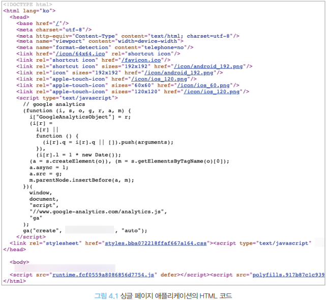
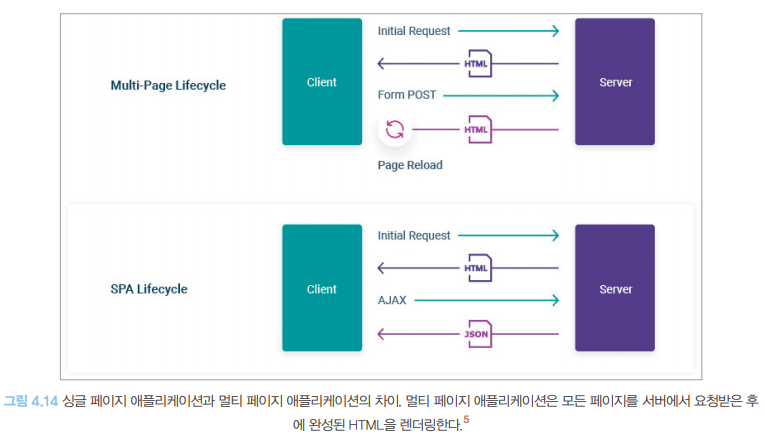

# 서버 사이드 렌더링이란?

## 싱글 페이지 애플리케이션의 세상
### 싱글 페이지 애플리케이션이란?
- **싱글 페이지 애플리케이션(Single Page Application; SPA)**: 렌더링과 라우팅에 필요한 대부분의 기능을 서버가 아닌 브라우저의 자바스크립트에 의존하는 방식
- 최초에 첫 페이지에서 데이터를 모두 불러온 이후에는 페이지 전환을 위한 모든 작업이 자바스크립트와 브라우저의 `history.pushState`와 `history.replaceState`로 이뤄지기 때문에 페이지를 불러온 이후에는 서버에서 HTML을 내려받지 않고 하나의 페이지에서 모든 작업을 처리

- 사진에서 보명 `<body/>` 태그가 비어있는데 이는 JavaScript로 채워질 부분이기 때문
- 페이지 전환 시에도 새로운 HTML 페이지를 요청하는 게 아니라 자바스크립트에서 다음 페이지의 렌더링에 필요한 정보만 HTTP 요청 등으로 가져온 다음, 그 결과를 바탕으로 `<body/>` 내부에 DOM을 추가, 수정, 삭제하는 방법으로 페이지 전환

- 장점: 한번 로딩된 이후에는 서버를 거쳐 필요한 리소스를 받아올 일이 적어지기 때문에 사용자에게 훌륭한 UI/UX를 제공
- 단점: 최초 렌더링 시에 로딩해야할 자바스크립트 리소스가 커짐

### 전통적인 방식의 애플리케이션과 싱글 페이지 애플리케이션의 작동 비교
- 과거 서버 사이드에서 작동하던 전통적인 방식의 애플리케이션
- 페이지 전환이 발생할 때마다 새롭게 페이지를 요청하고, HTML 페이지를 다운로드해 파싱하는 작업을 거침
    - ex) 네이버와 같은 대형 포털 사이트
- 현재 서비스되는 싱글 페이지 애플리케이션 중 가장 완성도가 높다고 손꼽히는 Gmail
    - 최초에 한 번 다소간의 로딩이 끝난 이후에는 페이지 전환이 모두 자바스크립트로 일어난다.

### 싱글 페이지 렌더링 방식의 유행과 JAM 스택의 등장
- 싱글 페이지 렌더링 방식의 유행
    - 과거 PHP나 JSP(JavaServer Pages)를 기반으로 대부분의 웹 애플리케이션이 만들어졌을 때는 거의 대부분의 렌덜이이 서버 사이드에서 이뤄졌다.
    - 자바스크립트의 작업 다양화와 모듈화하는 방안이 점차 논의 되며 CommonJS와 AMD(Asynchronous Module Definition) 등장
    - 2010 BackBone.js, AngularJS, Knockout.js 등 등장하면서 자바스크립트 수준에서 MVx 프레임워크를 구현하기 시작 및 자바스크립트의 역활과 규모가 점점 커짐
    - 웹페이지의 모든 영역(페이지의 렌더링에서부터 사용자의 인터랙션에 이르기까지)을 담당하면서 이를 모두 아우를 수 있는 방식인 싱글 페이지 렌더링이 인기를 얻게 됨

    - 또한 프런트엔드 개발자들에게 좀 더 간편한 개발 경험을 제공 및 간편하게 웹 애플리케이션이 개발되기 시작

- JAM 스택의 등장
    - 기존 웹 개발은 LAMP 스택(Linux(운영체제),  Apache(서버), MySQL(데이터베이스), PHP/Python(웹 프레임워크))으로 구성돼 있었음
    - 자바스크립트의 사용이 제한되어 대부분 작업을 서버에서 실행
    - 단점: 사용자가 늘어남에 따라 클라우드 개념이 부족한 당시 서버 확장이 매우 번거로움

    - **JAM(JavaScript, API, Markup) 스택**: 대부분의 작업을 Javascript에서 수행하기에 자바스크립트와 마크업을 미리 빌드해 두고 정적으로 사용자에게 제공하면 이후 작동은 모두 사용자의 클라이언트에서 실행되므로 서버 확장성 문제에서 좀 더 자유로워질 수 있게 됐음

    - 이후 MEAN(MongoDB, Express.js, AngularJS, Node.js)나 MERN(MongoDB, Express.js, React, Node.js) 스택 처럼 아예 API 서버 자체도 자바스크립트로 구현하는 구조가 인기를 끌기 시작

### 새로운 패러다임의 웹서비스를 향한 요구
- 사용자에게 공급되는 시스템의 성능이 증가함에도 불가하고 2017~ 2023까지 봤을 때 평균 로딩 시간은 10초를 넘기는 시간이 걸린다.
- 웹 애플리케이션 개발자라면 이런한 웹 서비스의 성능을 역행하는 추세에 책임감을 가질 필요가 있다.

## 서버 사이드 렌더링이란?
- 최초에 사용자에게 보여줄 페이지를 서버에서 렌더링해 빠르게 사용자에게 화면을 제공하는 방식
- 웹페이지가 점점 느려지는 상황에 대한 문제의식을 싱글 페이지 애플리케이션의 태생적인 한계에서 찾고, 이를 개선하고자 서버에서 페이지를 렌더링해 제공하는 기존 방식의 웹 개발이 다시금 떠오르고 있다.

### SPA와 SSR의 차이
- 웹 페이지 렌더링의 책임을 어디에 두는가
- SPA: 사용자에게 제공되는 자바스크립트 번들에서 렌더링 담당
- SSR: 렌더링에 필요한 작업을 모두 서버에서 수행

### SSR 장점

> 최초 페이지 진입이 비교적 빠르다
- 사용자가 최초 페이지에 진입했을 때 페이지에 유의미한 정보가 그려지는 시간(First Contentful Paint)이 더 빨라질 수 있다.
- 표시할 정보가 외부 API 호출에 많이 의존하고 있다면 다음과 같은 과정을 수행하는데 시간을 많이 사용할 것이다.
    - 사용자가 해당 페이지 진입
    - 자바스크립트 리소스 다운로드
    - HTTP 요청 - 응답
    - 응답결과를 통해 화면 렌더링

- SSR에서 수행하면 더욱 빠르게 렌더링 가능
    - 일반적으로 서버에서 HTTP요청을 수행하는 것이 더 빠르고, HTML을 그리는 작업도 서버에서 해당 HTML을 문자열로 미리 그려서 내려주는 것이 클라이언트에서 기존 HTML에 삽입하는 것보다 빠르다
- 물론 서버가 사용자에게 렌더링을 제공할 수 있을 정도의 충분한 리소스가 확보돼 있다는 일반적인 가정하에 비교
- 서버가 사용자를 감당하지 못하고, 리소스를 확보하기 어렵다면 오히려 SSR이 SPA보다 느릴 수 있다.

> 검색 엔진과 SNS 공유 등 메타데이터 제공이 쉽다.
- SSR은 검색 엔진 최적화에 유용하다.
- 검색 엔진이 사이트에 필요한 정보를 가져오는 과정
    1. 검색 엔진 로봇(머신)이 페이지에 진입
    2. 페이지가 HTML 정보를 제공해 로봇이 이 HTML을 다운로드(자바스크립트 코드 실행 ❌)
    3. 다운로드한 HTML 페이지 내부의 오픈 그래프(Open Graph)나 메타(meta) 태그 정보를 기반으로 페이지의 검색(공유) 정보를 가져오고 이를 바탕으로 검색 엔진에 저장
- 검색 엔진이 최초 페이지에 진입했을 때, 메타 정보를 제공할 수 있도록 조치하지 않는다면 검색 엔진이나 SNS 공유 시에 불이익이 있을 수 있음.(검색엔진은 JavaScript를 실행할 필요없이 정적인 정보를 가져오기 때문)
- 대부분의 작동이 자바스크립트에 의존하는 SPA와 달리, SSR은 최초 렌더링이 서버에서 일어남으로 검색 엔진에 제공할 정보를 서버에서 가공하여 HTML 응답으로 제공할 수 있음

> 누적 레이아웃 이동이 적다.
- 누적 레이아웃 이동: 사용자에게 페이지를 보여준 이후에 뒤늦게 어떤 HTML 정보가 추가되거나 삭제되어 마치 화면이 덜컥거리는 것과 같은 부정적인 사용자 경험
- 예시)
    - 신문기사를 제공하는 사이트에서 화면 전체에 기사 내용이 있고, 중간에 가로로 긴 배너를 삽입하고자 할 때, 기사(글)의 로딩은 빨라 먼저 노출되고 있는데 중간에 배너가 로딩되면 그 크기 만큼 영역이 밀려 사용자에게 불편을 초래할 것이다.(비동기적인 문제)
    - SSR은 요청이 완전히 완료된 이후에 완성된 페이지를 제공하므로 비교적 자유롭다.
- SSR도 누적 레이아웃 이동에 있어 완전히 자유롭지는 않다.
- `useEffect`를 사용하는 경우 `paint`이후 작동하기에 SSR이나 SPA 모두 문제의 소지가 있다.
- 또한 API 속도가 모두 달랐을 때, SSR에선 모든 요청이 완료되기 전까지 페이지가 렌더링되지 않을 것이므로 최초 페이지 다운로드가 굉장히 느려질 수 있다. 이는 react 18에서 등장한 스트림으로 인해 해결될 수도 있다.

> 사용자의 디바이스 성능에 비교적 자유롭다.
- 자바스크립트 리소스 실행은 사용자 디바이스에서만 실행되므로 절대적으로 사용자 디바이스 성능에 의존적
- SSR은 서버와 부담을 나눌 수 있어 사용자 디바이스 성능으로부터 조금 더 자유로워 질 수 있다.
- 인터넷 속도가 느리다면 어떤 방법이든 느리고, 사용자 방문이 폭증해 서버에 부담이 가증된다면, 또 적절한 처리가 없다면 SSR도 충분히 느려질 수 있다. 

> 보안에 좀 더 안전하다.
- JAM 스택을 채택한 프로젝트의 공통된 문제는 애플리케이션의 모든 활동이 브라우저에 노출된다는 것이다.
- API 호출과 인증 같이 사용자에게 노출되면 안 되는 민감한 작업도 포함되므로 정상적인 비즈니스 로직을 거치지 않은 상황에서 인증이나 API가 호출되는 것을 항상 방지할 준비가 돼 있어야 한다.
- 반면 SSR은 민감한 작업을 서버에서 수행하고 그 결과만 브라우저에 제공해 보안 위협을 피할 수 있다는 장점이 있다.

### SSR 단점

> 소스코드를 작성할 때 항상 서버를 고려해야 한다.
- 브라우저 전역 객체인 `window` 또는 `sessionStorage`와 같이 브라우저에만 있는 전역 객체 등이 가장 큰 문제
- `window`를 사용중이라면 `window is not defined`라는 에러를 마주친다.
- 이와 같이 서버가 접근할 수 있는 혹은 서버에서 처리할 수 있는 과정을 고려하여 코드를 작성하지 않으면 SSR의 장점을 잃는 셈이다.

> 적절한 서버가 구축돼 있어야 한다.
- SPA에서와 달리 SSR은 말 그대로 사용자의 요청을 받아 렌더링을 수행할 서버가 필요
- 사용자 요청에 따라 적절하게 대응할 수 있는 물리적인 가용량을 확보해야 하고, 때로는 예기치 않은 장애 상황에 대응할 수 있도록 복구 전략도 필요
- 또, 요청 분산 및 프로세스가 예기치 못하게 다운될 때를 대비해 PM2와 같은 프로세스 매니저의 도움도 필요
- 실제로 쿠버네티스 같은 여러 가지 라이브러리와 도구의 도움을 얻더라도 절대 쉽지 않은 일이라는 것을 알 수 있다.

> 서비스 지연에 따른 문제
- 예를 들어 SPA에서 무언가 느린 작업이 있을 때, SPA는 그래도 최초에 어떤 화면이라도 보여준 상태에서 무언가 느린 작업이 수행되기 때문에 '로딩중'과 같이 작업이 진행 중임을 적절히 안내한다면 충분히 기다릴 여지가 있지만,
- SSR에서는 최초 렌더링에 지연이 발생하면 큰 문제이다.
- 다양한 요청에 얽혀 병목 현상이 심해진다면 때로는 SSR이 더 안 좋은 사용자 경험을 제공할 수 있다.

## SPA와 SSR을 모두 알아야 하는 이유

### 서버 사이드 렌더링 역시 만능이 아니다
- 클라이언트에서 발생하는 모든 무거운 작업을 서버에 미루고, 작업이 모둣 ㅓ버에서 이뤄진다고 해서 모든 성능 문제가 해결되는 것은 아니며, 잘못된 웹페이지 설계는 오히려 성능을 해칠 뿐만 아니라 눈에 띄는 성능 개선도 얻지 못하고 서버와 클라이언트 두 군데로 관리 포인트만 늘어나기만 하는 역효과를 나을 수 있다.
- 웹페이지에서 사용자에게 제공하고 싶은 내용이 무엇인지, 또 어떤 우선순위에 따라 페이지의 내용을 보여줄 지를 잘 설계하는 것이 중요하다.

### 싱글 페이지 애플리케이션과 서버 사이드 렌더링 애플리케이션
- SPA와 모든 페이지를 각각 빌드하는 SSR 방식인 멀티페이지 애플리케이션에 대한 이야기

    1. 가장 뛰어난 싱글 페이지 애플리케이션은 가장 뛰어난 멀티 페이지 애플리케이션보다 낫다(고점이 높다)
    2. 평균적인 싱글 페이지 애플리케이션은 평균적인 멀티 페이지 애플리케이션보다 느리다. SPA에서 렌더링과 라우팅에 최적화가 돼 있지 않다면 사용자 기기에 따라 성능이 들쑥 날쑥하고, 적절한 성능 최적화도 돼 있지 않을 가능성이 높으므로 멀티 페이지 애플리케이션 대비 성능이 아쉬울 가능성이 크다(성능 최적화가 어려움)
        > 멀티 페이지 애플리케이션에서 발생하는 라우팅으로 인한 문제를 해결하기 위한 다양한 API
        > - 페인트 홀딩(Paint Holding): 같은 출처(origin)에서 라우팅이 일어날 경우 화면을 잠깐 하얗게 띄우는 대신 이전 페이지의 모습을 잠깐 보여주는 기법
        > - back forward cache(bfcahe): 브라우저 앞으로 가기, 뒤로가기 실행 시 캐시된 페이지를 보여주는 기법
        > - Shared Element Transitions: 페이지 라우팅이 일어났을 때 두 페이지에 동일 요소가 있다면 해당 콘텍스트를 유지해 부드럽게 전환되게 하는 기법
        >
        > SPA에서도 구현가능하지만 상당한 노력을 해야한다.

### 현대의 서버 사이드 렌더링
- 현대의 SSR방식은 지금까지의 LAMP 스택에서 표현했떤 서버 사이드 렌더링 방식과는 조금 다르다.

> 기존 LAMP 스택의 장단점
> - 장점: 모든 페이지 빌드를 서버에서 렌더링해 초기 페이지 진입이 빠르다
> - 단점: 이후 라우팅이 발생할 때도 마찬가지로 서버에 의존해야 하기 때문에 싱글 페이지 렌더링 방식에 비해 라우팅이 느림

- 현대의 서버 사이드 렌더링 방식: 두 장점을 모두 취한 방식

1. 최초 웹사이트 진입 시 서버 사이드 렌더링 방식으로 서버에서 완성된 HTML을 제공
2. 라우팅에서는 서버에서 내려받은 자바스크립트를 바탕으로 마치 싱글 페이지 애플리케이션처럼 작동
- `Next.js`, `Remix` 등등

## 정리

|구분|SPA|SSR|
|:---:|:---:|:---:|
|Full Name|Single Page Application|Server Side Rendering|
|정의|렌더링과 라우팅에 필요한 대부분의 기능을 서버가 아닌 브라우저의 자바스크립트에 의존하는 방식|최초에 사용자에게 보여줄 페이지를 서버에서 렌더링해 빠르게 사용자에게 화면을 제공하는 방식|
|차이(웹 페이지 렌더링의 책임을 어디에 둘까)|사용자에게 제공되는 자바스크립트 번들에서 렌더링 담당|렌더링에 필요한 작업을 모두 서버에서 수행|
|장점|최초 페이지 진입이 비교적 빠르다|향상된 사용자 경험|
||검색 엔진과 SNS 공유 등 메타데이터 제공이 쉽다.|빠른 로딩 속도와 반응성|
||누적 레이아웃 이동이 적다.|웹/모바일 공통 아키텍쳐 사용|
||사용자의 디바이스 성능에 비교적 자유롭다.|서버 확장에 있어 서버 부담이 비교적 덜하다.|
||보안에 좀 더 안전하다.|효율적인 캐싱|
|단점|소스코드를 작성할 때 항상 서버를 고려해야 한다.|비교적 보안에 취약하다|
||적절한 서버가 구축돼 있어야 한다.|사용자 디바이스 성능에 의존성이 크다|
||서비스 지연에 따른 문제||