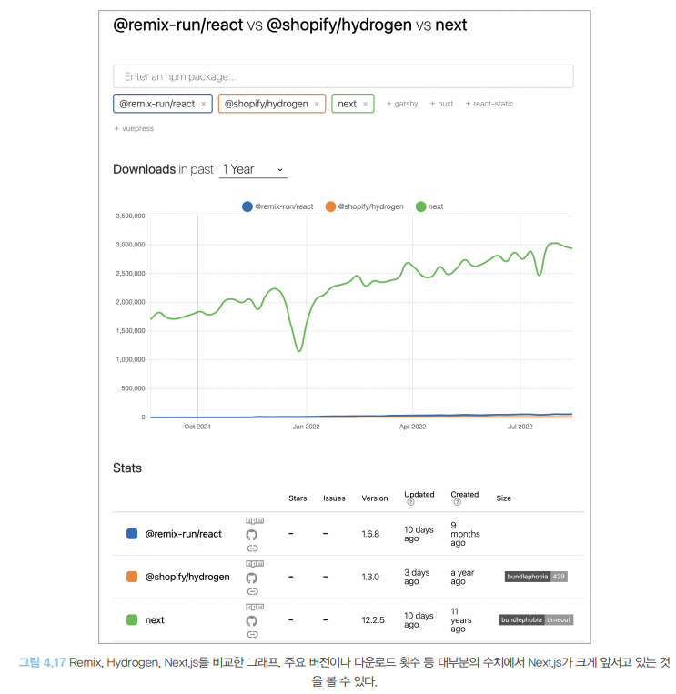
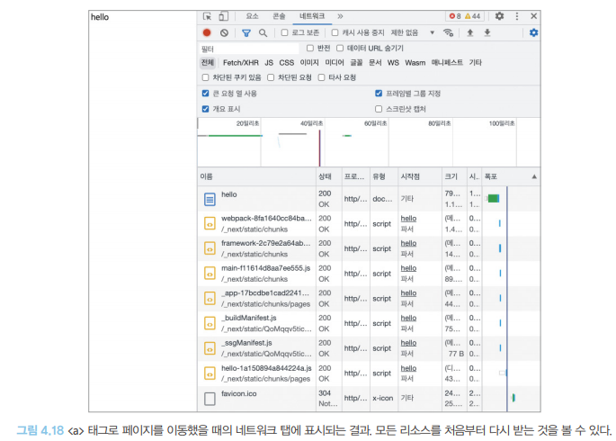
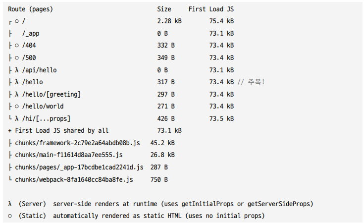
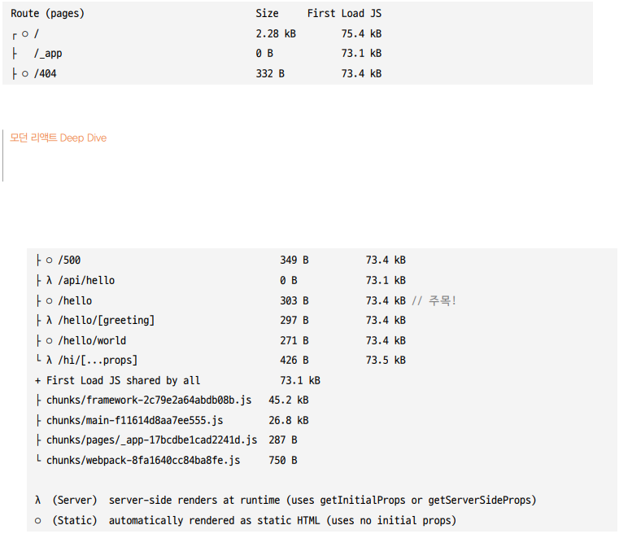

# Next.js 톺아보기
- 직접 리액트 서버 사이드 렌더링 애플리케이션을 만드는건 미친 짓이다. 그러니 이미 있는걸 사용하자(공식 문서에도 추천하지 않는 방법이다.)

## Next.js란?

> Next.js
- Vercel(미국 스타트업)에서 만든 풀스택 웹 애플리케이션을 구축하기 위한 **리액트 기반 프레임워크**
- 리액트 서버 사이드 렌더링의 대명사(Remix나 Hydrogen에 비해 사용자 층이 두껍고, 오래됨)

> 유사 프로젝트: `react-page`
- 페이지를 서버 또는 클라이언트에서 리액트를 손쉽게 사용할 수 있는 것을 목표로 만들어진 프로젝트
- `react-page-middlewares`를 보면 실제로 서버에서 렌더링이 가능하도록 코드를 작성
- 지금은 중단됨, `Next.js`가 영감을 받음
- Next.js의 페이지 구조, 즉 실제 디렉터리 구조가 곧 URL로 변환되는 것은 react-page에서 이미 라우팅을 위해 구현해 놓은 기능으로 Next.js에서도 동일하게 디렉터리 기반 라우팅을 서비스

> Next.js 선택이 합리적인 이유
- 다른 프레임워크에 비해 사용자 층이 많음
- 모기업인 Vercel의 전폭적인 지원을 받을 수 있음
- SWR, SWC, Turbopack, Svelte 등 웹 생태계 전반에 영향력 있는 프로젝트를 계속해서 개발하거나 인수
- 꾸준히 새로운 기능을 추가해 릴리스 중



## Next.js 시작하기
- `create-next-app`을 제공(`create-react-app`과 유사)

> 시작(`create-next-app`)

```bash
npx create-next-app@latest --ts
```

### 파일 살펴보기

> [package.json](../examples/next-example/package.json)
- npm 프로젝트를 살펴볼 때는 `package.json`을 먼저 봐야함
- **프로젝트 구동에 필요한 모든 명령어 및 의존성이 포함되어 있음**
- **프로젝트의 대략적인 모습을 확인하는데 매우 유용**

```json
{
  "name": "my-app",
  "version": "0.1.0",
  "private": true,
  "scripts": {
    "dev": "next dev",
    "build": "next build",
    "start": "next start",
    "lint": "eslint . --fix",
    "prettier": "prettier . --write"
  },
  "dependencies": {
    "@next/font": "13.1.6",
    "@types/node": "18.13.0",
    "@types/react": "18.0.28",
    "@types/react-dom": "18.0.11",
    "next": "13.1.6",
    "react": "18.2.0",
    "react-dom": "18.2.0",
    "typescript": "4.9.5"
  },
  "devDependencies": {
    "@titicaca/eslint-config-triple": "^5.0.0",
    "@titicaca/prettier-config-triple": "^1.0.2",
    "eslint": "^8.38.0",
    "eslint-config-next": "13.1.6",
    "prettier": "^2.8.7"
  }
}
```
- 의존성(`dependencies`)
    - `next`: Next.js의 기반이 되는 패키지
    - `eslint-config-next`: Next,js 기반 프로젝트에서 사용하도록 만들어진 ESLint 설정, Next.js 기반 프로젝트라면 꼭 사용하는 것을 추천(eslint-config-airbnb 같은 기존 사용 규칙이 있다면 추가하여 함께 사용하는 것을 추천)

> [next.config.js](../examples/next-example/next.config.js)
- Next.js 프로젝트의 환경 설정을 담당
```js
/** @type {import('next').NextConfig} */
const nextConfig = {
  reactStrictMode: true,
  swcMinify: true,
}

module.exports = nextConfig
```
- `@type` : 자바스크립트 파일에 타입스크립트의 타입도움을 위한 코드, next의 NextConfig를 기준으로 타입의 도움을 받을 수 있다.
- `reactStrictMode`: 리액트의 엄격 모드와 관련된 옵션, 리액트 애플리케이션 내부 잠재적인 문제를 개발자에게 알리기 위한 도구(특별한 이유가 없다면 켜두자)
- `swcMinify`: Vecel에서는 `SWC`라 불리는 또 다른 오픈소스를 만듦(번들링과 컴파일을 더욱 빠르게 수행하기 위해), 바벨의 대안이라고 볼 수 있으며, 국내 개발자 강동윤님이 만든 프로젝트(Vercel에 합류해 Next,js에 포함)
    - 바벨보다 `SWC`가 빠른 이유
        1. 자바스크립트 기반의 바벨과는 다르게 러스트(Rust)라는 완전이 다른 언어로 작성(C/C++과 비슷한 속도)
        2. 병렬로 작업을 처리
- [공식 홈페이지](https://nextjs.org/docs/api-reference/next.config.js/introduction)
- [자세한 설정](https://github.com/vercel/next.js/blob/canary/packages/next/src/server/config-shared.ts)

> [pages/_app.tsx](../examples/next-example/src/pages/_app.tsx)
- Next.js에서 제공하는 예약어로 관리하는 페이지
- `pages/`가 경우에 따라 `src/`하단에 존재할 수도 있음(`src/` 혹은 프로젝트 루트에 있어도 동일하게 작동)
- 애플리케이션 페이지 전체를 초기화하는 곳
```tsx
import type { AppProps } from 'next/app'

export default function App({ Component, pageProps }: AppProps) {
  return <Component {...pageProps} />
}
```
- `default export`로 내보낸 함수는 애플리케이션 전체 페이지의 시작점
- `_app.tsx`에서 할 수 있는 내용
    - 에러 바운더리를 사용해 애플리케이션 전역에서 발생하는 에러 처리
    - `reset.css` 같은 전역 CSS 선언
    - 모든 페이지에 공통으로 사용 또는 제공해야 하는 데이터 제공
- `render()` 내부에 `console.log()` 사용하면 브라우저 콘솔창이 아닌 Next.js를 실행한 터미널에 기록, 페이지 전환 시 서버에 로깅되지 않고, 브라우저에 로깅(최초: 서버 사이드 렌더링/ 이후: 클라이언트 사이드 렌더링)

> [pages/_document.tsx](../examples/next-example/src/pages/_document.tsx)
- Next.js에서 제공하는 예약어로 관리하는 페이지
- `_document.tsx`가 없어도 실행에 지장 없음(최초 `create-next-app` 실행 시 없는 파일)
- 몇 가지 시나리오에서 유용한 도움을 주는 파일
- 애플리케이션의 HTML을 초기화 하는 곳

```tsx
import { Html, Head, Main, NextScript } from 'next/document'

export default function Document() {
  return (
    <Html lang="en">
      <Head />
      <body>
        <Main />
        <NextScript />
      </body>
    </Html>
  )
}
```
- `_app.tsx`와의 차이점
    - `<html>`이나 `<body>`에 DOM 속성을 추가하고 싶다면 `_document.tsx`를 사용
    - `_app.tsx`는 렌더링이나 라우팅에 따라 서버나 클라이언트에서 실행할 수 있지만, `_document.tsx`는 무조건 서버에서 실행된다.(`onClick`과 같은 이벤트 핸들러 추가 불가능 - hydrate의 몫)
    - Next.js에 존자해는 두 가지 `<head>`
        1. `next/document`에서 제공하는 `head`
            - 오직 `_document.tsx`에서만 사용 가능
            - `<title/>` 사용 불가능(`@next/next/no-title-in-document-head` 경고 발생)
            - 서버에서 사용 가능한 데이터 불러오기 함수 사용 불가(`getServerSideProps`, `getStaticProps` 등)
            - `CSS-in-JS`의 스타일을 서버에서 모아 HTML로 제공
        2. `next/head`에서 기본적으로 제공하는 `head`
            - 페이지에서 사용가능
            - SEO(검색 엔진 최적화)에 필요하나 정보나 title 등을 담을 수 있음
    - `_app.tsx`: Next.js를 초기화하는 파일, Next.js 설정과 관련된 코드를 모아두는 곳
    - `_document.tsx`: **Next.js로 만드는 웹사이트의 뼈대가 되는 HTML 설정과 관련된 코드를 추가하는 곳(반드시 서버에서만 렌더링)**
- 웹 애플리케이션에 공통적인 제목 필요: `_app.tsx`
- 페이지별 제목 필요: 페이지 파일 내부에서 2번 사용

> [pages/_error.tsx](../examples/next-example/src/pages/_error.tsx)
- Next.js에서 제공하는 예약어로 관리하는 페이지
- `create-next-app`이 기본적으로 생성해 주는 파일이 아님(없더라도 실행에 지장 없음)
```tsx
import { NextPageContext } from 'next'

function Error({ statusCode }: { statusCode: number }) {
  return (
    <>
      {statusCode ? `서버에서 ${statusCode}` : '클라이언트에서'} 에러가
      발생했습니다.
    </>
  )
}

Error.getInitialProps = ({ res, err }: NextPageContext) => {
  const statusCode = res ? res.statusCode : err ? err.statusCode : ''
  return { statusCode }
}

export default Error
```
- 클라이언트에서 발생하는 에러 또는 서버에서 발생하는 `500`에러를 처리할 목적
- Next.js 프로젝트 전역 에러 처리 파일
- **개발 모드에서는 이 페이지에 방문할 수 없고, 에러가 발생하면 Next.js가 제공하는 개발자 에러 팝업(프로덕션으로 빌드해서 확인)**

> [pages/404.tsx](../examples/next-example/src/pages/404.tsx)
- Next.js에서 제공하는 예약어로 관리하는 페이지
- `404`페이지 정의할 수 있는 파일(커스텀 가능)
- 없으면 Next.js 기본 404 페이지 제공
```tsx
import { useCallback } from 'react'

export default function My404Page() {
  const handleClick = useCallback(() => {
    console.log('hi') // eslint-disable-line no-console
  }, [])
  return (
    <h1>
      페이지를 찾을 수 없습니다. <button onClick={handleClick}>클릭</button>
    </h1>
  )
}
```

> [pages/500.tsx](../examples/next-example/src/pages/500.tsx)
- Next.js에서 제공하는 예약어로 관리하는 페이지
- 서버에서 발생하는 에러 핸들링 페이지
- `_error.tsx`와 `500.tsx`가 모두 있다면 `500.tsx`가 우선적으로 실행(없으면 기본 페이지 제공, 커스텀 하는 파일)
```tsx
import { useCallback } from 'react'

export default function My500Page() {
  const handleClick = useCallback(() => {
    console.log('hi') // eslint-disable-line no-console
  }, [])

  return (
    <h1>
      (500페이지) 서버에서 에러가 발생했습니다.{' '}
      <button onClick={handleClick}>클릭</button>
    </h1>
  )
}
```

> [pages/index.tsx](../examples/next-example/src/pages/index.tsx)
- 개발자가 자유롭게 명칭할 수 있는 페이지
- `react-page`에서 영감을 받아 라우팅 명이 파일명으로 이어지는 구조가 현재 Next.js까지 이어진다
- `/pages`디렉터리를 기초로 구성, 각 페이지에 있는 `default export`로 내보낸 함수가 해당 페이지의 루트 컴포넌트
```tsx
import type { NextPage } from 'next'
import Link from 'next/link'

const Home: NextPage = () => {
  return (
    <ul>
      <li>
        {/* next의 eslint 룰을 잠시 끄기 위해 추가했다. */}
        {/* eslint-disable-next-line */}
        <a href="/hello">A 태그로 이동</a>
      </li>
      <li>
        {/* 차이를 극적으로 보여주기 위해 해당 페이지의 리소스를 미리 가져오는 prefetch를 잠시 꺼두었다. */}
        <Link prefetch={false} href="/hello">
          next/link로 이동
        </Link>
      </li>
    </ul>
  )
}

export default Home
```
- 예제 프로젝트의 구성 정리
    - `/pages/index.tsx` : 웹사이트의 루트, `localhost:3000`과 같은 루트 주소를 의미
    - `/pages/hello.tsx` : `/pages`가 생략되고, 파일명이 주소가 된다. (`localhost:3000/hello`로 접근 가능)
    - `/pages/hello/world.tsx` : 디렉터리 깊이만큼 주소를 설정할 수 있음(`localhost:3000/hello/world`로 접근 가능), `/pages/hello/index.tsx`은 ``/pages/hello.tsx`와 같은 주소
    - `/pages/hello/[greeting].tsx` : `[]`의 의미는 여기에 어떠한 문자도 올 수 있다라는 뜻
        - 서버 사이드에서 greeting이라는 변수에 사용자가 접속한 주소명이 오게 된다.
        - `localhost:3000/hello/1`, `localhost:3000/hello/greeting`모두 유효하며 `localhost:3000/hello/[greeting].tsx`로 접근, 만약 이미 정의된 주소가 있다면 정의해 둔 주소가 우선순위를 갖는다.
    - `/pages/hi/[...props].tsx` : `/hi`를 제외한 `/hi` 모든 주소가 여기로 접근, `[...props]`값은 `props`라는 변수에 배열로 오게 된다. 
    
> [[]의 변수로 지정된 값 사용법](../examples/next-example/src/pages/hi/[...props].tsx)
- 주의할 점
    - 숫자를 넘겨도 형변환되지 않음
    - 하나의 주소가 들어가도 배열 형태를 유지
```tsx
import { useRouter } from 'next/router'
import { useEffect } from 'react'
import { NextPageContext } from 'next'

export default function HiAll({ props: serverProps }: { props: string[] }) {
    // 클라이언트에서 값을 가져오는 법
  const {
    query: { props },
  } = useRouter()

  useEffect(() => {
    /* eslint-disable no-console */
    console.log(props)
    console.log(JSON.stringify(props) === JSON.stringify(serverProps)) // true
    /* eslint-enable no-console */
  }, [props, serverProps])

  return (
    <>
      hi{' '}
      <ul>
        {serverProps.map((item) => (
          <li key={item}>{item}</li>
        ))}
      </ul>
    </>
  )
}

export const getServerSideProps = (context: NextPageContext) => {
    // 서버에서 값을 가져오는 법
  const {
    query: { props },
  } = context

  return {
    props: {
      props,
    },
  }
}
```

> [/pages/api/hello.ts](../examples/next-example/src/pages/api/hello.ts)
- 서버의 API를 정의하는 폴더
- 기본적인 디렉터리에 따른 라우팅 구조는 페이지와 동일하되, `/pages/api`가 `/api`라는 접두사가 붙는다는 점만 다름
- `/pages/api/hello`는 다른 페이지 파일과 다르게 HTML요청이 아닌 단순히 서버 요청을 주고 받음

```ts
// Next.js API route support: https://nextjs.org/docs/api-routes/introduction
import type { NextApiRequest, NextApiResponse } from 'next'

interface Data {
  name: string
}

export default function handler(
  req: NextApiRequest,
  res: NextApiResponse<Data>,
) {
  res.status(200).json({ name: 'John Doe' })
}
```
- `default export`로 내보낸 함수가 실행
- 오직 서버에서만 실행
- `window`나 `document` 등 브라우저에서만 접근할 수 있는 코드를 작성하면 에러가 발생
- 서버에서 내려주는 데이터를 BFF(backend-for-frontend) 형태로 활용하거나 완전한 풀스택 애플리케이션을 구축하고 싶을 때 혹은 CORS(Cross-Origin Resource Sharing) 문제를 우회하기 위해 사용 가능


### 서버 라우팅과 클라이언트 라우팅의 차이
- Next.js는 서버 사이드 렌더링을 수행하지만 동시에 싱글 페이지 애플리케이션과 같이 클라이언트 라우팅 또한 수행(모두 사용)
- [예제](../examples/next-example/src/pages/hello.tsx)
> 서버 라우팅(`<a/>` 사용)



- 네트워크에는 `hello`라는 이름의 문서를 요청, 이후에는 `webpack`, `framework`, `main`, `hello` 등 페이지를 만드는 데 필요한 모든 리소스를 처음부터 가져옴
- `console.log()`도 서버와 클라이언트에 각각 동시에 기록
- **서버에서 렌더링 수행 후 클라이언트에서 `hydrate` 과정에서 한 번 더 실행**


> 클라이언트 라우팅(`Link 태그 사용(next/Link에서 가져와서 사용)`)


- `hello.js`만 요청
- `hello.js` : `hello` 페이지를 위한 자바스크립트, 클라이언트에서 필요한 자바스크립트만 불러온 뒤 라우팅하는 클라이언트 라우팅/렌더링 방식으로 동작


> Next.js 장점 적극 살리기 위한 규칙
- `<a>` 대신 `<Link>`를 사용
- `window.location.push` 대신 `router.push`를 사용 

### 페이지에서 getServerSideProps를 제거하면 어떻게 될까?
- 어떠한 방식으로 접근해도 `<a/>`, `<Link/>`에 상관없이 서버에 로그가 남지 않는다.
- **Next.js는 서버 사이드 렌더링 프레임워크지만 모든 작업이 서버에서 일어나지 않는다.**
```tsx
// pages/hello.tsx
export default function Hello() {
    console.log(typeof window === 'undefined' ? '서버' : '클라이언트')

    return <>hello</>
}
```

> `getServerSideProps`가 있는 빌드
- 서버 사이드 런타임 체크가 되어 있음


> `getServerSideProps`가 없는 빌드
- 빌드 크기가 약간 줄고, 서버 사이드 렌더링이 필요없는 정적인 페이지로 분류
- `getServerSideProps`가 없기 때문에 서버에서 실행되지 않아도 되는 페이지로 처리(`typeof window === 'undefined' ? '서버' : '클라이언트'`도 `'클라이언트'`로 축약)



## Data Fetching
- Next.js의 서버 사이드 렌더링 지원을 위한 몇 가지 데이터 불러오기 전략
- `pages/`의 폴더에 있는 라우팅이 되는 파일에서만 사용 가능
- 예약어로 지정되어 반드시 정해진 함수명으로 `export`를 사용해 함수를 파일 외부로 내보내야 함
- 활용 시, 서버에서 미리 필요한 페이지를 제공하거나 해당 페이지에 요청이 있을 때마다 서버에서 데이터를 조회해서 미리 페이지를 만들어서 제공할 수 있음

### getStaticPaths와 getStaticProps
- 어떠한 페이지를 CMS(Contents Management System)나 블로그, 게시판과 같이 사용자와 관계없이 정적으로 결정된 페이지를 보여주고자 할 때 사용되는 함수(fallback을 사용해 사용자의 요청이 있을 때만 빌드하는 등 최적화를 추가 가능)
- `getStaticPaths`와 `getStaticProps`는 반드시 함께 있어야 사용 가능

- 예시(/pages/post/[id]와 같은 페이지가 있고, 해당 페이지에 다음과 같이 두 함수를 사용했다고 가정)
```tsx
import { GetStaticPaths, GetStaticProps } from 'next'

export const getStaticPaths: GetStaticPaths = async () => {
    return {
        paths: [{ params: {id: '1' } }, { params: { id: '2' } }],
        fallback: false,
    }
}

export const getStaticProps: GetStaticProps = async ({ params }) => {
    const { id } = params

    const post = await fetchPost(id)

    return {
        props: { post },
    }
}

export default function Post({ post }: { post: Post }){
    // post로 페이지를 렌더링한다.
}
```

> getStaticPaths
- `/pages/post/[id]`가 접근 가능한 주소를 정의하는 함수
- `params`를 키로 하는 함수에 적절한 값을 배열을 넘겨주면 해당 페이지에서 접근 가능한 페이지를 정의할 수 있음
- 예시에서는 `/post/1`, `/post/2`만 접근 가능함을 의미, 다른 페이지는 404를 반환

- `fallback` 옵션
    - 미리 빌드해야 할 페이지가 너무 많은 경우 사용 가능
    - paths에 미리 빌드해 둘 몇 개의 페이지만 리스트로 반환하고, true나 "blocking"으로 값을 선언할 수 있다
    - next build를 실행할 때 미리 반환해 둔 paths에 기재돼 있는 페이지만 앞서와 마찬가지로 미리 빌드하고, 나머지 페이지의 경우에는 다음과 같이 작동
        - `true`: 사용자가 미리 빌드하지 않은 페이지에 접근할 경우, 빌드되기 전까지는 `fallback` 컴포넌트를 보여주고, 빌드가 완료된 이후에 해당 페이지를 보여주는 옵션
            ```tsx
            function Post({ post } : { post: Post}) {
                const router = useRouter()
                // 아직 빌드되지 않은 페이지에 왔을 경우 사용자에게 노출할 로딩 컴포넌트를 정의할 수 있다.
                if (router.isFallback) {
                    return <div>Loading...</div>
                }

                // post 렌더링
            }
            ``` 
        
        - `"blocking"`: 별도의 로딩과 같은 처리를 하지 않고, 단순히 빌드가 완료될 때까지 사용자를 기다리게 하는 옵션, 서버 사이드에서 렌더링할 때까지 대기한 다음, 렌더링이 완료되면 해당 페이지를 제공 

> getStaticProps
- `getStaticPaths`를 통해 정의한 페이지를 기준으로 해당 페이지로 요청이 왔을 때 제공할 `props`를 반환하는 함수
- 예시에서는 id가 1과 2로 제한돼 있기 때문에 `fetchPost(1)`, `fetchPost(2)`를 기준으로 각각 함수의 응답 결과를 변수로 가져와 `props`의 `{post}`로 반환하게 됨

> Post
- `getStaticProps`가 반환하는 post를 렌더링하는 역할

> 정리
- `getStaticPaths`: 페이지 제한
- `getStaticProps`: 페이지 데이터 요청을 수행해 props로 반환
- `POST`: 페이지 렌더링
- 두 함수를 사용하면 빌드 시점에 미리 데이터를 불러온 다음에 정적인 HTML 페이지를 만들 수 있음

### getSeverSideProps
- **서버에서 실행되는 함수**이며 해당 함수가 있다면 **무조건 페이지 진입 전에 이 함수를 실행**(컴포넌트 내 DOM에 추가하는 이벤트 핸들러 함수와 `useEffect`와 같은 몇가지를 제외하고는 서버에서 실행될 수 있다.)
- 응답값에 따라 페이지의 루트 컴포넌트에 `porps`를 반환할 수도, 혹은 다른 페이지로 리다이렉트시킬 수도 있다.
- Next.js는 꼭 서버에서 실행해야 하는 페이지로 분류해 빌드 시에도 서버용 자바스크립트 파일을 별도로 만듦
- 서버사이드 렌더링은 getServerSideProps의 실행과 함께 이뤄지며, 이를 바탕으로 페이지를 렌더링하는 과정이 서버 사이드 렌더링임.
- `__NEXT_DATA__`라는 id가 지정된 script는 getServerSideProps의 정보인 props와 현재 페이지 정보, query 등 Next.js 구동에 필요한 다양한 정보가 담겨있음
- `props`의 결과를 HTML에 정적으로 작성해주기에 `JSON`으로 직렬화할 수 없는 값(`class`, `Date` 등)은 `props`로 제공할 수 없음

```tsx
import type { GetServerSideProps } from 'next'

export default function Post({ post }: { post: Post }) {
    // 렌더링
}

export const getServerSideProps: GetServerSideProps = async (context) => {
  const {
    query: { id = '' },
  } = context       //  /post/[id]와 같은 경로에 있는 id 값을 context.query.id 로 접근 가능
  const post =  await fetchPost(id.toString())
  return {
    props: {post},
  } 
}
```
```html
<!-- 결과 -->
<!DOCTYPE html>
<html>
  <!-- 생략 -->
  <body>
    <div id="__next" data-reactroot="">
      <h1>안녕하세요</h1>
      <p>반갑습니다.</p>
      <script id="__NEXT_DATA__" type="application/json">
        {
          "props": {
            "pageProps": {
              "post": { "title": "안녕하세요", "contents": "반갑습니다." }
            },
            "__N_SSP": true
          },
          "page": "/post/[id]",
          "query": { "id": "1" },
          "buildId": "development",
          "isFallback": false,
          "gssp": true,
          "scriptLoader": []
        }
      </script>
    </div>
    <!-- 생략 -->
  </body>
</html>
```

> 리액트의 서버 사이드 렌더링 과정
1. 서버에서 fetch 등으로 렌더링에 필요한 정보를 가져옴
2. 1번에서 가져온 정보를 기반으로 HTML을 완성
3. 2번의 정보를 클라이언트(브라우저)에 제공
4. 3번의 정볼르 바탕으로 클라이언트에서 `hydrate`작업을 수행(DOM에 리액트 라이프 사이클과 이벤트 핸드러를 추가하는 작업)
5. 4번 작업인 `hydrate`로 만든 리액트 컴포넌트 트리와 서버에서 만든 HTML이 다르다면 불일치 에러 발생
6. 5번 작업도 1번과 마찬가지로 fetch 등을 이용해 정보를 가져와야 함

> `__NEXT_DATA__` 정보는 왜 script 태그로 되어 있을까
- 위 과정에서 1번과 6번 작업 사이에 fetch 시점에 따라 결과물의 불일치가 발생할 수 있으므로 1번에서 가져온 정보를 결과물인 HTML에 script 형태로 내려줌
- 1번의 작업을 6번의 작업에서 반복하지 않아도 돼 불필요한 요청을 막을 수 있고, 시첨 차이로 인한 결과물 차이도 막을 수 있음
- 6번에서 재요청하는 대신 `<script />`를 읽어도 1번의 데이터를 동일하게 가져올 수 있음
- Next.js에서는 이 정보를 `window` 객체에도 저장

> `getServerSideProps` 제약
- `window`, `document`와 같이 브라우저에서만 접근할 수 있는 객체에는 접근할 수 없다
- API 호출 시 `/api/some/path`와 같이 `protocol`과 `domain` 없이 fetch요청을 할 수 없다. 브라우저와 다르게 서버는 자신의 호스트를 유추할 수 없기 때문에 반드시 완전한 주소를 제공해야 `fetch`가 가능하다.
- 여기서 발생한 에러는 `500.tsx`와 같이 미리 정의해 둔 에러 페이지로 리다이렉트된다.
- 꼭 최초에 보여줘야하는 데이터가 아니라면 `getServerSideProps`보다는 클라이언트에서 호출하는 것이 유리하며, `getServerSideProps` 내부에서 실행하는 내용은 최대한 간결하게 작성하는 것이 좋다.

> 조건에 따른 redirect
- post를 조회하는데 실패하면 `/404` 페이지로 보낼 수 있도록 설정할 수 있음
```tsx
export const getServerSideProps: GetServerSideProps = async (context) => {
  const {
    query: { id= "" },
  } = context
  const post = await fetchPost(id.toString())

  if (!post){
    redirect: {
      destination: "/404"
    }
  }
  return {
    props: { post },
  }
}
```

### getInitialProps
- `getStaticProps`나 `getServerSideProps`가 나오기 전, 사용할 수 있는 유일한 페이지 데이터 불러오기 수단
- 대부분의 경우 `getStaticProps`나 `getServerSideProps`를 사용하는 것을 권장(`getInitialProps`의 제한적인 사용 - _app.tsx, _error.tsx 등 Next.js 특성상 사용이 제한돼 있는 페이지에서만 사용하는 것이 좋음)

> `getInitialProps`를 이용한 예시
```jsx
// 함수 컴포넌트
import Link from 'next/link'

export default function Todo({ todo }) {
  return (
    <>
      <h1>{todo.title}</h1>
      <ul>
        <li>
          <Link href="/todo/1">1번</Link>
        </li>

        <li>
          <Link href="/todo/2">2번</Link>
        </li>

        <li>
          <Link href="/todo/3">3번</Link>
        </li>
      </ul>
    </>
  )
}

Todo.getInitialProps = async (ctx) => {
  const {
    query: { id= "" },
  } = ctx
  const response = await fetch(
    `https://jsonplaceholder.typicode.com/todos/${id}`,
  )
  const result = await response.json()
  console.log('fetch Complete!')
  return { todo: result }
}

// 클래스 컴포넌트
export default class Todo extends React.Component {
  static async getInitialProps() {
    const {
      query: { id: "" },
    } = ctx
    const response = await fetch(
      `https://jsonplaceholder.typicode.com/todos/${id}`,
    )
    const result = await response.json()
    console.log('fetch Complete!')
    return {todo: result}
  }

  render(){
    // ...
  }
}
```

> `console.log`를 활용한 `getInitialProps` 라우팅 위치 확인
- 최초 페이지 진입 시: 서버 라우팅
- 최초를 제외한 페이지 진입 시: 클라이언트 라우팅
```jsx
Todo.getInitialProps = async = (context) => {
  const isServer = context.req
  console.log(`${isServer ? '서버' : '클라이언트'}에서 실행됐습니다.`)
  // do something...
}
```

- context 객체 값
  - `pathname`: 현재 경로명, 단 실제 경로가 아닌 페이지상 경로(예제- "/todo/[id]")
  - `asPath`: 브라우저에 표시되는 실제 경로를 의미. pathname과 다르게 "/todo/1"과 같이 사용자에게 표시되는 주소가 보임
  - `query`: URL에 존재하는 쿼리. `pathname`속 `[id]`도 포함, 쿼리 파라미터가 없어도 기본적으로 `{id: '1'}`과 같은 값이 제공. 만약 쿼리 문자열에 `/todo/2?foo=bar&id=3`처럼 추가되어 있다면 `{foo: 'bar', id: '2'}` 객체가 반환된다. `[id]`는 페이지의 `query`를 우선시하므로 반드시 다른 값으로 변경해야 한다.
  - `req`: Node.js에서 제공하는 HTTP request 객체(http.IncomingMessage)
  - `res`: Node.js에서 제공하는 HTTP response 객체(http.ServerResponse)

> 

## 스타일 적용하기
- 웹 개발 환경에서 Next.js에서 입힐 수 있는 스타일 방식

### 전역 스타일
- `_app.tsx` 사용(`import`로 불러오면 애플리케이션 전체에 영향을 미칠 수 있음)
- 글로벌 스타일은 다른 페이지나 컴포넌트와 충돌할 수 있어 반드시 `_app.tsx`에서만 제한적으로 사용
- CSS Reset
- 브라우저에 기본으로 제공되고 있는 스타일을 초기화하는 등 애플리케이션 전체에 공통으로 적용하고 싶을 때 사용

```tsx
import type { AppProps } from 'next/app'

// 적용하고 싶은 글로벌 스타일
import '../styles.css'

// 혹은 node_modules에서 바로 꺼내올 수 있음
import 'normalize.css/normalize.css'

export default function MyApp({ Component, pageProps }: AppProps){
  return <Component {...pageProps} />
}
```

### 컴포넌트 레벨 CSS
- `[name].module.css`와 같은 명명 규칙만 준수하면 되며, 이 컴포넌트 레벨 CSS는 다른 컴포넌트의 클래스명과 겹쳐서 스타일에 충돌이 일어나지 ㅇ낳도록 고유한 클래스명을 제공(어느 파일에서든 추가 가능)
```css
.alert {
  color: red;
  font-size: 16px;
}
```

```tsx
import styles from './Button.module.css'

export function Button() {
  return (
    <button type="button" className={styles.alert}>
    경고!
    </button>
  )
}
```

```html
<head>
  <!-- 생략 -->
  <!-- 실제 프로덕션 빌드 시에는 스타일 태그가 아닌 별도 CSS 파일로 생성 -->
  <style>
    /* 컴포넌트 별 스타일 충돌을 방지하기 위한 Next.js의 최적화: Button_alert__62TGU */
    .Button_alert__62TGU {
      color: red;
      font-size: 16px;
    }
  </style>
</head>
<button type="button" class="Button_alert__62TGU">경고!</button>
```

### SCSS와 SASS
- css를 사용할 때와 동일한 방식으로 사용 가능
- `npm install --save-dev sass`와 같은 명령어로 별도의 설정 없이 바로 사용 가능
- scss에서 제공하는 variable을 컴포넌트에서 사용하고 싶다면 export 문법을 사용하면 됨
```tsx
// primary 변수에 blue라는 값을 넣음
$primary: blue;

:export{
  primary: $primary
}

import styles from "./Button.module.scss";

export function Button() {
  return (
    {/* styles.primary 형태로 꺼내올 수 있음*/}
    <span style={{color: styles.primary}}>
      안녕하세요
    </span>
  );
}
```

### CSS-in-JS
- 자바스크립트 내부에 스타일시트를 삽입하는 방식
- 편의성 이외의 성능 이점이 있는지는 의문(직관성)
- 예) styled-jsx, styled-components, Emontion, Linaria 등
- [참조](https://nextjjs.org/docs/basic-features/built-in-css-support#css-in-js)

> styled-component Next.js에 추가하기
- `_document.tsx` 추가 및 아래 코드 추가
```tsx
// _document.tsx
import Document, {
  Html,
  Head,
  Main,
  NextScript,
  DocumentContext,
  DocumentInitialProps,
} from 'next/document'
import { ServerStyleSheet } from 'styled-components'

export default function MyDocument(){
  return (
    <Html lang="ko">
      <Head />
      <body>
        <Main />
        <NextScript />
      </body>
    </Html>
  )
}

MyDocument.getInitialProps = async (
  ctx: DocumentContext,
): Promise<DocumentInitialProps> => {
  const sheet = new ServerStyleSheet
  const originalRenderPage = cts.renderPage

  console.log(sheet)

  try {
    ctx.renderPage = () => 
    originalRenderPage({
      enhanceApp: (App) => (props) => sheet.collectStyles(<App {...props}>),
    })

    const initialProps = await Document.getInitialProps(ctx)
    return {
      ...initialProps,
      styles: (
        <>
          {initialProps.styles}
          {sheet.getStyleElement()}
        </>
      ),
    }
  } finally {
    sheet.seal()
  }
}
```
- `ServerStyleSheet`: styled-components의 스타일을 서버에서 초기화해 사용되는 클래스, 이 클래스를 인스턴스로 초기화하면 서버에서 styled-components가 작동하기 위한 다양한 기능을 가지고 있음
- `originalRenderPage`: `ctx.renderPage`를 담아두고 있다. 즉, 기존 `ctx.renderPage`가 하는 작업에 추가적으로 styled-component 관련 작업을 하기 위해 별도 변수로 분리함
- `ctx.renderPage`: 기존에 해야 하는 작업과 함께 enhanceApp, 즉 App을 렌더링할 때 추가로 수행하고 싶은 작업을 정의
  - 여기서 추가로하는 작업: `sheet.collectStyles(<App {...props}>)`
  - `sheet.collectStyles`는 `StyleSheetManager`라고 불리는 `Context.API`로 감싸는 역할(기존의 `<App/>` 위에 styled-components의 Context.API로 한 번 더 감싼 형태)
- `const initialProps = await Document.getInitialProps(ctx)`: 기존의 `_document.tsx`가 렌더링을 수행할 때 필요한 `getInitialProps`를 생성하는 작업
- 마지막 반환 문구: 기존에 기본적으로 내려주는 `props` + styled-components가 모아둔 자바스크립트 파일 내 스타일 반환(서버 사이드 최초 _document 렌더링 시 styled-components에서 수집한 스타일도 함께 내릴 수 있음)

> styled-components in Server Side Rendering 
1. 리액트 트리 내부에서 사용하고 있는 styled-components의 스타일을 모두 모음
2. 이 각각의 스타일에 유니크한 클래스명을 부여해 스타일이 충돌하지 않게 클래스명과 스타일을 정리
3. _document.tsx가 서버에서 렌더링할 때 React.Context 형태로 제공

> 과정을 밟지 않는다면..
- 스타일이 브라우저에서 뒤늦게 추가되어 FOUC(flash of unstyled content)라는 스타일이 입혀지지 않은 날거의 HTML을 잠시간 사용자에게 노출하게 됨

> 바벨 대신 swc 추가하여 styled-components 사용
- `next.config.js`에 다음과 같이 `compiler.styledComponents` 추가
- styled-jsx, styled-components, Emotion도 swc와 함께 사용 가능
```js
/** @type {import('next').NextConfig} **/
const nextConfig = {
  reactStricMode: true,
  swcMinify: true,
  compiler: {
    styledComponents: true,
  }
}

module.exports = nextConfig
```

```tsx
// 결과물
import styled from 'styled-components'

const ErrorButton = styled.button`
  color: red;
  font-size: 16px;
`

export function Button() {
  return (
    <>
      <ErrorButton type="button">경고!</ErrorButton>
    </>
  )
}
// 생략

<style data-styled="" data-styled-version="5.3.5">
  .bXq0dA {
    color: red;
    font-size: 16px;
  } /*!sc*/
  data-styled.g1[id="Button__ErrorButton-sc-8cb2349-0]{
    content: 'bXq0dA,';
  } /*!sc*/
  // 생략
  <button type="button" class="Button__ErrorButton-sc-8cb2349-0 bXq0dA">
    경고!
  </button>
  

</style>
```

## _app.tsx 응용하기
- `const appProps = await App.getInitialProps(context)` 없으면 정상 실행 ❌
```tsx
import App, { AppContext } from 'next/app'
import type { AppProps } from 'next/app'

function MyApp({ Component, pageProps }: AppProps) {
  return (
    <>
      <Component {...pageProps} />
    </>
  )
}

MyApp.getInitialProps = async = async (context: AppContext) => {
  const appProps = await App.getInitialProps(context) // 없으면 정상 실행 ❌
  return appProps
}

export default MyApp
```

> app.getInitialProps의 작동 방식
- 다음을 `_app`에 추가한 후  Next.js 라우팅을 반복해보자
```tsx
MyApp.getInitialProps = async (context: AppContext) => {
  const appProps = await App,getInitialProps(context)
  const isServer = Boolean(context.ctx.req)
  console.log(
    `[${isServer ? '서버' : '클라이언트'}] ${context.router.pathname}에서 ${context.ctx?.req?.url}를 요청함.`,
  )
  return appProps
}
```
- 실행 순서
  1. 가장 먼저 자체 페이지에 getInitialProps가 있는 곳을 방문
    - 로그: [서버] /test/GIP에서 /test/GIP를 요청
  2. getServerSideProps가 있는 페이지를 `<Link>`를 이용해서 방문
    - 로그: [서버] /test/GIP에서 /_next/data/XBY50vq6_LSP5vdU2XD5n/test/GSSP.json를 요청
  3. 다시 1번 페이지를 `<Link>`를 이용하여 방문
    - 로그: [클라이언트] /test/GIP에서 undefined를 요청
  4. 다시 2번 페이지를 `<Link>`를 이용하여 방문
    - 로그: [서버] /test/GIP에서 /_next/data/XBY50vq6_LSP5vdU2XD5n/test/GSSP.json를 요청

> 최초 1번만 서버 사이드 렌더링 이후 클라이언트 라우팅을 통해 해당 페이지의 getServerSideProps 결과를 json 파일만을 요청하는 사실 활용하기
- 웹서비스를 최초에 접근했을 때만 실행하고 싶은 내용을 app.getInitialProps 내부에 담아 둘 수 있음
- 사용예시) userAgent 확인, 사용자 정보와 같은 애플리케이션 전역에서 걸쳐 사용해야 하는 정보 등을 호출하는 작업 수행 가능
```tsx
MyApp.getInitialProps = async (context: AppContext) => {
  const appProps = await App.getInitialProps(context)
  const {
    ctx: { req },
    router: { pathname },
  } = context
  // 웹사이트 최초 접근 조건문
  if (
    req &&                                        // req가 있으면 서버로 오는 요청
    !req.url?.startsWith('/_next') &&             // '/_next'로 시작하지 않으면 클라이언트 렌더링으로 인해 발생한 getServerSideProps 요청이 아님을 알 수 있다
    !['/500','/404','/_error'].includes(pathname) // 접근 요청하는 경로가 에러 페이지가 아니라면 정상적인 페이지 접근일 것이다.
  ){
    doSomethingOnlyOnce()
  }

  return appProps
}
```
    
## next.config.js 살펴보기
- Next.js 실행에 필요한 설정을 추가할 수 있는 파일
- 실행과 사용자화에 필요한 다양한 설정을 추가할 수 있음

> @type 구문
- 자바스크립트 파일에 미리 선언돼 있는 설정 타입(NextConfig)의 도움을 받을 수 있음
```js
/**
 * @type {import('next').NextConfig}
 */
const nextConfig = {
  // 설정
} 

module.exports = nextConfig
```

> 실무에서 자주 사용하는 설정들
- `basPath`: 기본적으로 애플리케이션을 실행하면 호스트 아래 `/`에 애플리케이션이 제공하는데, 이 설정을 통해 바꿀 수 있음(예 - basePath: "docs"/ localhost:3000/docs) 일종의 URL을 위한 접두사(prefix)
  - `<Link>`나 `router.push()` 등에 `basePath`를 추가할 필요 없이 알아서 붙어 작동(Next.js가 제공하는 기능으로 `<a>`나 `window.location.push`등으로 라우팅을 하면 `basePath`가 붙어있어야함)
- `swcMinify`: swc를 이용해 코드를 압축할지를 나타냄, 기본값은 `true`, 실험적인 기능
  - Next.js 13 기준 `default : true`
- `poweredByHeader`: Next.js는 응답 헤더에 X-Power-by: Next.js 정보를 제공하는데, `false` 선언시 이 정보가 사라짐, **기본적으로 보안 관련 솔루션에서는 powered-by 헤더를 취약점으로 분류함으로 `false` 권장**
- `redirects`: 특정 주소를 다른 주소로 보내고 싶을 때 사용, 정규식도 사용 가능하므로 다양한 방식으로 응용가능
  ```tsx
  module.export = {
    redirects() {
      return [
        {
          // /tag/foo => /tag/foo/pages/1
          source: '/tag/:tag',
          destination: 'tags/:tag/pages/1',
          parmanent: true,
        },
        {
          // /tag/foo => /tag/foo/pages/1
          source: '/tag/:tag/page/:no',
          destination: 'tags/:tag/pages/:no',
          parmanent: true,
        },
          // /tag/foo/pages/something => /tag/foo/pages/1
          source: '/tag/:tag/page/((?!\\d).*)',
          destination: 'tags/:tag/pages/:no',
          parmanent: true,
        {
          
        }
      ]
    }
  }
  ```
- `reactStrictMode`: 리액트에서 제공하는 엄격 모드 설정 여부, 기본값-false, true로 설정해 다가올 리액트 업데이트에 대비하는 것을 추천
- `assetPrefix`: 만약 next에서 빌드된 결과물을 동일한 호스트가 아닌 다른 CDN 등에 업로드하고자 한다면 이 옵션에 해당 CDN 주소를 명시하면 된다.
  ```tsx
  const isProduction = process.env.NODE_ENV  === "production"

  module.export = {
    assetPrefix: isProduction ? 'https://cdn.somewhere.com' : undefined,
  }
  ```
  - 활성화 시 static 리소스들은 해당 주소에 있다고 가정하고 해당 주소로 요청
  - CDN 리소스의 주소가 `https://cdn.somewhere.com/_next/static/chunks/webpack-3433a2a2d0cf6fb6.js` 와 같이 변경

## 정리

### Next.js
- 리액트 기반 서버 사이드 렌더링 프레임워크
- `react-page`에서 영감을 받음

> Next.js 선택이 합리적인 이유
- 다른 프레임워크에 비해 사용자 층이 많음
- 모기업인 Vercel의 전폭적인 지원을 받을 수 있음
- SWR, SWC, Turbopack, Svelte 등 웹 생태계 전반에 영향력 있는 프로젝트를 계속해서 개발하거나 인수
- 꾸준히 새로운 기능을 추가해 릴리스 중

### Next.js 파일 살펴보기

> 시작(`create-next-app`)

```bash
npx create-next-app@latest --ts
```

> Next.js에서 제공하는 예약어로 관리하는 페이지

|파일명|역할|활용|비고|
|:--------:|:-----------------------:|:------------------------:|:------------:|
|[`package.json`](../examples/next-example/package.json)|프로젝트 구동에 필요한 모든 명령어 및 의존성이 포함|프로젝트의 대략적인 모습을 확인하는데 유용|npm 프로젝트를 볼땐 제일 먼저보기|
|[`next.config.js`](../examples/next-example/next.config.js)|Next.js 프로젝트의 환경 설정 담당|[자세한 설정](https://github.com/vercel/next.js/blob/canary/packages/next/src/server/config-shared.ts)||
|[`pages/_app.tsx`](../examples/next-example/src/pages/_app.tsx)|애플리케이션 페이지 전체 초기화하는 곳|ㅁ에러 바운더리를 사용해 애플리케이션 전역에서 발생하는 에러 처리<br/>ㅁ`reset.css` 같은 전역 CSS 선언<br/>ㅁ모든 페이지에 공통으로 사용 또는 제공해야 하는 데이터 제공|라우팅에 따라 렌더링 위치 다름|
|[`pages/_document.tsx`](../examples/next-example/src/pages/_document.tsx)|ㅁ몇 가지 시나리오에서 유용한 도움을 주는 파일<br/>ㅁ애플리케이션의 HTML 초기화|ㅁ`<html>`이나 `<body>`에 DOM 속성을 추가<br/>ㅁNext.js로 만드는 웹사이트의 뼈대가 되는 HTML 설정과 관련된 코드를 추가하는 곳(반드시 서버에서만 렌더링)|ㅁ없어도 실행에 지장 없음<br/>ㅁ무조건 서버에서 실행|
|[`pages/_error.tsx`](../examples/next-example/src/pages/_error.tsx)|Next.js 프로젝트 전역 에러 처리 파일||ㅁ없어도 실행에 지장 없음<br/>|
|[`pages/404.tsx`](../examples/next-example/src/pages/404.tsx)|`404`페이지 정의할 수 있는 파일(커스텀 가능)||없으면 Next.js 기본 404 페이지 제공|
|[`pages/500.tsx`](../examples/next-example/src/pages/500.tsx)|서버에서 발생하는 에러 핸들링 페이지|`_error.tsx`와 `500.tsx`가 모두 있다면 `500.tsx`가 우선적으로 실행(없으면 기본 페이지 제공, 커스텀 하는 파일)||


> 개발자가 자유롭게 명명할 수 있는 페이지

-예제 프로젝트의 구성 정리
    - `/pages/index.tsx` : 웹사이트의 루트, `localhost:3000`과 같은 루트 주소를 의미
    - `/pages/hello.tsx` : `/pages`가 생략되고, 파일명이 주소가 된다. (`localhost:3000/hello`로 접근 가능)
    - `/pages/hello/world.tsx` : 디렉터리 깊이만큼 주소를 설정할 수 있음(`localhost:3000/hello/world`로 접근 가능), `/pages/hello/index.tsx`은 ``/pages/hello.tsx`와 같은 주소
    - `/pages/hello/[greeting].tsx` : `[]`의 의미는 여기에 어떠한 문자도 올 수 있다라는 뜻
        - 서버 사이드에서 greeting이라는 변수에 사용자가 접속한 주소명이 오게 된다.
        - `localhost:3000/hello/1`, `localhost:3000/hello/greeting`모두 유효하며 `localhost:3000/hello/[greeting].tsx`로 접근, 만약 이미 정의된 주소가 있다면 정의해 둔 주소가 우선순위를 갖는다.
    - `/pages/hi/[...props].tsx` : `/hi`를 제외한 `/hi` 모든 주소가 여기로 접근, `[...props]`값은 `props`라는 변수에 배열로 오게 된다. 
    - `/pages/api/hello.ts`: 서버의 API를 정의하는 폴더. 기본적인 디렉터리에 따른 라우팅 구조는 페이지와 동일하되, `/pages/api`가 `/api`라는 접두사가 붙는다는 점만 다름, `/pages/api/hello`는 다른 페이지 파일과 다르게 HTML요청이 아닌 단순히 서버 요청을 주고 받음

  
### 서버 라우팅과 클라이언트 라우팅
- Next.js는 서버 사이드 렌더링을 수행하지만 동시에 싱글 페이지 애플리케이션과 같이 클라이언트 라우팅 또한 수행(모두 사용)

> 서버 라우팅(`<a/>` 사용)

- 네트워크에는 `hello`라는 이름의 문서를 요청, 이후에는 `webpack`, `framework`, `main`, `hello` 등 페이지를 만드는 데 필요한 모든 리소스를 처음부터 가져옴
- `console.log()`도 서버와 클라이언트에 각각 동시에 기록
- **서버에서 렌더링 수행 후 클라이언트에서 `hydrate` 과정에서 한 번 더 실행**


> 클라이언트 라우팅(`Link 태그 사용(next/Link에서 가져와서 사용)`)

- `hello.js`만 요청
- `hello.js` : `hello` 페이지를 위한 자바스크립트, 클라이언트에서 필요한 자바스크립트만 불러온 뒤 라우팅하는 클라이언트 라우팅/렌더링 방식으로 동작


> Next.js 장점 적극 살리기 위한 규칙
- `<a>` 대신 `<Link>`를 사용
- `window.location.push` 대신 `router.push`를 사용 

### Data Fetching
- `pages/`의 폴더에 있는 라우팅이 되는 파일에서만 사용 가능
- 예약어로 지정되어 반드시 정해진 함수명으로 `export`를 사용해 함수를 파일 외부로 내보내야 함
- 활용 시, 서버에서 미리 필요한 페이지를 제공하거나 해당 페이지에 요청이 있을 때마다 서버에서 데이터를 조회해서 미리 페이지를 만들어서 제공할 수 있음

> 리액트의 서버 사이드 렌더링 과정
1. 서버에서 fetch 등으로 렌더링에 필요한 정보를 가져옴
2. 1번에서 가져온 정보를 기반으로 HTML을 완성
3. 2번의 정보를 클라이언트(브라우저)에 제공
4. 3번의 정볼르 바탕으로 클라이언트에서 `hydrate`작업을 수행(DOM에 리액트 라이프 사이클과 이벤트 핸드러를 추가하는 작업)
5. 4번 작업인 `hydrate`로 만든 리액트 컴포넌트 트리와 서버에서 만든 HTML이 다르다면 불일치 에러 발생
6. 5번 작업도 1번과 마찬가지로 fetch 등을 이용해 정보를 가져와야 함

> 사용자와 관계없이 정적으로 결정된 페이즈를 보여주고 싶을 때 사용하는 함수들
- `getStaticPaths`: 페이지 제한(getStaticProps와 함께 사용)
- `getStaticProps`: 페이지 데이터 요청을 수행해 props로 반환(getStaticPaths와 함께 사용)
- `POST`: 페이지 렌더링
- 두 함수를 사용하면 빌드 시점에 미리 데이터를 불러온 다음에 정적인 HTML 페이지를 만들 수 있음

```tsx
import { GetStaticPaths, GetStaticProps } from 'next'

export const getStaticPaths: GetStaticPaths = async () => {
    return {
        paths: [{ params: {id: '1' } }, { params: { id: '2' } }],
        fallback: false,
    }
}

export const getStaticProps: GetStaticProps = async ({ params }) => {
    const { id } = params

    const post = await fetchPost(id)

    return {
        props: { post },
    }
}

export default function Post({ post }: { post: Post }){
    // post로 페이지를 렌더링한다.
}
```

> getSeverSideProps
- **서버에서 실행되는 함수**이며 해당 함수가 있다면 **무조건 페이지 진입 전에 이 함수를 실행**(컴포넌트 내 DOM에 추가하는 이벤트 핸들러 함수와 `useEffect`와 같은 몇가지를 제외하고는 서버에서 실행될 수 있다.)

- 제약
  -`window`, `document`와 같이 브라우저에서만 접근할 수 있는 객체에는 접근할 수 없다
  - API 호출 시 `/api/some/path`와 같이 `protocol`과 `domain` 없이 fetch요청을 할 수 없다. 브라우저와 다르게 서버는 자신의 호스트를 유추할 수 없기 때문에 반드시 완전한 주소를 제공해야 `fetch`가 가능하다.
  - 여기서 발생한 에러는 `500.tsx`와 같이 미리 정의해 둔 에러 페이지로 리다이렉트된다.
  - 꼭 최초에 보여줘야하는 데이터가 아니라면 `getServerSideProps`보다는 클라이언트에서 호출하는 것이 유리하며, `getServerSideProps` 내부에서 실행하는 내용은 최대한 간결하게 작성하는 것이 좋다.

> getInitialProps
- `getStaticProps`나 `getServerSideProps`가 나오기 전, 사용할 수 있는 유일한 페이지 데이터 불러오기 수단

> `getInitialProps`를 이용한 예시
```jsx
// 함수 컴포넌트
import Link from 'next/link'

export default function Todo({ todo }) {
  return (
    <>
      <h1>{todo.title}</h1>
      <ul>
        <li>
          <Link href="/todo/1">1번</Link>
        </li>

        <li>
          <Link href="/todo/2">2번</Link>
        </li>

        <li>
          <Link href="/todo/3">3번</Link>
        </li>
      </ul>
    </>
  )
}

Todo.getInitialProps = async (ctx) => {
  const {
    query: { id= "" },
  } = ctx
  const response = await fetch(
    `https://jsonplaceholder.typicode.com/todos/${id}`,
  )
  const result = await response.json()
  console.log('fetch Complete!')
  return { todo: result }
}

// 클래스 컴포넌트
export default class Todo extends React.Component {
  static async getInitialProps() {
    const {
      query: { id: "" },
    } = ctx
    const response = await fetch(
      `https://jsonplaceholder.typicode.com/todos/${id}`,
    )
    const result = await response.json()
    console.log('fetch Complete!')
    return {todo: result}
  }

  render(){
    // ...
  }
}
```

### 스타일 적용
> 전역 스타일
- `_app.tsx` 사용(`import`로 불러오면 애플리케이션 전체에 영향을 미칠 수 있음)
- 글로벌 스타일은 다른 페이지나 컴포넌트와 충돌할 수 있어 반드시 `_app.tsx`에서만 제한적으로 사용

> 컴포넌트 레벨 CSS
- `[name].module.css`와 같은 명명 규칙만 준수하면 되며, 이 컴포넌트 레벨 CSS는 다른 컴포넌트의 클래스명과 겹쳐서 스타일에 충돌이 일어나지 ㅇ낳도록 고유한 클래스명을 제공(어느 파일에서든 추가 가능)

> SCSS와 SASS
- css를 사용할 때와 동일한 방식으로 사용 가능
- `npm install --save-dev sass`와 같은 명령어로 별도의 설정 없이 바로 사용 가능
- scss에서 제공하는 variable을 컴포넌트에서 사용하고 싶다면 export 문법을 사용하면 됨

> CSS-in-JS
- 자바스크립트 내부에 스타일시트를 삽입하는 방식
- 편의성 이외의 성능 이점이 있는지는 의문(직관성)
- 예) styled-jsx, styled-components, Emontion, Linaria 등
- [참조](https://nextjjs.org/docs/basic-features/built-in-css-support#css-in-js)

> styled-components in Server Side Rendering 
1. 리액트 트리 내부에서 사용하고 있는 styled-components의 스타일을 모두 모음
2. 이 각각의 스타일에 유니크한 클래스명을 부여해 스타일이 충돌하지 않게 클래스명과 스타일을 정리
3. _document.tsx가 서버에서 렌더링할 때 React.Context 형태로 제공

