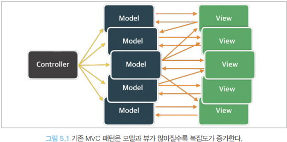
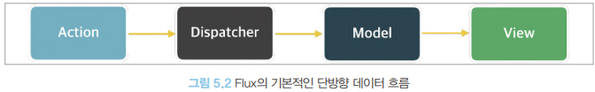
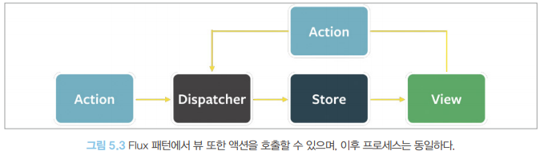

# 상태 관리는 왜 필요한가?

## 리액트 상태 관리의 역사
### 웹 애플리케이션에서의 상태(State)
- 어떠한 의미를 지닌 값이며 애플리케이션의 시나리오에 따라 지속적으로 변경될 수 있는 값
- 상호작용이 가능한 모든 요소의 현재 값
> 상태 값 분류
- UI: 다크/라이트 모드, 라디오를 비롯한 각종 input, 알림창의 노출 여부 등
- URL: 브라우저에서 관리되고 있는 상태 값, `https://www.airbnb.co.kr/rooms/34113796?adults=2` 에서 `roomId=34113796`과 `adults=2`라고하는 상태가 존재, 이는 사용자의 라우팅에 따라 변경
- 폼(form): 로딩 중, 제출, 접근 불가능, 값의 유효 등
- 서버에서 가져온 값: 클라이언트에서 서버로 요청을 통해 가져온 값(API 요청 등)

### 리액트 상태 관리의 역사
- 프레임워크가 아닌 라이브러리인 리액트는 단순히 사용자 인터페이스를 만들기 위함일 뿐이고 그 이상의 기능을 제공하지 않음.(개발자, 시간에 따라 상태 관리에 많은 차이가 있음)

> Flux 패턴의 등장
- 배경
    - 전역 상태관리를 하던건 Context API(16.3버전) 이후 useContext(16.8버전) 그 전까지는(리덕스가 나타나기 전까지) 딱히 이름을 알린 상태 관리 라이브러리는 없음
- 2014년
    - **Flux 등장** : 상태와 그 상태의 변경에 대한 흐름과 방식을 단방향으로 채택
    - 웹 애플리케이션이 비대해지고 상태(데이터)도 많아짐에 따라 상태의 변화 추적과 이해가 어려워졌음
    
    - 페이스북 팀: 양방향 데이터 바인딩의 문제점 언급 👉 단방향 데이터 바인딩 제안(**Flux 패턴의 시작**)
    
- Flux 패턴 톺아보기
    - 액션(`action`): 어떠한 작업을 처리할 액션과 그 액션 발생 시 함께 포함시킬 데이터를 의미, 액션 타입과 데이터를 각각 정의해 이를 디스패처로 보냄
    - 디스패처(`dispatcher`): 액션을 스토어에 보내는 역할, 콜백 함수 형태로 앞서 액션이 정의한 타입과 데이터를 모두 스토어에 전송
    - 스토어(`store`): 실제 샅애에 따른 값과 상태를 변경할 수 있는 메서드를 가지고 있음, 액션의 타입에 따라 어떻게 변경할지가 정의돼 있음
    - 뷰(`view`): 리액트의 컴포넌트에 해당하는 부분으로, 스토어에서 만들어진 데이터를 가져와 화면을 렌더링하는 역할. 또한 뷰에서도 사용자의 입력이나 행위에 따라 상태를 업데이트하고자 할 수 있는데, 이 경우 다음 그림처럼 뷰에서 액션을 호출하는 구조로 구성
    
- 리액트 코드 예제
    ```tsx
    type StoreState = {
        count: number
    }

    <!-- "type Action"으로 어떤 종류가 있고, 어떤 데이터를 필요로하는지 정의 -->

    type Action = { type: 'add'; payload: number }

    <!-- 스토어 역할: useReducer, reducer/ 현재 상태에 따른 값 변경 정의 -->
    function reducer(prevState: StoreState, action: Action) {
        const { type: ActionType } = action
        if (ActionType === 'add') {
            return {
                count: prevState.count + action.payload,
            }
        }

        throw new Error(`Unexpected Action [${ActionType}]`)
    }

    <!-- 뷰인 App에서 보여줌 -->
    export default function App() {
        const [state, dispatcher] = useReducer(reducer, {count:0})

        function handleClick() {
            dispatcher({ type: 'add', payload: 1 })
        }

        return (
            <div>
                <h1>{state.count}</h1>
                <button onClick={handleClick}>+</button>
            </div>
        )
    }
    ```
    
- 단방향 데이터 흐름 방식의 장/단점
    - 장점: 데이터 흐름은 모두 액션이라는 한 방향으로 줄어들어 데이터 흐름 추적과 코드 이해가 수월해짐
    - 단점: 사용자의 입력에 따라 데이터를 갱신하고 화면을 어떻게 업데이트해야 하는지 코드로 모두 작성(코드의 양 🔺)

- Flux 패턴을 따르는 다양한 라이브러리의 등장
    - [Flux](https://github.com/facebookarchive/flux)
    - [alt](https://github.com/goatslacker/alt)
    - [RefluxJS](https://github.com/reflux/refluxjs)
    - [Nuclear JS](https://github.com/optimizely/nuclear-js)
    - [Fluxible](https://github.com/yahoo/fluxible)
    - [Fluxxor](https://github.com/BinaryMuse/fluxxor)

> 시장 지배자 리덕스의 등장
- 최초에는 Flux 구조를 구현하기 위해 만들어진 라이브러리
- `Elm` 아키텍쳐를 도입

- `Elm`이란?
    - 웹페이지를 선언적으로 작성하기 위한 언어
    - 예제
        ```elm
        module Main exposing (..)

        imoprt Browser
        import Html exposing (Html, button, div, text)
        import Html.Events exposing (onClick)
        
        -- MAIN
        main = Browser.sandbox { init = init, update = update, view = view }

        -- MODEL
        type alias Model = Int
        
        init : Model
        init = 0

        -- UPDATE
        type Msg = Increment | Decrement

        update : Msg -> Model -> Model
        update msg model = 
            case msg of
                Increment ->
                    model + 1
                
                Decrement -> 
                    model - 1
        
        -- VIEW

        view : Model -> Html Msg
        view model = 
        div []
            [ button [ onClick Decrement ] [ text "-" ]
            , div[] [ text (String.fromInt model) ]
            , button [ onClick Increment ] [ text "+" ]
            ]
        <div>
            <button>-</button>
            <div>2</div>
            <button>+</button>
        </div>
        ```
    - 핵심
        - 모델(model): 애플리케이션의 상태를 의미(Model, 초깃값 : 0)
        - 뷰(view): 모델을 표현하는 HTML(Model을 인수로 받아서 HTML을 표현)
        - 업데이트(update): 모델을 수정하는 방식(`Increment`, `Decrement`를 선언해 각각의 방식이 어떻게 모델을 수정하는지 나타냄)

- 하나의 상태 객체를 스토어에 저장, 이 객체를 업데이트하는 작업을 디스패치해 업데이트를 수행(**`reducer` 함수로 발생, 웹 애플리케이션의 상태에 대한 완전히 새로운 복사본을 반환한 다음, 애플리케이션에 이 새롭게 만들어진 상태를 전파**)
- 하나의 글로벌 상태 객체를 통해 이 상태를 하위 컴포넌트에 전파할 수 있기 때문에 props를 깊이 전파해야 하는 이른바 prop 내려주기 문제 해결
- 스토어가 필요한 컴포넌트라면 단지 `connect`를 통해 스토어 접근 가능

- 리덕스의 단점
    - 단순히 하나의 상태를 바꾸고 싶어도 해야 할 일이 너무 많음
    - 액션 타입 선언, 액션 수행 creator 함수 작성, dispatcher와 selector 생성, 새로운 상태가 어떻게 기존 리듀서 내부에서 어떤식으로 변경해야 할지 등 하는 일에 비해 보일러플레이트가 너무 많음

> Context API와 useContext
- 배경
    - 상태를 어떻게 적절하게 주입해야하는가?
    - 자식 컴포넌트에게 prop 내려주기를 통함: 필요한 컴포넌트까지 계속 내려줘야함(props의 컴포넌트 관통)
    - 리덕스의 보일러플레이트 또한 부담스러움
- 16.3 Context API 출시 이전
    ```tsx
    class MyComponent extends React.Component {
        static childContextType = {
            name: PropType.string,
            age: PropType.number,
        }

        getChildContext() {
            return {
                name: 'foo',
                age: 30,
            }
        }

        render() {
            return <ChildComponent />
        }
    }

    function ChildComponent(props, context) {
        return (
            <div>
                <p>Name: {context.name}</p>
                <p>Age: {context.age}</p>
            </div>
        )
    }

    ChildComponent,contextType = {
        name: PropTypes.string,
        age: PropTypes.number,
    }
    ```
    - 문제점 1: 상위 컴포넌트가 렌더링되면 `getChildContext`도 같이 호출됨과 동시에 `shouldComponentUpdate`가 항상 `true`를 반환해 불필요하게 렌더링이 일어남
    - 문제점 2: `getChildContext`를 사용하기 위해선 `context`를 인수로 받아야하는데, 이 때문에 컴포넌트와 결합도가 높아짐

- 16.3 리액트 팀의 Context API
    - 전역 상태를 하위 컴포넌트에 주입할 수 있음
    - 원하는 곳에서 Context Provider가 주입하는 상태
    ```tsx
    type Counter = {
        count: number
    }

    const CounterContext = createContext<Counter | undefined>(undefined)

    class CounterComponent extends Component {
        render() {
            return (
                <CounterContext.Consumer>
                    {(state) => <p>{state?.count}</p>}
                </CounterContext.Consumer>
            )
        }
    }

    class DummyParent extends Component {
        render() {
            return (
                <>
                    <CounterComponent />
                </>
            )
        }
    }

    export default class MyApp extends Component<{}, Counter> {
        state = { count: 0 }

        componentDidMount() {
            this.setState({ count: 1 })
        }

        handleClick = () => {
            this.setState((state) => ({ count: state.count + 1 }))
        }

        render() {
            return (
                <CounterContext.Provider value={this.state}>
                    <button onClick={this.handleClick}>+</button>
                    <DummyParent />
                </CounterContext.Provider>
            )
        }
    }
    ```

> 훅의 탄생, 그리고 React Query와 SWR
- `16.8` 함수 컴포넌트에서 사용할 수 있는 다양한 훅 API의 등장
- 가장 큰 변경점: state를 매우 손쉽게 재사용 가능
    - **클래스 컴포넌트보다 훨씬 간결하고 직관적**
    ```tsx
    function useCounter(){
        const [count, setCount] = useState(0)

        function increase() {
            setCount((prev) => prev+1)
        }

        return {count, increase}
    }
    ```
- [React Query와 SWR](https://yoonhaemin.com/tag/technical-thinking/react-query-vs-swr/)
    - 외부에서 데이터를 불러오는 `fetch`를 관리하는데 특화
    - API 호출에 대한 상태를 관리하고 있기 때문에 HTTP 요청에 특화된 상태 관리 라이브러리
    - [차이 비교](https://tech.madup.com/react-query-vs-swr/)
    - 예시 코드(SWR)
        ```tsx
        import React from 'react'
        import useSWR from 'swr'

        const fetcher = (url) => fetcher(url).then((res) => res.json())

        export default function App() {
            const {data, error} = useSWR(
                'https://api.github.com/repo/vercel/swr',
                fetcher,
            )

            if (error) return 'An error has occured.'
            if (!data) return 'Loading'

            return (
                <div>
                    <p>{JSON.stringify(data)}</p>
                </div>
            )
        }
        ```
    - 예시 코드(React Query)
        ```tsx
        import { QueryClient, QueryClientProvider, useQuery } from "react-query";

        const queryClient = new QueryClient();
        const url = "https://61b88c9d64e4a10017d19053.mockapi.io/user";

        const App = () => (
        <div>  
            <!-- provider로 감싸지 않으면 에러 발생 -->
            <QueryClientProvider client={queryClient}>
            <ReactQueryProfile />
            </QueryClientProvider>
        </div>
        );

        const ReactQueryProfile = () => {
        const {isLoading, error, data, isFetching} = useQuery("users", () =>
            fetch("https://61b88c9d64e4a10017d19053.mockapi.io/user").then(res => res.json())
        );

        if (error) return <div>failed to load</div>;
        if (isLoading) return <div>loading...</div>;

        return <Profile library="React Query" data={data} />;
        }

        const Profile = ({library, data}) => (
        <div>
            <h1>Users from {library}</h1>
            {data.map(user => <p>{user.level} developer <strong>{user.name}</strong></p>)}
        </div>
        )

        export default App;
        ```

> Recoil, Zustand, Jotai, Valtio에 이르기까지
- 범용적인 상태 관리 라이브러리
```tsx
// Recoil
const counter = atom({ key: 'count', default: 0 })
const todoList = useRecoilValue(counter)

// Jotai
const countAtom = atom(0)
const [count, setCount] = useAtom(countAtom)

// Zustand
const useCounterStore = create((set) => ({
    count: 0,
    increase: () => set((state) => ({ count: state.count + 1 }))
}))
const count = useCounterStore((state) => state.count)

// Valtio
const state = proxy({ count: 0 })
const snap = useSnapshot(state)
state.count ++
``` 

- 리덕스와의 차이점
    - 훅을 활용해 작은 크기의 상태를 효율적으로 관리
    - peerDependencies로 리액트 16.8버전 이상을 요구
    - 리덕스나 MobX도 `react-redux`, `mobx-react-lite` 등을 설치해 훅으로 상태를 가져올 수 있지만 위 상태 관리 라이브러리는 별도 라이브러리를 설치하지 않아도 됨

## 정리

### 웹 애플리케이션에서의 상태(State)
- 어떠한 의미를 지닌 값이며 애플리케이션의 시나리오에 따라 지속적으로 변경될 수 있는 값
- 상호작용이 가능한 모든 요소의 현재 값
> 상태 값 분류
- UI: 다크/라이트 모드, 라디오를 비롯한 각종 input, 알림창의 노출 여부 등
- URL: 브라우저에서 관리되고 있는 상태 값, `https://www.airbnb.co.kr/rooms/34113796?adults=2` 에서 `roomId=34113796`과 `adults=2`라고하는 상태가 존재, 이는 사용자의 라우팅에 따라 변경
- 폼(form): 로딩 중, 제출, 접근 불가능, 값의 유효 등
- 서버에서 가져온 값: 클라이언트에서 서버로 요청을 통해 가져온 값(API 요청 등)

### 리액트 상태 관리 역사
> 초기
- MVC 패턴을 사용( 양방향 바인딩 )
- 데이터 흐름 파악이 어려워 단방향 바인딩 채용(**Flux 패턴 등장**)
- props를 내려주기 위해 부모 컴포넌트에서 자식 컴포넌트를 통해 원하는 컴포넌트까지 내려주면 컴포넌트를 관통하는 문제가 생김

> Redux 탄생
- 단방향 바인딩 Flux 패턴을 기준으로 `action`, `reducer`, `store`, `view`개념을 통해 데이터를 관리하고, `connect`함수를 통해 원하는 곳에서 상태를 가져올 수 있음
- 단점: 상태를 관리하기 위해 보일러플레이트가 너무 많음(코드 단계에서)

> Context API 등장
- props로 내려주자니 너무 많은 컴포넌트를 관통해야함
- 리덕스를 사용하자니 보일러 플레이트가 부담스러움
- context를 통해 관리 하자니 불필요한 렌더링이 심함
    ```tsx
    class MyComponent extends React.Component {
        static childContextType = {
            name: PropType.string,
            age: PropType.number,
        }
        // Context관리 함수
        getChildContext() {
            return {
                name: 'foo',
                age: 30,
            }
        }

        render() {
            return <ChildComponent />
        }
    }

    function ChildComponent(props, context) {
        return (
            <div>
                <p>Name: {context.name}</p>
                <p>Age: {context.age}</p>
            </div>
        )
    }

    ChildComponent,contextType = {
        name: PropTypes.string,
        age: PropTypes.number,
    }
    ```
    - 문제점 1: 상위 컴포넌트가 렌더링되면 `getChildContext`도 같이 호출됨과 동시에 `shouldComponentUpdate`가 항상 `true`를 반환해 불필요하게 렌더링이 일어남
    - 문제점 2: `getChildContext`를 사용하기 위해선 `context`를 인수로 받아야하는데, 이 때문에 컴포넌트와 결합도가 높아짐

- `16.8`버전 Context API 등장
    - 장점: 전역 상태를 하위 컴포넌트에 주입할 수 있음(원하는 곳에서 Context Provider가 주입하는 상태)
    - 불필요한 렌더링 문제 해결
    ```tsx
    type Counter = {
        count: number
    }

    const CounterContext = createContext<Counter | undefined>(undefined)

    class CounterComponent extends Component {
        render() {
            return (
                <CounterContext.Consumer>
                    {(state) => <p>{state?.count}</p>}
                </CounterContext.Consumer>
            )
        }
    }

    class DummyParent extends Component {
        render() {
            return (
                <>
                    <CounterComponent />
                </>
            )
        }
    }

    export default class MyApp extends Component<{}, Counter> {
        state = { count: 0 }

        componentDidMount() {
            this.setState({ count: 1 })
        }

        handleClick = () => {
            this.setState((state) => ({ count: state.count + 1 }))
        }

        render() {
            return (
                <CounterContext.Provider value={this.state}>
                    <button onClick={this.handleClick}>+</button>
                    <DummyParent />
                </CounterContext.Provider>
            )
        }
    }
    ```

> 훅의 탄생과 React Query / SWR
- `16.8` 함수 컴포넌트에서 사용할 수 있는 다양한 훅 API의 등장
- 가장 큰 변경점: state를 매우 손쉽게 재사용 가능(**클래스 컴포넌트보다 훨씬 간결하고 직관적**)
    ```tsx
    function useCounter(){
        const [count, setCount] = useState(0)

        function increase() {
            setCount((prev) => prev+1)
        }

        return {count, increase}
    }
    ```
- [React Query와 SWR](https://yoonhaemin.com/tag/technical-thinking/react-query-vs-swr/)
    - 외부에서 데이터를 불러오는 `fetch`를 관리하는데 특화
    - API 호출에 대한 상태를 관리하고 있기 때문에 HTTP 요청에 특화된 상태 관리 라이브러리
    - [차이 비교](https://tech.madup.com/react-query-vs-swr/)
    - 예시 코드(SWR)
        ```tsx
        import React from 'react'
        import useSWR from 'swr'

        const fetcher = (url) => fetcher(url).then((res) => res.json())

        export default function App() {
            const {data, error} = useSWR(
                'https://api.github.com/repo/vercel/swr',
                fetcher,
            )

            if (error) return 'An error has occured.'
            if (!data) return 'Loading'

            return (
                <div>
                    <p>{JSON.stringify(data)}</p>
                </div>
            )
        }
        ```
    - 예시 코드(React Query)
    ```tsx
    import { QueryClient, QueryClientProvider, useQuery } from "react-query";

    const queryClient = new QueryClient();
    const url = "https://61b88c9d64e4a10017d19053.mockapi.io/user";

    const App = () => (
    <div>
        <!-- provider로 감싸지 않으면 에러 발생 -->
        <QueryClientProvider client={queryClient}>
        <ReactQueryProfile />
        </QueryClientProvider>
    </div>
    );

    const ReactQueryProfile = () => {
    const {isLoading, error, data, isFetching} = useQuery("users", () =>
        fetch("https://61b88c9d64e4a10017d19053.mockapi.io/user").then(res => res.json())
    );

    if (error) return <div>failed to load</div>;
    if (isLoading) return <div>loading...</div>;

    return <Profile library="React Query" data={data} />;
    }

    const Profile = ({library, data}) => (
    <div>
        <h1>Users from {library}</h1>
        {data.map(user => <p>{user.level} developer <strong>{user.name}</strong></p>)}
    </div>
    )

    export default App;
    ```

> 이후 상태 관리 라이브러리(Recoil, Zustand, Jotai, Valtio)
- 범용적인 상태 관리 라이브러리
```tsx
// Recoil
const counter = atom({ key: 'count', default: 0 })
const todoList = useRecoilValue(counter)

// Jotai
const countAtom = atom(0)
const [count, setCount] = useAtom(countAtom)

// Zustand
const useCounterStore = create((set) => ({
    count: 0,
    increase: () => set((state) => ({ count: state.count + 1 }))
}))
const count = useCounterStore((state) => state.count)

// Valtio
const state = proxy({ count: 0 })
const snap = useSnapshot(state)
state.count ++
``` 

- 리덕스와의 차이점
    - 훅을 활용해 작은 크기의 상태를 효율적으로 관리
    - peerDependencies로 리액트 `16.8`버전 이상을 요구
    - 리덕스나 MobX도 `react-redux`, `mobx-react-lite` 등을 설치해 훅으로 상태를 가져올 수 있지만 위 상태 관리 라이브러리는 별도 라이브러리를 설치하지 않아도 됨