# 리액트 개발 도구 활용하기

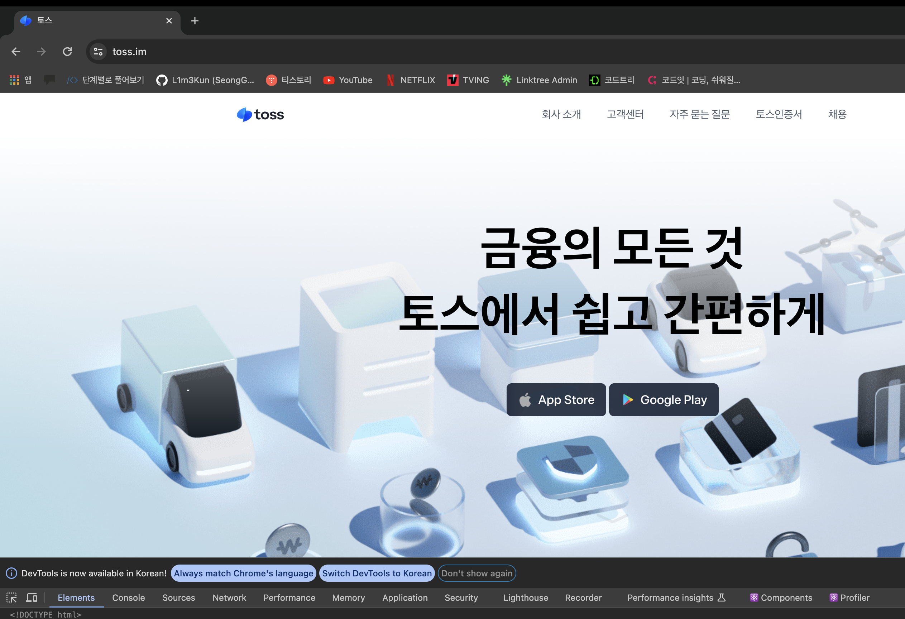

## 컴포넌트
- 현재 리액트 애플리케이션의 컴포넌트 트리와 `props`, 내부 `hooks` 등 다양한 정보를 확인
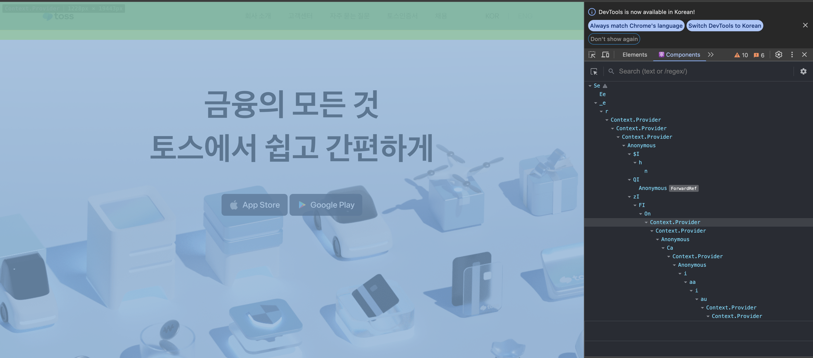

### 컴포넌트 트리

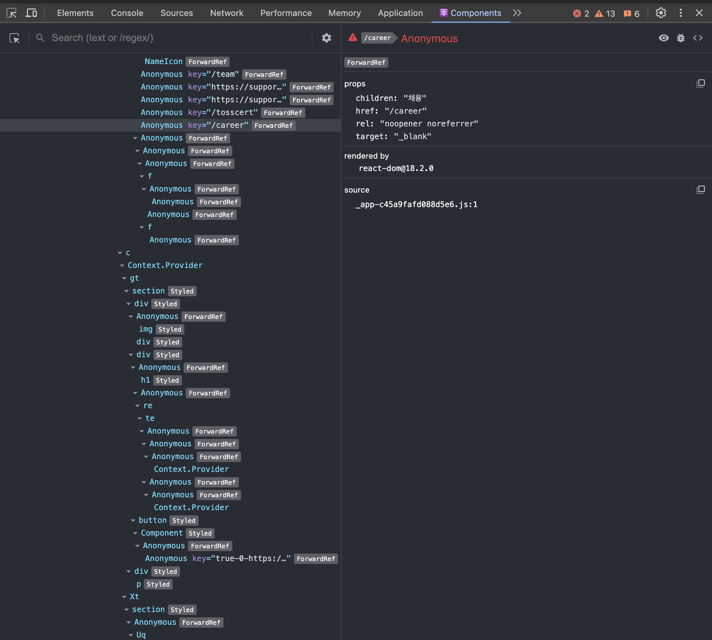

- 왼쪽 영역은 해당 리액트 페이지의 컴포넌트 트리를 나타냄(트리 구조 도시)
- 기명 함수로 선언되어 컴포넌트명을 알 수 있다면 해당 컴포넌트 명을 보여주고, 익명 함수인 경우 `Anonymous`라는 이름으로 컴포넌트를 보여줌

- 예제 코드
    ```tsx
    // App.tsx
    // ...
    import AnonymousDefaultComponent from './Component3'

    function Component1() {
        return <>Component1</>
    }

    const Component2 = () => {
        return <>Component2</>
    }
    
    const MemoizedComponent = memo(() => <>MemoizedComponent</>)

    const withSampleHOC = (Component: ComponentType) => {
        return function () {
            return <Component />
        }
    }

    const HOCComponent = withSampleHOC(() => <>HOCComponent</>)

    export default function App() {
        return (
            <div className="App">
                <Component1 />
                <Component2 />
                <AnonymouseDefaultComponent />
                <MemoizedComponent />
                <HOCComponent />
            </div>
        )
    }

    export default () => {
        return <>Component3</>
    }
    ```
    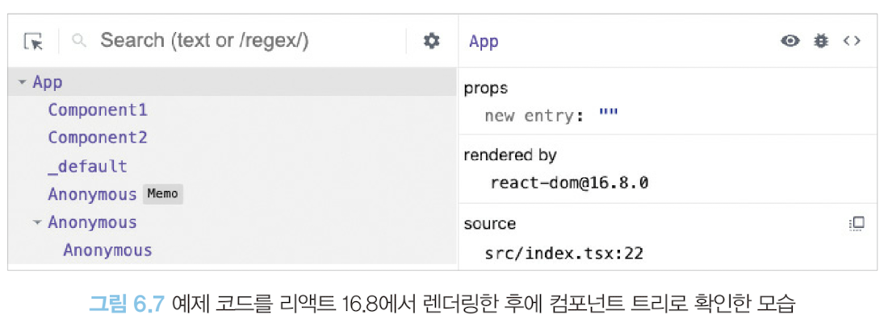

    - 익명 함수를 `default`로 export한 `AnonymousDefaultComponent`의 경우, 코드 내부에서 사용되는 이름일 뿐, 실제로 default export로 내보낸 함수의 명칭은 추론할 수 없기에 `_default`로 표기

    - memo를 사용해 익명 함수로 만든 컴포넌트를 감싼 경우, 함수명을 추론하지 못해 `Anonymous`로 표기, memo 라벨을 통해 memo로 감싸진 컴포넌트임을 알 수 있음

    - 고차 컴포넌트 withSampleHOC로 감싼 HOCComponent의 경우 두 가지 경우 모두 `Anonymous`로 선언되어 있는데, 이 또한 고차 컴포넌트의 명칭을 제대로 추론하지 못했기 때문

    - 리액트 `16.9` 버전부터 일부 익명 함수에 대해 컴포넌트 명칭을 제대로 추론하지 못하는 문제 일부 해결

    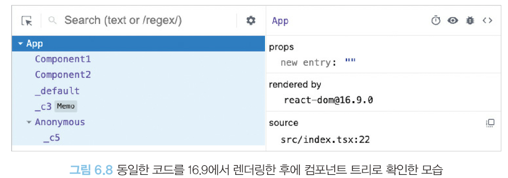

- 기명함수 예제
    ```tsx
    // ...
    const MemoizedComponent = memo(function MemoizedComponent() {
        return <>MemoizedComponent</>
    })

    const withSamplHOC = (Component: ComponentType) => {
        return function withSampleHOC() {
            return <Component />
        }
    }

    const HOCComponent = withSampleHOC(function HOCComponent() {
        return <>HOCComponent</>
    })

    // ...
    ```
    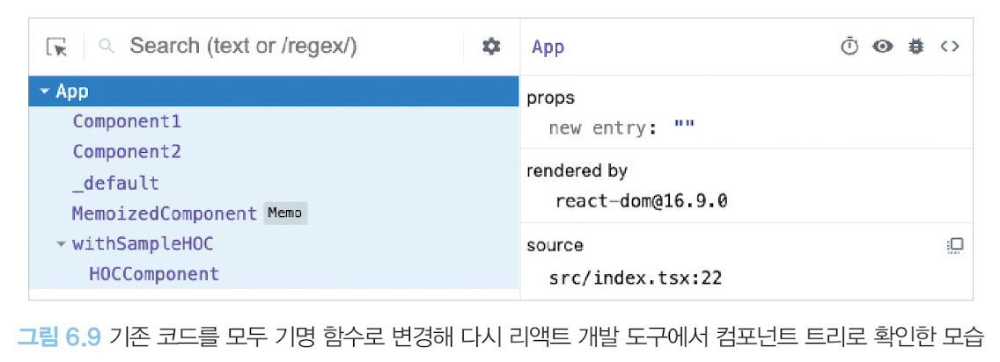
- 기명함수로 바꾸기 어렵다면 함수에 `displayName` 속성을 추가하는 방법도 있음
    ```tsx
    const MemoizedComponent = memo(function () {
        return <>MemoizedComponent</>
    })

    MemoizedComponent.displayNAme = '메모 컴포넌트입니다.'
    ```

- 특히 고차 컴포넌트에서 도움이 많이 된다.
    ```tsx
    function withHigherOrderComponent(WrappedComponent){
        class WithHigherOrderComponent extends React.Component {
            /* ... */
        }

        WithHigherOrderComponent.displayName = `WithHigherOrderComponent(${getDisplayName(
            WrappedComponent,
            )})`
        
        return WithHigherOrderComponent
    }

    function getDisplayName(WrappedComponent) {
        return WrappedComponent.displayName || WrappedComponent.name || 'Component'
    }
    ```

- 리액트 컴포넌트 트리가 아닌 리액트 빌드 트리를 확인하는 경우, 기명 함수로 선언한다 하더라도 `terser` 등의 압축 도구 등이 컴포넌트명을 단순하게 난수화하기 때문에 확인하기 어려움
- 따라서 displayName과 함수명은 개발 모드에서만 제한적으로 참고하는 것이 좋음

### 컴포넌트명과 props

- 오른쪽 내용은 왼쪽 컴포넌트 트리에서 컴포넌트를 선택했을 때 해당 컴포넌트의 상세 정보를 보여주는 영역

> 컴포넌트명과 key
- 컴포넌트의 명치과 해당 컴포넌트를 나타냄
- 빨간색 ⚠️ 표시: 해당 애플리케이션이 strict mode 렌더링되지 않았음

> 컴포넌트 도구
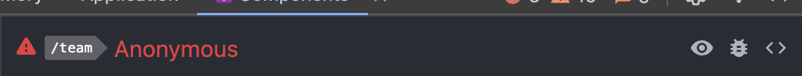
- 3개의 아이콘
    - 👁️ 아이콘: 해당 컴포넌트가 HTML의 어디에서 렌더링 됐는지 확인 가능(`Element`탭으로 즉시 이동하며 해당 요소 선택됨)
    - 🪲 아이콘: `console` 탭에 해당 컴포넌트 정보가 출력됨(복잡한 정보 확인 또는 정보 복사하는 용도 등)
    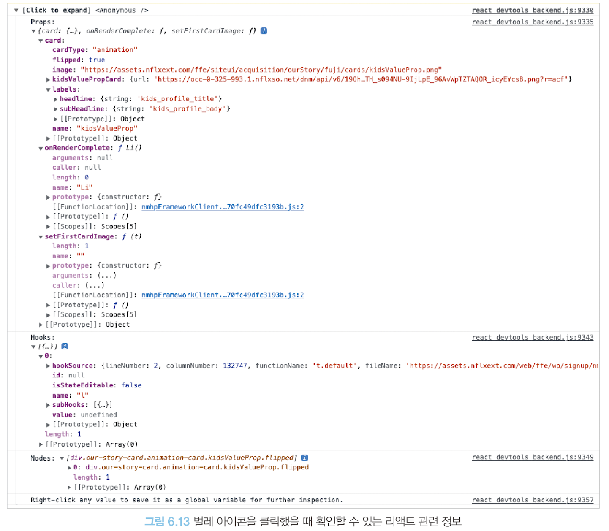
    - `{ }` 아이콘: 해당 컴포넌트의 소스 코드 확인가능(webpack에 의해 한줄로 되어 있는 경우 왼쪽 아래 `{ }`버튼을 통해 가독성을 높일 수 있음)

> 컴포넌트 props
- 해당 컴포넌트가 받은 `props` 확인 가능
- 원시 값과 함수도 포함
- 우클릭을 통해 복사가능(`Store as global variable`을 선택 시 `window.$r` 정보가 담김)
    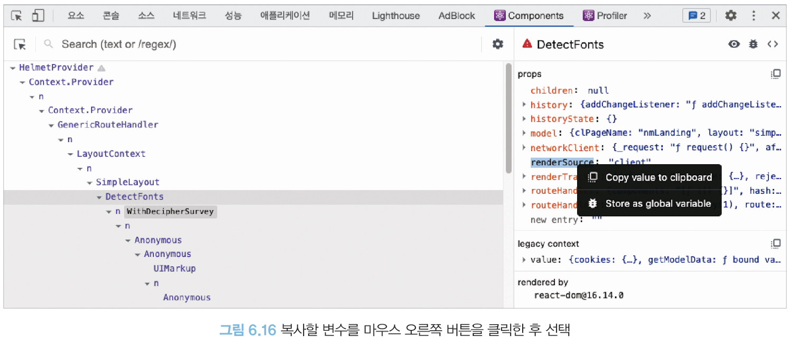
- 함수 값을 우클릭시 `Go to definition`을 통해 해당 함수가 선언된 코드로 이동 가능(수정 가능)

> 컴포넌트 hooks
- 컴포넌트에서 사용 중인 훅 정보 확인 가능
- `useState` => `State`와 같이 use가 생략된 이름으로 나타남
    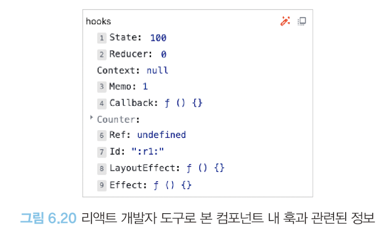
- 리액트 개발자 도구에서 볼 수 있는 훅 목록
    |이름|표시되는 이름|
    |:---:|:-----:|
    |useState|State|
    |useReducer|Reducer|
    |useContext|Context|
    |useMemo|Memo|
    |useCallback|Callback|
    |useRef|Ref|
    |useId|id|
    |useLayoutEffect|LayoutEffect|
    |useEffect|Effect|
    |사용자 훅(useCounter)|Counter|

- 익명 함수 대신 기명 함수로 훅에 넘겨주면 해당 훅을 실행할 때 실행되는 함수 이름을 확인할 수 있음
    ```tsx
    // before
    useEffect(() => {
        console.log('useEffect')
    })

    // after
    useEffect(function effectOnlyMount() {
        console.log('useEffect')
    })
    ```
    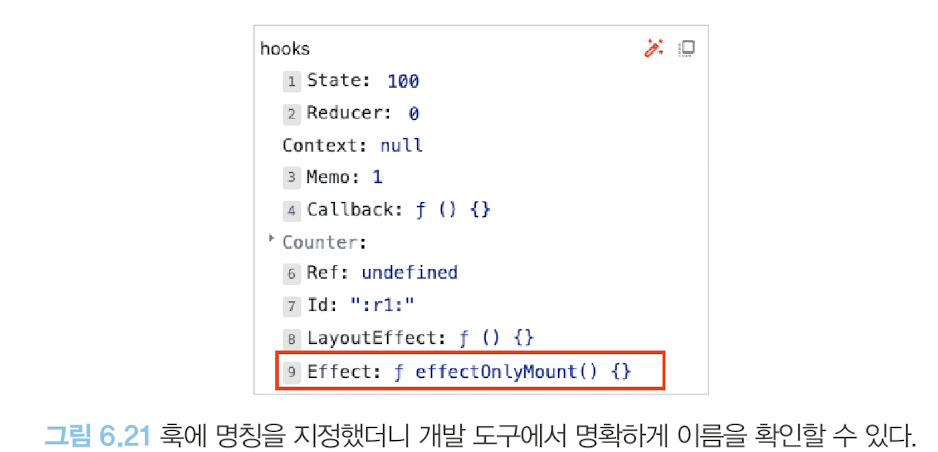
- 더블 클릭을 통해 수정 가능

> 컴포넌트를 렌더링한 주체, rendered by
- 컴포넌트를 렌더링한 주체가 누구인지 확인 가능
- 프로덕션 모드: react-dom의 버전만 확인 가능
    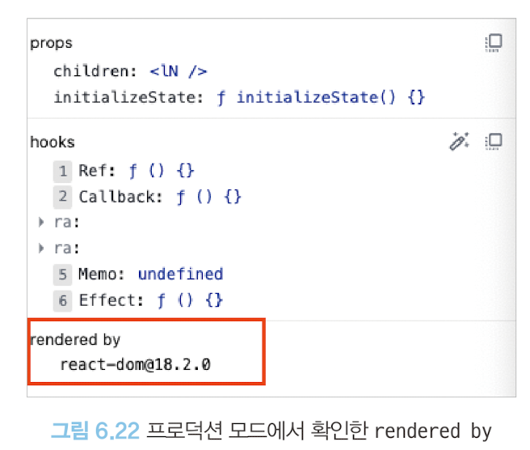
- 개발 모드: 해당 컴포넌트를 렌더링한 부모 컴포넌트도 가능
    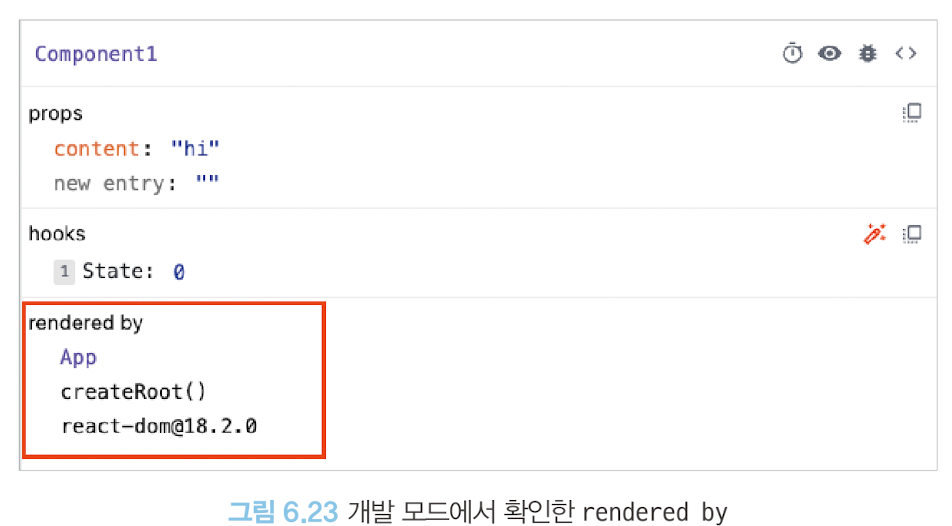

## 프로파일러
- 리액트가 렌더링하는 과정에서 발생하는 상황을 확인하는 도구
- 애플리케이션이 렌더링되는 과정에서 어떤 컴포넌트가 렌더링됐는지, 또 몇 차례나 렌더링이 일어났으며 어떤 작업에서 오래 걸렸는지 등 확인 가능
- **프로덕션 빌드로 실행되는 리액트 애플리케이션에서는 사용 불가능**

- 문제가 있는 예제 코드
    ```tsx
    import { ChangeEvent, useEffect, useState } from 'react'

    export default function App() {
        const [text, setText] = useState('')
        const [number, setNumber] = useState(0)
        const [list, setlist] = useState([
            { name: 'apple', amount: '5000' },
            { name: 'orange', amount: '1000' },
            { name: 'watermelon', amount: '1500' },
            { name: 'pineapple', amount: '500' },
        ])

        useEffect(() => {
            setTimeout(() => {
                console.log('surprise!')
                setText('1000')
            }, 3000)
        })

        function handleTextChange(e: ChangeEvent<HTMLInputElement>) {
            setText(e.target.value)
        }

        function handleSubmit() {
            setList((prev) => [...prev, { name: text, amount: number }])
        }

        function handleNumberChange(e: ChangeEvent<HTMLInputElement>) {
            setNumber(e.target.valueAsNumber)
        }

        return (
            <div>
                <input type="text" value={text} onChange={handleTextChange} />
                <button onClick={handleSubmit}>추가</button>

                <input type="number" value={number} onChange={handleNumberChange}>

                <ul>
                    {list.map((value, key) => (
                        <li key={key}>
                            {value.name} {value.amount}원
                        </li>

                    ))}
                </ul>
            </div>
        )
    } 
    ```

### 설정 변경하기
> 설정 살펴보기
- `General` 탭의 `Highlight updates when components render`: 컴포넌트 렌더링 될 때마다 해당 컴포넌트에 하이라이트를 표시(**매우 유용**)

- `Debugging` 탭의 `Hide during second render in Strict Mode`: 리액트 애플리케이션이 엄격 모드에서 실행되는 경우, 원활한 디버깅을 위해 `useEffect` 등이 두 번씩 작동하는데, 이를 막고 싶으면 활성화

- `Profiler` 탭의 `Record why each component rendered while profiling`: 프로파일링 도중 무엇 때문에 컴포넌트가 렌더링됐는지 기록, 애플리케이션 속도에 영향이 있지만, 디버깅에 도움이 되기에 켜두는 것을 추천

### 프로파일링
> 프로파일링 메뉴
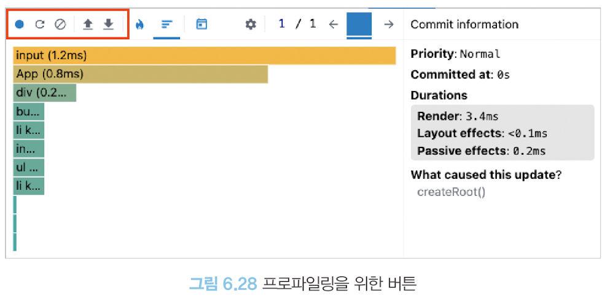
- 렌더링 시에 어떠한 일이 벌어지는지 확인할 수 있음

- 🔵 버튼: `Start Profiling`(프로파일링 시작) 버튼, 프로파일링이 시작되면 곧바로 🔴로 바뀌며 프로파일링 중이라는 메시지가 나타난다.

- 두 번째 버튼: `Reload and Start profiling`(새로고침 후 프로파일링 시작) 버튼, 웹페이지가 새로고침되면서 동시에 프로파일링이 시작된다. 첫 번째 버튼도 🔴로 바뀌며, 마찬가지로 다시 누르면 프로파일링이 중단되고 프로파일링 결과가 나옴. 새로고침이 끝난다고 해서 프로파일링이 중단되지 않으며, 중단을 원하면 🔴을 누르면 된다.

- 🚫 버튼: `Stop Profiling`(프로파일링 종료) 버튼으로, 프로파일링된 현재 내용을 모두 지우는 버튼. 프로파일링된 기록을 모두 삭제 가능

- 네 번째, 다섯 번째 버튼: `Load Profile`(프로파일 불러오기), `Save Profile`(프로파일 저장하기) 버튼, 프로파일링 결과를 불러오고 저장하는 버튼
    - 저장: 프로파일링 정보가 담긴 JSON 파일 다운로드(불러오기용 확인 힘듦)

> Flamegraph
- 🔥모양 탭
- 렌더 커밋별 어떠한 작업이 일어났는지 나타남
- 너비가 넓을수록 해당 컴포넌트를 렌더링하는데 오래 걸렸다는 것을 의미
- 마우스를 가져가 대면 해당 컴포넌트의 렌더링과 관련된 정보를 얻을 수 있음
- 렌더링이 되지 않은 컴포넌트는 회색으로 표시(`Did not render` 라는 메시지가 표시)
- 아이콘 옆에 있는 화살표를 누르면 각 렌더 커밋별 리액트 트리에서 발생한 렌더링 정보를 확인 가능

> Randked
- 해당 커밋에서 렌더링하는데 오랜 시간이 걸린 컴포넌트를 순서대로 나열한 그래프
- Flamegraph와 차이: 모든 컴포넌트를 보여주지 않고 단순히 렌더링이 발생한 컴포넌트만 보여줌

### 타임라인 🗓️
- 시간이 지남에 따라 컴포넌트에서 어떤 일이 일어났는지 확인 가능
- 리액트 18 이상의 환경에서만 확인 가능
- input에 글자를 입력하면서 state의 값이 업데이트 되고, 이 값이 동기로 업데이트됐는지, 또 언제 업데이트가 이뤄졌는지 등 확인 가능
- 시간 단위 리액트 작동 내용 추적에 용의

### 프로파일러로 렌더링 원인 파악해서 수정해보기

```tsx
import { ChangeEvent, useEffect, useState, memo } from 'react'
import logo from './logo.svg';
import './App.css';

// function CopyrightComponent({ text }: {text:string} ) {
//   return <p>{text}</p>
// }

const CopyrightComponent = memo(function CopyrightComponent({
  text,
}: {
  text: string
}) {
  return <p>{text}</p>
})


function InputText({ onSubmit }: { onSubmit: (text: string) => void}) {
  const [text, setText] = useState('')
   
  function handleSubmit() {
      onSubmit(text)
  }

  function handleTextChange(e: ChangeEvent<HTMLInputElement>) {
      setText(e.target.value)
  }

  return (
    <>
      <input type='text' value={text} onChange={handleTextChange} />
      <button onClick={handleSubmit}>추가</button>
      <CopyrightComponent text='all rights reserved' />
    </>
  )
}

export default function App() {
    const [number, setNumber] = useState(0)
    const [list, setList] = useState([
        { name: 'apple', amount: '5000' },
        { name: 'orange', amount: '1000' },
        { name: 'watermelon', amount: '1500' },
        { name: 'pineapple', amount: '500' },
    ])

    // useEffect(() => {
    //     setTimeout(() => {
    //         console.log('surprise!')
    //         setText('1000')
    //     }, 3000)
    // })

    function onSubmit(text:string) {
      setList((prev) => [ ...prev, { name: text, amount: number.toString() }])
    }

    function handleNumberChange(e: ChangeEvent<HTMLInputElement>) {
        setNumber(e.target.valueAsNumber)
    }

    return (
        <div>
            <InputText onSubmit={onSubmit} />
            <input type="number" value={number} onChange={handleNumberChange} />

            <ul>
                {list.map((value, key) => (
                    <li key={key}>
                        {value.name} {value.amount}원
                    </li>

                ))}
            </ul>
        </div>
    )
} 
```