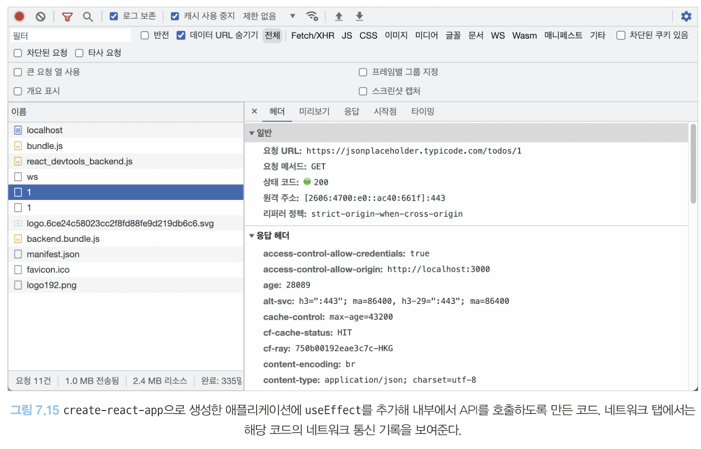

# 크롬 개발자 도구를 활용한 애플리케이션 분석
- 리액트가 아닌 자바스크립트의 범주에서 브라우저 디버깅하기
- 자세한 내용은 공식문서 확인

## 크롬 개발자 도구란?
- 크롬에서 제공하는 개발자용 도구
- 웹페이지에서 일어나는 거의 모든 일을 확인할 수 있는 강력한 도구
- 오른쪽 마우스 => 검사 혹은 `F12`
- **시크릿 모드(개인정보 보호 모드)에서 여는 것을 권장**
- 확장 프로그램으로 인해 원본 소스에 다른 사용자는 볼 수 없는 요소들이 들어가 방해가 되기 때문

## [요소 탭](notes/7_2_요소_탭.md)

## 소스 탭
- 웹 애플리케이션을 불러오기 위해 실행하거나 참조된 모든 파일을 확인할 수 있음
- 자바스크립트 파일, CSS, HTML, Font까지 다양한 파일 정보를 확인할 수 있음
- 파일열기를 통해 create-react-app을 기반응로 생선된 다양한 파일을 찾아볼 수 있음
- 소스 중단점을 생성해 자바스크립트 실행을 중단시키고 디버깅을 수행할 수 있다.(debugger를 선언하는 것과 동일, 소스코드를 오염시키지 않아 유용)

- 소스 탭 오른쪽 화면에서 할 수 있는 것들
    - 감시: 감시하고 싶은 변수를 선언하고, 해당 변수의 정보를 확인할 수 있음(확인할 수 없는 값은 `<not available>`로 표시)
    - 중단점: 현재 웹사이트에서 추가한 중단점을 확인할 수 있다. 현재 열려 있는 파일뿐만 아니라 웹페이지 전체에 걸쳐 소스탭에서 추가한 모든 중단점을 확인할 수 있다
    - 범위: 현재 중단점에서의 스코프를 의미한다. 로컬은 현재 로컬 스코프를 의미하며, 이 스코프에서 접근할 수 있는 값을 확인할 수 있다. 이 밖에도 클로저, 전역 스코프 등을 확인할 수 있다.
    - 호출 스택: 호출 스택에서는 현재 중단점의 콜스택을 확인할 수 있다. 이 메뉴를 활용하면 자바스크립트 코드가 실행되며 생성되는 실행 콘텍스트가 어떻게 저장되어 현재 어떤 모습을 하고 있는지 직접 볼 수 있다.
    - 전역 리스너: 현재 전역 스코프에 추가된 리스너 목록을 확인할 수 있다.
    - XHR/가져오기, DOM, 이벤트 리스너, CSP 위반 중단점: 소스의 중단점 이외에 다양한 중단점을 확인할 수 있다.

## 네트워크 탭
- 해당 웹페이지를 접속하는 순간부터 발생하는 모든 네트워크 관련 작동이 기록. 웹사이트에서 자주 사용하는 HTTP 요청부터 웹 소켓에 이르기까지, 웹페이지가 외부 데이터와 통신하는 정보 확인 가능

    

- 해당 페이지의 렌더링 시 다운로드하는 파일과 API 요청 등을 순서대로 확인할 수 있음
- 스크린 샷 캡쳐(설정 아이콘을 누르면 나옴)을 통해 렌더링 과정을 사진을 볼 수 있음

> 네트워크 탭을 통해 집중적으로 확인해봐야 하는 점
- 불필요한 요청 또는 중복되는 요청이 없는지
- 웹페이지 구성에 필요한 리소스 크기가 너무 크지 않은지
- 리소스를 불러오는 속도는 적절한지 또는 너무 속도가 오래 걸리는 리소스는 없는지
- 리소스가 올바른 우선순위로 다운로드되어 페이지를 자연스럽게 만들어가는지

## [메모리 탭](notes/7_5_메모리_탭.md)
- [자바스크립트 인스턴스 VM 선택](notes/7_5_메모리_탭.md#자바스크립트-인스턴스-vm-선택)
- [힙 스냅샷](notes/7_5_메모리_탭.md#힙-스냅샷)
- [타임라인 할당 계측](notes/7_5_메모리_탭.md#타임라인-할당-계측)
- [할당 샘플링](notes/7_5_메모리_탭.md#할당-샘플링)

## [Next.js 환경 디버깅하기](notes/7_6_Nextjs_환경_디버깅하기.md)
- [Next.js 프로젝트를 디버그 모드로 실행하기](notes/7_6_Nextjs_환경_디버깅하기.md#nextjs-프로젝트를-디버그-모드로-실행하기)
- [Next.js 서버에 트래픽 유입시키기](notes/7_6_Nextjs_환경_디버깅하기.md#nextjs-서버에-트래픽-유입시키기)
- [Next.js의 메모리 누수 지점 확인하기](notes/7_6_Nextjs_환경_디버깅하기.md#nextjs의-메모리-누수-지점-확인하기)

## 정리
- 크롬 개발자 도구란?:  페이지의 거의 모든 동작을 확인할 수 있는 도구, 사용 시 `개인정보 보호 모드` 활용 권장

|탭|용도|
|:---:|:-------------------------------|
|요소 탭|HTML, CSS 등 정보 확인 가능|
|소스 탭|웹 애플리케이션을 불러오기 위해 실행하거나 참조된 모든 파일을 확인 가능|
|네트워크 탭|해당 페이지 접속부터 발생하는 모든 네트워크 관련 작동 기록 정보 확인|
|메모리 탭|현재 웹페이지가 차지하고 있는 메모리 관련 정보를 확인|