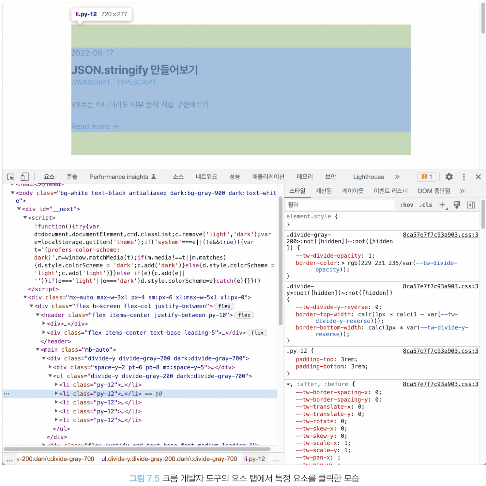
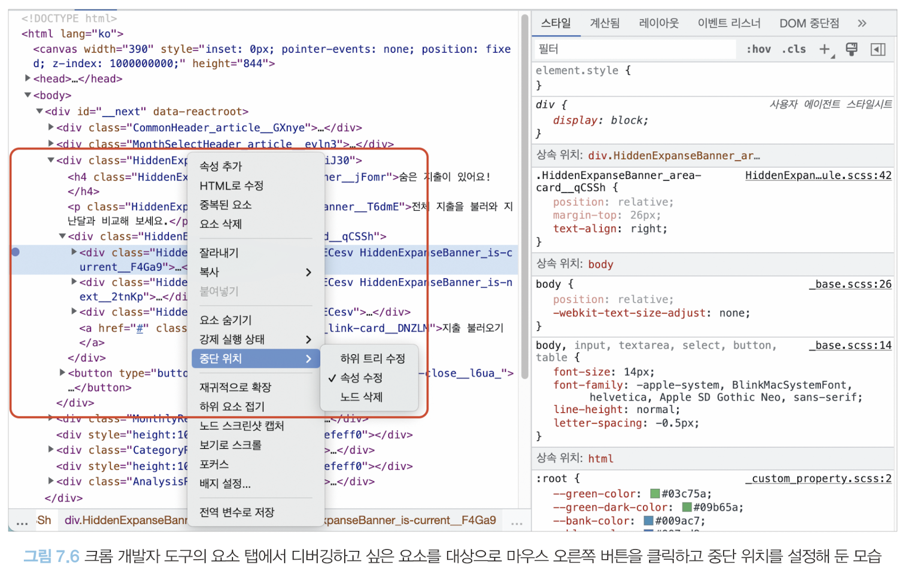

# 요소 탭
- 크롬 개발자 도구에서 가장 첫 번째로 노출되는 탭 `요소(Element)`
- 현재 웹페이지를 구성하고 있는 HTML, CSS 등의 정보 확인 가능

## 요소 화면

- 원하는 태그를 클릭하면 브라우저 페이지의 해당 요소 강조 및 관련 정보 확인 가능
- 직접 HTML, CSS 코드를 수정해 미리보기 가능
- 배너와 같은 코드에 의해 클래스나 속성값이 동적으로 제어되는 DOM은 요소의 중단점을 사용해 디버깅 가능
    
- 이 밖에도 요소에 속성을 추가, 수정, 삭제하거나 해당 요소를 스크린샷으로 캡처하거나 숨기는 등 HTML DOM과 관련된 다양한 작업을 수행할 수 있다.

## 요소 정보
- **스타일**: 요소와 관련된 스타일 정보를 나타냄, 어떤 클래스, 태그명, 아이디 등으로 매핑되어 설정된 스타일인지 확인할 수 있고, 또한 스타일이 선언돼 있는 파일도 확인할 수 있음. 스타일 정보를 수정하여 미리보기 가능

- **계산됨**: 해당 요소의 크기, 패딩, 보더, 마진과 각종 CSS 적용 결괏값을 알 수 있는 탭, 스타일은 어디서 왔는지라면 계산됨은 적용된 스타일이 결과적으로 어떤 결과물로 나타나는지 알 수 있음

- **레이아웃**: CSS 그리드나 레이아웃과 관련된 정보를 알 수 있음

- **이벤트 리스너**: 현재 요소에 부착된 각종 이벤트 리스너를 확인할 수 있음. 상위 버튼을 체크 해제하면 딱 해당 요소에 명확하게 부착된 이벤트만 볼 수 있음. (**이벤트 버블링 등으로 이벤트를 발생시키는 경우 확인할 수 없음**)

- **DOM 중단점**: 앞서 설명한 중단점이 있는지 알려주는 탭

- **속성**: 해당 요소가 가지고 있는 모든 속성값을 나타남. 자바스크립트에서 해당 DOM으로 `.attributes`를 실행했을 때 나오는 결과와 비슷하지만, `.attributes`는 직접 할당된 값만 나오는 반면 속성 탭에는 모든 값이 나온다는 차이가 있음

- **접근성**: 웹 이용에 어려움을 겪는 장애인, 노약자를 위한 스크린리더기 등이 활용하는 값을 말함. 

