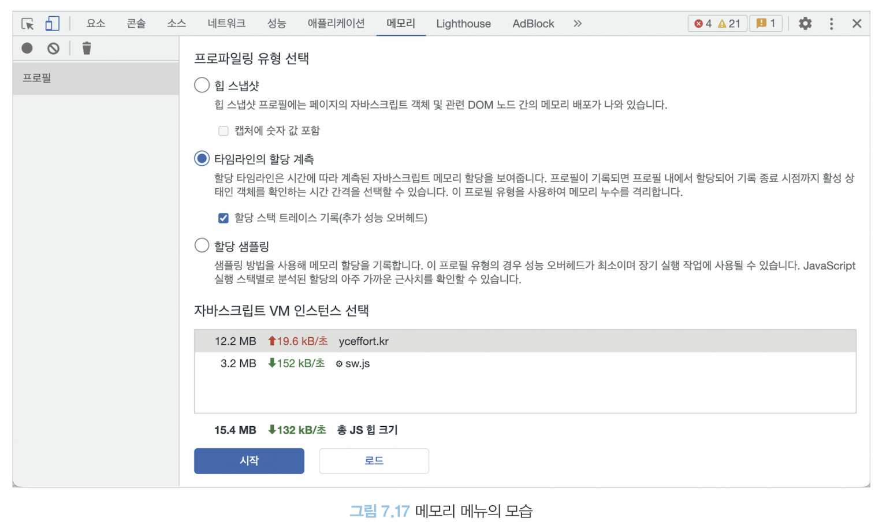
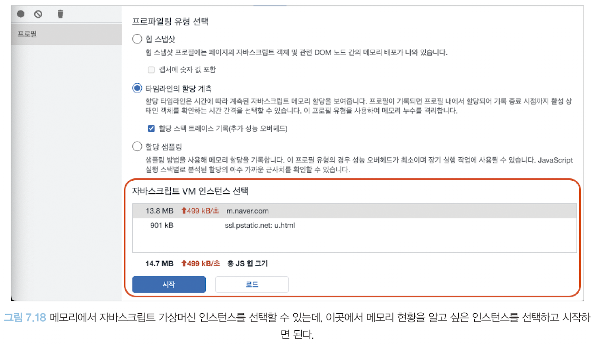
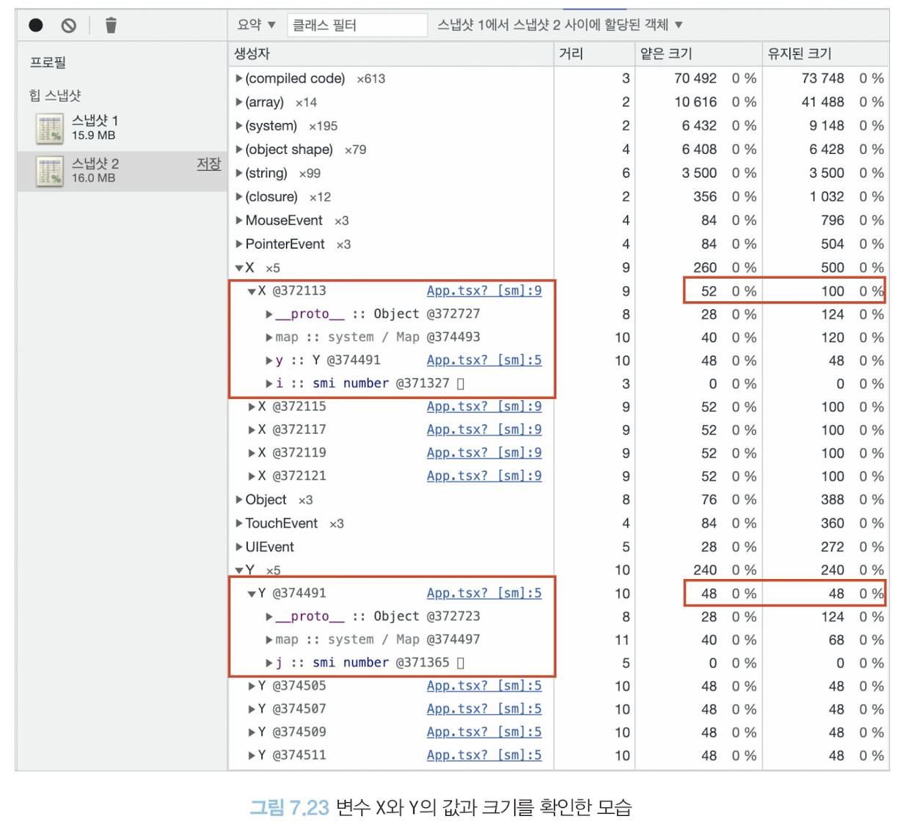

# 메모리 탭
- 현재 웹페이지가 차지하고 있는 메모리 관련 정보를 확인
- 메모리 누수, 속도 저하, 혹은 웹페이지 프리징 현상을 확인할 수 있음



## 자바스크립트 인스턴스 VM 선택
- 현재 실행 중인 **자바스크립트 VM 인스턴스** 확인 가능
- 디버깅하고 싶은 자바스크립트 VM 환경을 선택하여 확인 가능
- 실제 해당 페이지가 자바스크립트 힙을 얼마나 점유하고 있는지 나타냄
- 자바스크립트 실행에 따른 실시간성 보장(브라우저 부담 줄일 수 있음)


## 힙 스냅샷
- 현재 메모리 상황을 사진 찍듯이 촬영할 수 있다.(현재 시점의 메모리 상황을 알 수 있음)
- 예시 코드
    ```tsx
    const DUMMY_LIST = []

    export default function App() {
        function handleClick() {
            Array.from({ length: 10_000_000 }).forEach((_, idx) => DUMMY_LIST.push(Math.random() * idx)),
        alert('complete!')
        }

        return <button onClick={handleClick}>BUG</button>
    }
    ```
- 스냅샷 정보는 생각보다 많은 정보가 담겨있어 개발자가 원하는 메모리 누수 정보를 찾는 것이 쉽지 않아 예상되는 지점 위주로 찾으며 전후로 비교하는 것이 좋다.

> ## 얕은 크기와 유지된 크기의 차이?
> - 얕은 크기: 객체 자체가 보유하는 메모리 바이트의 크기를 나타냄
> - 유지된 크기: 해당 객체 자체뿐만 아니라 다른 부모가 존재하지 않는 모든 자식 객체들의 크기까지 더한 값
> ```tsx
> var counter = 0
> var instances = []
> function Y() {
>   this.j = 5   
> }
> 
> function X() {
>   this.i = counter ++
>   this.y = new Y()   
> }
>
> export default function App() {
>   function handleClick() {
>      instances.push(new X())  
>   }
>
>   return <button onClick={handleClick}>+</button>
> }
> ```
>
> 
>
> - **메모리 누수를 찾을 때는 얕은 크기(객체 자체의 크기)는 작으나 유지된 크기(객체가 참조하고 있는 모든 객체들의 크기)가 큰 객체를 찾아야함**
> - 이는 해당 객체가 복잡한 참조 관계를 가지고 있다는 뜻


## 타임라인 할당 계측
- 현재 시점의 메모리 상황이 아닌, **시간의 흐름에 따라 메모리의 변화**를 살펴볼 때 사용
- 주로 로딩 과정의 메모리 변화 또는 페이지에서 어떠한 상호작용을 했을 때 메모리의 변화 과정을 확인 가능
- 특정 변수 클릭해서 `전역 변수로 저장`을 누르면 해당 변수가 무슨 값을 가지고 있는 객체인지 확인 가능


## 할당 샘플링
- 메모리 공간을 차지하고 있는 자바스크립트 함수를 볼 수 있음
- 할당 계측과 비슷하지만 자바스크립트 실행 스택별로 분석할 수 있고, 이 분석을 함수 단위로 한다는 차이점
- 정렬을 통해 문제가 문제인 함수를 쉽게 추론할 수 있음
- 소스 패널에 표시를 선택해 해당 함수가 어느 파일에 어떻게 정의됐는지 확인 가능
- 할당 샘플링은 타임라인 할당 계측과 유사하지만 프로파일링할 때 브라우저에 주는 부담을 최소화할 수 있어 장시간에 걸쳐 디버깅을 수행해야할 때 유리
- **힙 스냅샷을 통해 메모리 누수가 짐작되지만 발생 구간이 확인하기 어렵다면 장기간 프로파일링을 수행해야한다면 할당 샘플링을 활용하는 것을 추천**