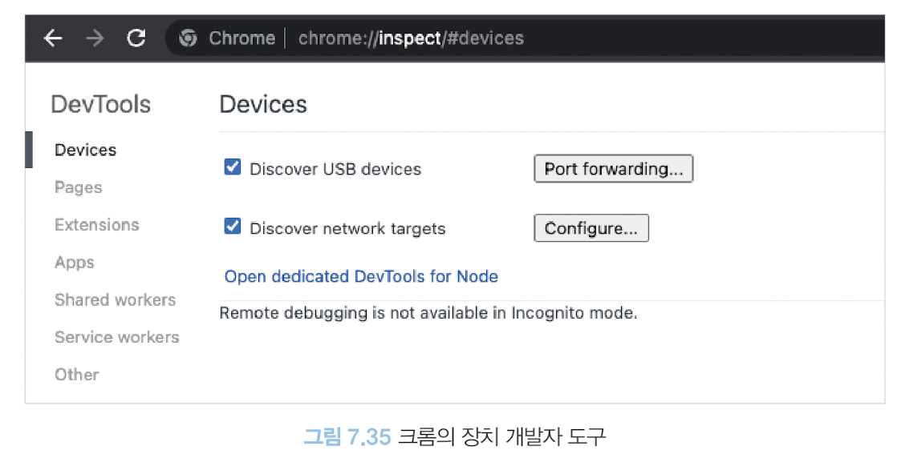
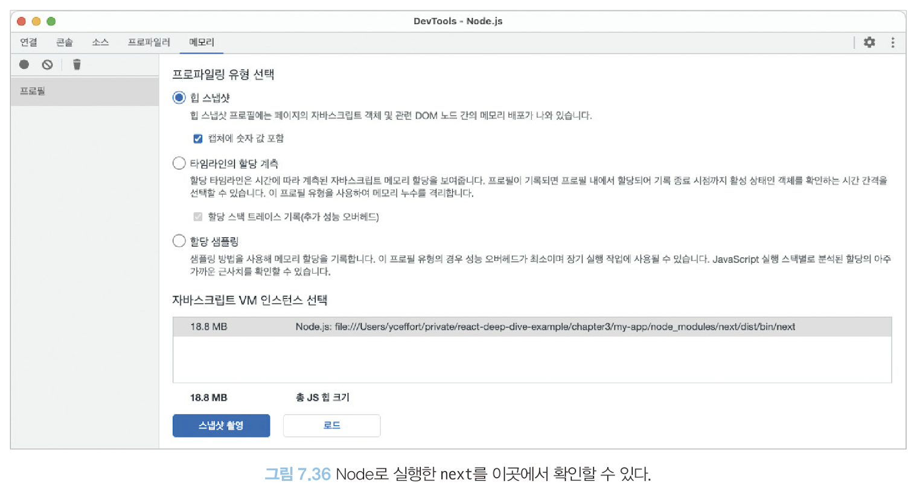
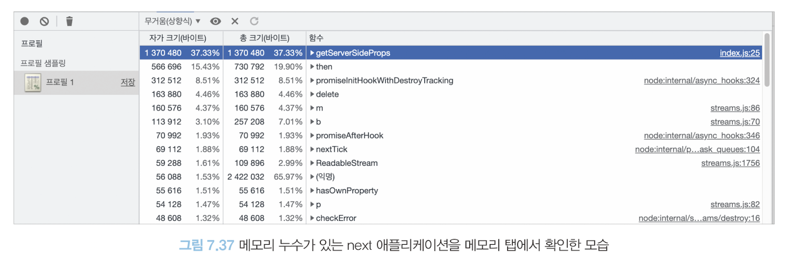

# Next.js 환경 디버깅하기
- CSR 환경에서의 메모리 누수는 사용자의 책임으로 넘길 수 있지만, SSR 환경인 경우 서비스 자체가 사용할 수 없는 지경에 이른다.

## Next.js 프로젝트를 디버그 모드로 실행하기
- 디버그 모드 Next.js 프로젝트 실행
    ```bash
    "dev": NODE_OPTION='--inspect' next dev
    ```

    - 실행 결과
    ```bash
    >> npm run dev

    > my-app@0.1.0 dev
    > NODE_OPTION='--inspection' next dev

    Debugger linstening oon ws://127.0.0.1:9229/b9d825b1-3046-4237-8c76-80e2a958ceea
    For help, see: https://nodejs.org/en/docs/inspector
    ready - started server on 0.0.0.0:3000, url: http://localhost:3000
    ```
- `chrome://inspect` 이동

    

- `Open dedicated DevTools for Node`를 클릭

    


## Next.js 서버에 트래픽 유입시키기
- 오픈 소스 도구 [ab](https://httpd.apache.org/docs/current/ko/programs/ab.html)

- 50개의 요청을 총 10,000회 `http://127.0.0.1:3000/`을 향해 날리는 명령어(`localhost`를 적으면 제대로 작동하지 않는다.)
    ```bash
    >> ab -k -c -50 -n 10000 "http://127.0.0.1:3000/"
    ```
- 결과
    - 요청으로 응답 받는데 걸리는 시간, 바이트 크기 등 다양한 정보 확인 가능
    
    
    
## Next.js의 메모리 누수 지점 확인하기
- `getServerSideProps`가 있는 Next.js 페이지로서 `getServerSideProps`가 실행될 때마다 전역 변수로 선언된 `access_users`에 끊임없이 push를 수행한다.
```tsx
import type { GetServerSidePropsContext, NextPage } from 'next'

const access_users = []

function Home({ currentDateTime }: { currentDateTime: number }) {
    return <>{currentDateTime}</>
}

export const getServerSideProps = (ctx: GetServerSidePropsContext) => {
    const currentDateTime = new Date().getTime()

    access_users.push({
        user: `user-${Math.round(Math.random() * 100000)}`,
        currentDateTime,
    })

    return {
        props: {
            currentDateTime,
        },
    }
}

export default Home
```

- debug


- next 애플리케이션을 방문한 뒤 변화


- `getServerSideProps`의 다수 실행과 메모리 누수 확인 가능
