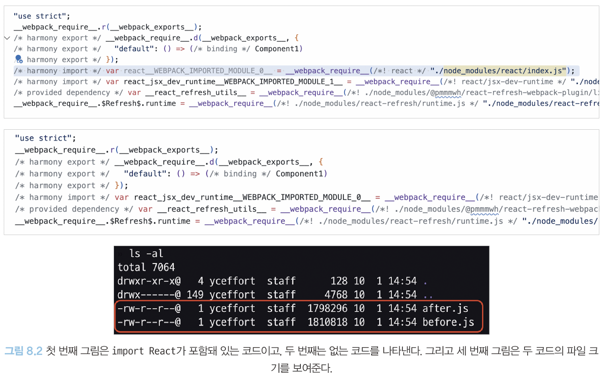
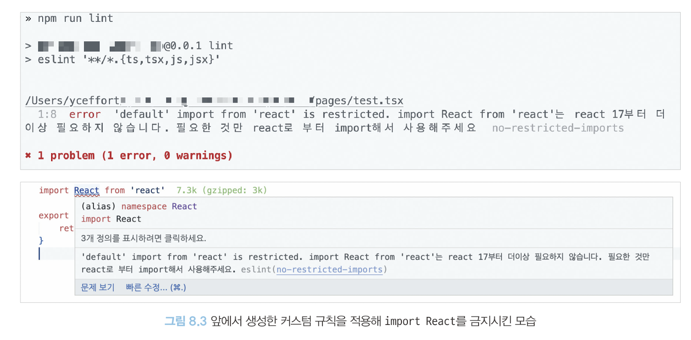

# ESLint를 활용한 정적 코드 분석
- 가장 많이 사용되는 정적 코드 분석 도구 `ESLint`를 알아보고 어떻게 사용하면 좋을 지 알아보자

## ESLint 살펴보기

### ESLint는 어떻게 코드를 분석할까?
- ESLint는 자바스크립트 코드를 분석해 잠재적인 문제를 발견하고 나아가 수정까지 해주는 도구

> ESLint가 코드를 읽고 분석하는 방법 요약
1. 자바스크립트 코드를 문자열로 읽는다.
2. 자바스크립트 코드를 분석할 수 있는 파서(parser)로 코드를 구조화한다.
3. 2번에서 구조화한 트리를 `AST(Abstract Syntax Tree)`라고 하며, 이 구조화된 트리를 기준으로 각종 규칙과 대조한다.
4. 규칙과 대조했을 때 이를 위반한 코드를 알리거나(report) 수정한다(fix).

> ESLint가 코드를 구조화하는 파서 espree
- [espree](https://github.com/eslint/espree#espree): ESLint 파서 중 하나이다

    ```js
    function hello(str) {}
    ```

    - espree로 분석한 결과(JSON)
    ```json
    {
        "type": "Program",
        "start": 0,
        "end": 22,
        "range": [0, 22],
        "body": [
            {
                "type": "FunctionDeclaration",
                "start": 0,
                "end": 22,
                "range": [0, 22],
                "id": {
                    "type": "Identifier",
                    "start": 9,
                    "end": 14,
                    "range": [9, 14],
                    "name": "hello"
                },
                "expression":false,
                "generator": false,
                "async": false,
                "params":[
                    {
                        "type": "Identifier",
                        "start": 15,
                        "end": 18,
                        "range": [15, 18],
                        "name": "str"
                    }
                ],
                "body": {
                    "type": "BlockStatement",
                    "start": 20,
                    "end": 22,
                    "range": [20, 22],
                    "body": []
                }
            }
        ],
        "sourceType": "module"
    }
    ```

    - [다른 파서 분석](https://astexplorer.net/)

- 타입스크립트의 경우에도 `@typescript-eslint/typescript-estree`라고 하는 espree 기반 파서가 있으며, 이를 통해 타입스크립트 구조화([AST explorer](https://astexplorer.net/)에서 사용해볼 수 있음)

> ESLint plugins
- `ESLint 규칙`의 모음
- `ESLint 규칙`: espree로 코드를 분석한 결과를 바탕으로 어떤 코드가 잘못된 코드이며 어떻게 수정해야 할지 정하는 것 

- debugger 사용 금지 예제
    - debugger 분석
        ```json
        {
            "type": "Program",
            "body": [
                {
                    "type": "DebuggerStatement",
                    "range": [0, 8]
                }
            ],
            "sourceType": "module",
            "range": [0, 8]
        }
        ```
    - no-debugger 규칙
    ```js
    module.exports = {
        meta: {
            type: 'problem',
            docs: {
                description: 'Disallow the use of `debugger`',
                recommended: true,
                url: 'https://eslint.org/docs/rules/no-debugger',
            },
            fixable: null,
            schema: [],
            messages: {
                unexpected: "Unexpected 'debugger' statement.",
            },
        },
        create(context) {
            // 실제 코드에서 문제점을 확인하는 곳
            // AST트리를 실제로 순회해 여기서 선언한 특정 조건을 만족하는 코드를 찾음(코드 전체에서 반복)
            // DebuggerStatement를 만나면 해당 노드를 리포트해 debugger를 사용했다는 것을 알려줌
            return {
                DebuggerStatement(node) {
                    context.report({
                        node,
                        messageId: 'unexpected',
                    })
                },
            }
        },
    }
    ```

## eslint-plugin과 eslint-config
- ESLint 패키지 eslint-plugin과 eslint-config
- 네이밍시 반드시 `eslint-plugin`이나 `eslint-config`라는 접두사를 준수하며, 반드시 **한 단어로 구성**

### eslint-plugin
- `eslint-plugin`이라는 접두사로 시작하는 플러그인은 앞서 언급했던 규칙을 모아놓은 패키지
- 예시1. `eslint-plugin-import`: 자바스크립트에서 다른 모듈을 불러오는 `import`와 관련된 다양한 규칙을 제공
- 예시2. `eslint-plugin-react`: jsx배열에 키를 선언하지 않았을 때 경고 메시지를 띄워주는 규칙(react/jsx-key)
    - 키 값이 독립적인지 확인할 순 없지만, 존재 여부는 확인 가능

### eslint-config
- `eslint-plugin`을 한데 묶어서 완벽하게 한 세트로 제공하는 패키지
- 여러 프로젝트에 걸쳐 동일하게 사용할 수 있는 ESLint 관련 설정을 제공하는 패키지
- 입맛에 맞춰 직접 설정할 수 있지만, 이미 존재하는 `eslint-config`를 설치하여 빠르게 적용하는 경우가 일반적

> 바로 사용가능한 eslint-config 예시1. `eslint-config-airbnb`
- Airbnb에서 만든 규칙 
- 제공하는 규칙
    - 자바스크립트: https://github.com/airbnb/javascript#types
    - 리액트: https://github.com/javascript/tree/master/react
- 설치 가이드: https://github.com/airbnb/javascript/tree/master/packages/eslint-config-airbnb#eslint-config-airbnb-1


> 바로 사용가능한 eslint-config 예시2. `@titicaca/triple-config-kit`
- 한국 커뮤니티에서 운영되는 eslint-config 중 유지보수가 활발한 편
- 트리플(인터파크트리플)에서 개발하며, 다른 패키지와 다른 몇 가지 특징이 있음
    - 자체적으로 정의한 규칙을 기반으로 운영
    - `eslint-config-airbnb`기반으로 하지 않았음에도 대부분의 유용하고 자바스크립트 개발자 사이에서 널리 알려진 규칙은 모두 제공
    - 외부로 제공하는 규칙에 대한 테스트 코드 존재(eslint-config를 사용하는 개발자가 규칙을 수정하거나 추가할 때 eslint-config-triple에서 규칙이 추가됐는지 확인 가능)
    - CI/CD환경, 카나리 배포 등 일반적인 npm 라이브러리 구축 및 관리를 위한 시스템이 잘 되어 있음
    - frontend 규칙도 제공하고 있어 Node.js환경 또는 리액트 환경에 맞는 규칙을 적용할 수 있음
- Prettier와 Stylelint를 각각 관리하고 있어, 필요에 따라 사용 가능


> 바로 사용가능한 eslint-config 예시3. `eslint-config-next`
- Next.js 프레임워크에서 사용하는 eslint-config 
- Next.js 11부터 만들어짐
- 자바스크립트 정적 분석 뿐만 아니라 페이지나 컴포넌트에서 반환하는 JSX 구문 및 _app, _document에서 작성돼 있는 HTML 코드 또한 정적 분석 대상으로 분류해 제공
- 전체적 Next.js 기반 웹 서비스의 성능 향상에 도움이 될 수 있음
    - 제공하는 규칙: https://nextjs.org/docs/basic-features/eslint#eslint-plugin
    - 설치 가이드: https://nextjs.org/docs/basic-features/eslint


## 나만의 ESLint 규칙 만들기
- ESLint 규칙을 생성해 관리하면 개발자가 일일이 수정하는 것보다 훨씬 더 빠르고 쉽게 수정할 수 있고, 이후에 반복되는 실수 또한 방지할 수 있음

### 이미 존재하는 규칙을 커스터미이징해서 적용하기: improt React를 제거하기 위한 ESLint 규칙 만들기
- React 17 버전부터는 새로운 JSX 런타임 덕분에 import React 구문이 필요 없어짐

    ```tsx
    // Component(import react가 있는 코드)
    // 다음과 같은 컴포넌트가 100개 있다고 가정
    export function Component1() {
        return <div>hello world!</div>
    }

    // App
    import Component1 from './Components/1'
    import Component2 from './Components/2'
    // ...
    import Component100 from './Components/100'

    function App() {
        return (
            <div className="App">
                <Component1 />
                <Component2 />
                {/* ... */}
                <Component100 />
            </div>
        )
    }

    export default App
    ```
    ```tsx
    // Component(import react가 없는 코드)
    // 다음과 같은 컴포넌트가 100개 있다고 가정
    import React from 'react'

    export function Component1() {
        return <div>hello world!</div>
    }

    // App
    import React from 'react'
    import Component1 from './Components/1'
    import Component2 from './Components/2'
    // ...
    import Component100 from './Components/100'

    function App() {
        return (
            <div className="App">
                <Component1 />
                <Component2 />
                {/* ... */}
                <Component100 />
            </div>
        )
    }

    export default App
    ```
    

- import react 금지시키기
    - .eslintrc.js 파일
    ```js
    module.exports = {
        rules: {
            'no-restricted-import': [
                'error',
                {
                    // paths에 금지시킬 모듈을 추가한다.
                    paths: [
                        {
                            // 모듈명
                            name: 'react',
                            // 모듈의 이름(default export만 금지해야 다른 모듈들을 가져올 때 에러가 안 뜸)
                            importNames: ['default'],
                            // 경고 메시지
                            message: 
                                "import React from 'react'는 react 17부터 더 이상 필요하지 않습니다. 필요한 것만 react로부터 import해서 사용해 주세요.",
                        },
                    ],
                },
            ],
        },
    }
    ```
    

- 트리쉐이킹 되지 않는 `lodash` 같은 라이브러리 import 방지
    ```js
    module.exports = {
        rules: {
            'no-restricted-imports': [
                'error',
                {
                    name: 'lodash',
                    message:
                        'lodash는 CommonJS로 작성돼 있어 트리쉐이킹이 되지 않아 번들 사이즈를 크게 합니다. lo-dash/* 형식으로 import 해주세요.',
                },
            ],
        },
    }
    ```

### 완전히 새로운 규칙 만들기: new Date를 금지시키는 규칙
- `new Date`는 기기의 현재 시간을 바꿔버리면 `new Date()`가 반환하는 현재 시간 또한 변경됨
- 서버의 시간을 반환하는 함수를 만들어 써야할 상황을 가정하여 규칙을 구현해보자

- new Date() AST
    ```json
    {
        "type": "Program",
        "start": 0,
        "end": 10,
        "range": [0, 10],
        "body": [
            {
                "type": "ExpressionStatement",  // 해당 코드의 표현식 전체를 나타냄
                "start": 0,
                "end": 10,
                "range": [0, 10],
                // ESLint에서 확인하는 하나의 node 단위
                "expression": {
                    "type": "NewExpression",    // 생성자를 사용한 타입(new)
                    "start": 0,
                    "end": 10,
                    "range": [0, 10],
                    // 생성자를 사용한 표현식에서 생성자의 이름을 나타냄
                    "callee": {
                        "type": "Identifier",
                        "start": 4,
                        "end": 8,
                        "range": [4. 8],
                        "name": "Date"
                    },
                    // 전달하는 인수
                    "arguments": []
                }
            }
        ],
        "sourceType": "module"
    }
    ```
- AST기반 ESlint 규칙
    ```js
    /**
     *  @type {import('eslint').Rule.RuleModule}
     */
    module.exports = {
        // 해당 규칙과 관련된 정보를 나타냄(실제 규칙이 작동하는 코드와는 크게 관련 없음)
        meta: {
            type: 'suggestion',
            docs: {
                description: 'disabllow use of the new Date()',
                recommended: false,
            },
            fixable: 'code',
            schema: [],
            messages: {
                message:
                    'new Date()는 클라이언트에서 실행 . 시해당 기기의 시간에 의존적이라 정확하지 않습니다. 현재 시간이 필요하다면 ServerDate()를 사용해 주세요.',
            },
        },
        // 코드 스멜을 감지할 선택자나 이벤트명을 선언할 수 있다.
        create: function (context) {
            return {
                NewExpression: function (node) {
                    if (node.callee.name === 'Date' && node.arguments.length === 0) {
                        // 해당 코드스멜 리포트
                        context.report({
                            node: node,
                            messageId: 'message',
                            fix: function (fixer) {
                                // 자동 수정 함수
                                return fixer.replaceText(node, 'ServerDate()')
                            }
                        })
                    } 
                }
            }
        }
    }
    ```

## 주의할 점

### Prettier와의 충돌
- Prettier: 코드의 포매팅을 도와주는 도구,줄바꿈, 들여쓰기, 작은따옴표, 큰따옴표 등을 담당(HTML, CSS, MD, JSON 등 적용가능)
- ESLint에서도 관련 기능 수행가능(충돌 가능)

> 해결방법 1
- 서로 규칙이 충돌되지 않게끔 규칙을 잘 선언

> 해결방법 2
- 자바스크립트나 타입스크립트는 ESLint, 그 외의 파일은 Prettier (사용 장소 구분)
- eslint-plugin-prettier를 사용하여 Prettier 관련 규칙들을 사용

### 규칙에 대한 예외 처리, 그리고 react-hooks/no-exhaustive-deps
- 만약 일부 코드에서 특정 규칙을 임시로 제외시키고 싶다면 eslint-disable-주석을 사용하면 된다.

    ```js
    // 특정 줄만 제외
    console.log('hello world') // eslint-disable-line no-console

    // 다음 줄 제외
    // eslint-disable-next-line no-console
    console.log('hello world') 

    // 특정 여러 줄 제외
    
    /* eslint-disable no-console */
    console.log('JavaScript debug log')
    console.log('eslint is disabled now')
    /* eslint-disable no-console */
    

    // 파일 전체에서 제외
    /* eslint-disable no-console */
    console.log('hello world') 
    ```

> // eslint-disable-line no-exhaustive-deps
- useEffect나 useMemo와 같이 의존 배열이 필요한 훅에 의존성 배열을 제대로 선언했는지 확인하는 역할
- 의존성 배열이 너무 길어지거나, 빈 배열을 넣어서 컴포넌트가 마운트되는 시점에 한 번만 강제로 실행되게 하고 싶을 때, 임의로 판단해 없어도 괜찮다고 생각 될 때 등 다양
    - `괜찮다고 임의로 판단한 경우`: 가장 위험한 경우(해당 변수가 컴포넌트의 상태와 별개로 동작하는 것을 의미) -> 어디서 어떻게 선언할 것인지 고민
    - `의존성 배열이 너무 긴 경우`: useEffect 내부 함수가 너무 길다는 말과 동일, useEffect를 쪼개서 의존성 배열의 가독성과 안정성 확보
    - `마운트 시점에 한 번만 실행하고 싶을 경우`: 상태과 관계없이 한 번만 실행돼야 하는 것이 있다면 해당 컴포넌트에 존재할 이유가 없음

> 타입스크립트의 any를 강제로 사용하기 위한 typescript-eslint/no-explicit-any
- 정말 필요한 경우라면 "off"를 통해 끄는 것이 옳다

### ESLint 버전 충돌
- eslint-config, eslint-plugin이 지원하는 ESLint 버전을 확인하고, 또 설치하고자 하는 프로젝트에서 ESLint 버전을 어떻게 지원하고 있는지 살펴볼 필요성이 있음

## 정리

### ESLint
- ESLint는 자바스크립트 코드를 분석해 잠재적인 문제를 발견하고 나아가 수정까지 해주는 도구

> ESLint가 코드를 읽고 분석하는 방법 요약
1. 자바스크립트 코드를 문자열로 읽는다.
2. 자바스크립트 코드를 분석할 수 있는 파서(parser)로 코드를 구조화한다.
3. 2번에서 구조화한 트리를 `AST(Abstract Syntax Tree)`라고 하며, 이 구조화된 트리를 기준으로 각종 규칙과 대조한다.
4. 규칙과 대조했을 때 이를 위반한 코드를 알리거나(report) 수정한다(fix).

> ESLint plugins
- `ESLint 규칙`의 모음
- `ESLint 규칙`: espree로 코드를 분석한 결과를 바탕으로 어떤 코드가 잘못된 코드이며 어떻게 수정해야 할지 정하는 것 

- `eslint-plugin`이라는 접두사로 시작하는 플러그인은 앞서 언급했던 규칙을 모아놓은 패키지
- 예시1. `eslint-plugin-import`: 자바스크립트에서 다른 모듈을 불러오는 `import`와 관련된 다양한 규칙을 제공
- 예시2. `eslint-plugin-react`: jsx배열에 키를 선언하지 않았을 때 경고 메시지를 띄워주는 규칙(react/jsx-key)
    - 키 값이 독립적인지 확인할 순 없지만, 존재 여부는 확인 가능

> Eslint-config
- `eslint-plugin`을 한데 묶어서 완벽하게 한 세트로 제공하는 패키지
- 여러 프로젝트에 걸쳐 동일하게 사용할 수 있는 ESLint 관련 설정을 제공하는 패키지
- 입맛에 맞춰 직접 설정할 수 있지만, 이미 존재하는 `eslint-config`를 설치하여 빠르게 적용하는 경우가 일반적

### ESLint Customizing
- import react 금지시키기
    - .eslintrc.js 파일
    ```js
    module.exports = {
        rules: {
            'no-restricted-import': [
                'error',
                {
                    // paths에 금지시킬 모듈을 추가한다.
                    paths: [
                        {
                            // 모듈명
                            name: 'react',
                            // 모듈의 이름(default export만 금지해야 다른 모듈들을 가져올 때 에러가 안 뜸)
                            importNames: ['default'],
                            // 경고 메시지
                            message: 
                                "import React from 'react'는 react 17부터 더 이상 필요하지 않습니다. 필요한 것만 react로부터 import해서 사용해 주세요.",
                        },
                    ],
                },
            ],
        },
    }
    ```

- 처음부터 제거하는 new Date() 규칙 만들기
    ```js
    /**
     *  @type {import('eslint').Rule.RuleModule}
     */
    module.exports = {
        // 해당 규칙과 관련된 정보를 나타냄(실제 규칙이 작동하는 코드와는 크게 관련 없음)
        meta: {
            type: 'suggestion',
            docs: {
                description: 'disabllow use of the new Date()',
                recommended: false,
            },
            fixable: 'code',
            schema: [],
            messages: {
                message:
                    'new Date()는 클라이언트에서 실행 . 시해당 기기의 시간에 의존적이라 정확하지 않습니다. 현재 시간이 필요하다면 ServerDate()를 사용해 주세요.',
            },
        },
        // 코드 스멜을 감지할 선택자나 이벤트명을 선언할 수 있다.
        create: function (context) {
            return {
                NewExpression: function (node) {
                    if (node.callee.name === 'Date' && node.arguments.length === 0) {
                        // 해당 코드스멜 리포트
                        context.report({
                            node: node,
                            messageId: 'message',
                            fix: function (fixer) {
                                // 자동 수정 함수
                                return fixer.replaceText(node, 'ServerDate()')
                            }
                        })
                    } 
                }
            }
        }
    }
    ```

### 주의사항
- Prettier와의 충돌(비슷한 역할)
- 규칙에 대한 예외 처리, 그리고 react-hook/no-exhaustive-deps
- ESLint 버전 충돌